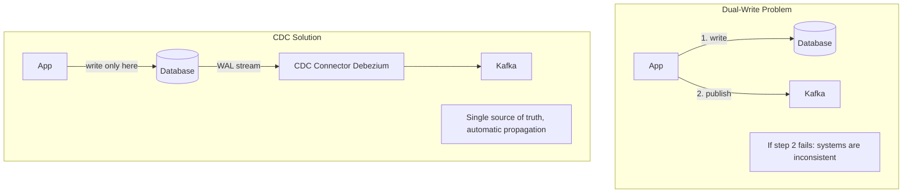
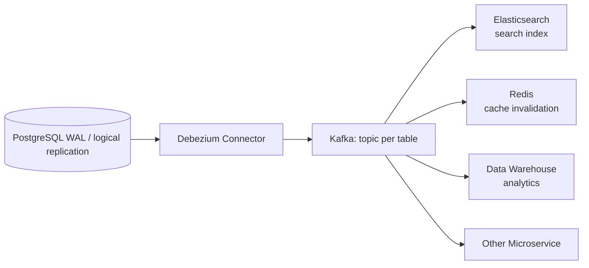
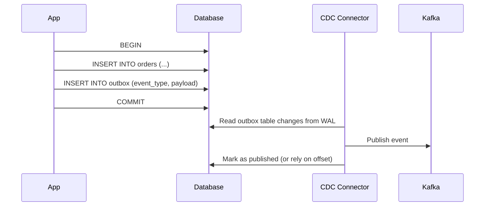

# Change Data Capture (CDC)

Track row-level changes in a database and stream them to other systems in real-time — without dual-write problems.

---

## Why CDC?



---

## How It Works



### CDC Methods

| Method | How | Latency | Impact on DB |
|--------|-----|---------|-------------|
| Log-based (WAL) | Read write-ahead log | ms | Zero (reads log file) |
| Trigger-based | DB triggers write to changelog | ms | Slight (trigger overhead) |
| Polling | `SELECT WHERE updated_at > ?` | seconds-minutes | Query load |
| Timestamp | Track last-modified | seconds | Query load |

**Production standard**: Log-based (Debezium reading PostgreSQL WAL or MySQL binlog).

---

## PostgreSQL Logical Replication

```sql
-- Enable logical replication in postgresql.conf
-- wal_level = logical

-- Create a publication (what to capture)
CREATE PUBLICATION my_pub FOR TABLE users, orders;

-- Create a replication slot (cursor position in WAL)
SELECT pg_create_logical_replication_slot('my_slot', 'pgoutput');
```

### Go: Reading WAL Changes

```go
// Using jackc/pglogrepl for logical replication
conn, _ := pgconn.Connect(ctx, "postgres://...?replication=database")

// Start replication
err = pglogrepl.StartReplication(ctx, conn, "my_slot", startLSN,
    pglogrepl.StartReplicationOptions{
        PluginArgs: []string{"proto_version '1'", "publication_names 'my_pub'"},
    })

// Read changes
for {
    msg, _ := conn.ReceiveMessage(ctx)
    switch msg := msg.(type) {
    case *pgproto3.CopyData:
        // Parse XLogData → INSERT/UPDATE/DELETE events
        // Forward to Kafka / process directly
    }
}
```

---

## Debezium Event Format

```json
{
  "before": {"id": 1, "name": "Alice", "email": "old@example.com"},
  "after":  {"id": 1, "name": "Alice", "email": "new@example.com"},
  "source": {
    "connector": "postgresql",
    "db": "mydb",
    "table": "users",
    "lsn": 123456789
  },
  "op": "u",
  "ts_ms": 1700000000000
}
```

| `op` | Meaning |
|------|---------|
| `c` | CREATE (INSERT) |
| `u` | UPDATE |
| `d` | DELETE |
| `r` | READ (snapshot) |

---

## Use Cases

| Use Case | How CDC Helps |
|----------|--------------|
| Cache invalidation | Invalidate Redis key when DB row changes |
| Search sync | Update Elasticsearch when data changes |
| Microservice sync | Propagate changes without API coupling |
| Audit log | Immutable history of all changes |
| Data warehouse | Real-time ETL without batch jobs |
| Event sourcing migration | Retrofit events from existing CRUD DB |

---

## Outbox Pattern (CDC + Transactional Outbox)



**Why outbox?** Guarantees atomicity — the event is written in the same transaction as the data change. CDC picks it up reliably.

```go
// Transactional outbox in Go
func (r *Repo) CreateOrder(ctx context.Context, order Order) error {
    tx, _ := r.db.BeginTx(ctx, nil)
    defer tx.Rollback()

    tx.ExecContext(ctx, `INSERT INTO orders (...) VALUES (...)`, ...)
    
    // Write event to outbox in same transaction
    payload, _ := json.Marshal(OrderCreatedEvent{OrderID: order.ID})
    tx.ExecContext(ctx, `INSERT INTO outbox (event_type, payload) VALUES ($1, $2)`,
        "order.created", payload)

    return tx.Commit()
}
// CDC connector reads outbox table → publishes to Kafka
```
