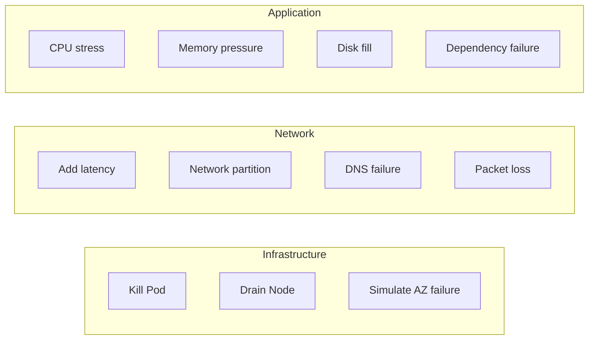
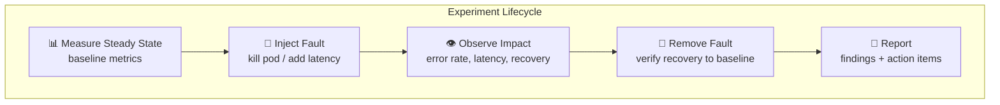

# Chaos Engineering

Fault injection, game days, and building confidence in system resilience.

---

## What is Chaos Engineering?

```mermaid
graph TD
    HYPOTHESIS[Form Hypothesis<br>"System handles pod failure gracefully"] --> EXPERIMENT[Design Experiment<br>Kill 1 of 3 pods]
    EXPERIMENT --> BLAST[Limit Blast Radius<br>staging first, then prod]
    BLAST --> RUN[Run Experiment<br>inject fault]
    RUN --> OBSERVE[Observe<br>metrics, errors, latency]
    OBSERVE --> LEARN{Hypothesis confirmed?}
    LEARN -->|Yes| CONFIDENCE[✅ Increased confidence]
    LEARN -->|No| FIX[🔧 Fix weakness<br>then re-test]
```

**Not**: randomly breaking things in production.
**Is**: disciplined experiments to uncover weaknesses before they cause outages.

---

## Types of Fault Injection



| Fault Type | What it tests | Tool |
|-----------|---------------|------|
| Pod kill | Restart resilience, readiness probes | `kubectl delete pod` |
| Network latency | Timeout handling, circuit breakers | tc netem, Litmus |
| Dependency failure | Fallback logic, graceful degradation | Toxiproxy |
| CPU/Memory stress | Autoscaling, resource limits | stress-ng |
| Disk full | Log rotation, error handling | fallocate |
| DNS failure | Retry logic, caching | iptables |

---

## Game Day Runbook

### Before

```markdown
1. Define hypothesis: "If Redis goes down, API returns cached responses or degrades gracefully"
2. Define success criteria: error rate < 5%, latency p99 < 2s
3. Define abort criteria: error rate > 20% → rollback immediately
4. Notify team: "Chaos experiment running 2-3pm in staging"
5. Ensure monitoring dashboards are open
```

### During

```markdown
1. Record baseline metrics (5 min steady state)
2. Inject fault (e.g., block Redis port)
3. Observe for 5-10 minutes
4. Record: error rate, latency, user impact
5. Remove fault
6. Verify recovery (metrics return to baseline)
```

### After

```markdown
1. Document findings
2. File tickets for weaknesses found
3. Share learnings with team
4. Schedule follow-up after fixes
```

---

## Go: Building Resilient Services

```go
// Circuit breaker protects against dependency failure
func getUser(ctx context.Context, id string) (*User, error) {
    var user *User
    err := circuitBreaker.Execute(func() error {
        var err error
        user, err = userService.Get(ctx, id)
        return err
    })
    if err != nil {
        // Fallback: return cached/default data
        return getCachedUser(id)
    }
    return user, nil
}

// Timeout prevents hanging on slow dependencies
func callWithTimeout(ctx context.Context) error {
    ctx, cancel := context.WithTimeout(ctx, 2*time.Second)
    defer cancel()
    return dependency.Call(ctx) // respects context deadline
}

// Retry with jitter for transient failures
func retryWithBackoff(fn func() error) error {
    for attempt := 0; attempt < 3; attempt++ {
        if err := fn(); err == nil {
            return nil
        }
        jitter := time.Duration(rand.Intn(100)) * time.Millisecond
        time.Sleep(time.Duration(1<<attempt)*100*time.Millisecond + jitter)
    }
    return errors.New("max retries exceeded")
}
```

---

## Tools



| Tool | Type | Environment |
|------|------|-------------|
| Litmus Chaos | K8s-native experiments | Kubernetes |
| Chaos Monkey | Random instance termination | AWS |
| Toxiproxy | Network fault proxy | Any (Shopify) |
| tc netem | Network latency/loss | Linux |
| stress-ng | CPU/memory/disk stress | Linux |
| Gremlin | Commercial platform | Any |
| `kubectl delete pod` | Simplest chaos test | Kubernetes |

---

## Principles

| Principle | Description |
|-----------|-------------|
| Start small | One pod, one service, staging first |
| Automate | Repeatable experiments, not ad-hoc |
| Minimize blast radius | Feature flags to abort instantly |
| Run in production | Staging ≠ production (but start there) |
| Build hypotheses | Not "let's break stuff" — scientific method |
| Fix and re-test | Chaos without follow-up is just destruction |
