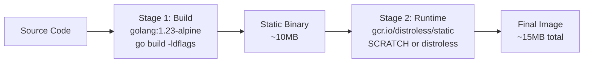
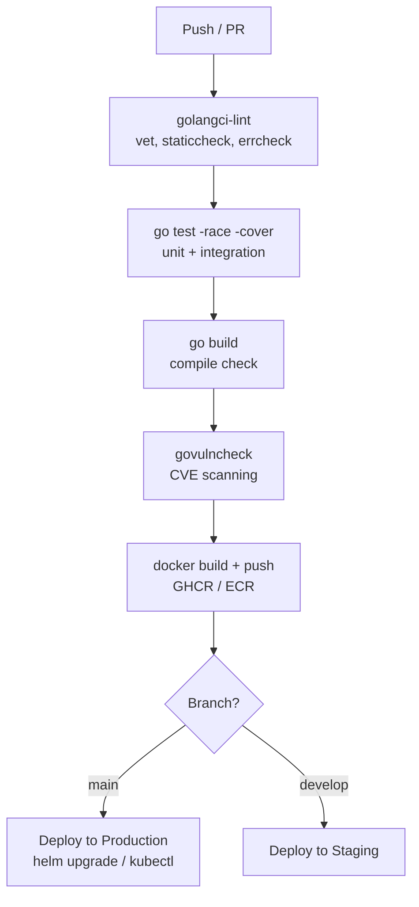
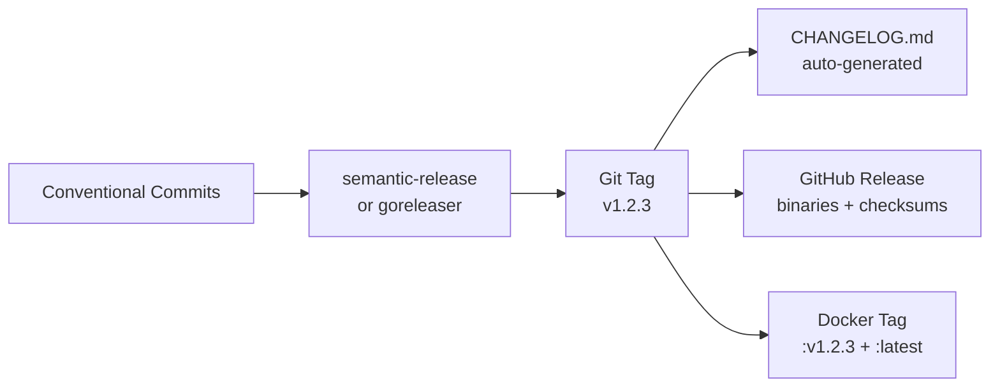

# CI/CD for Go Services

Multi-stage Docker builds, GitHub Actions pipelines, semantic versioning, and deployment strategies for Go microservices.

---

## Multi-Stage Docker Build



### Production Dockerfile

```dockerfile
# Stage 1: Build
FROM golang:1.23-alpine AS builder
RUN apk add --no-cache git ca-certificates
WORKDIR /app
COPY go.mod go.sum ./
RUN go mod download
COPY . .
RUN CGO_ENABLED=0 GOOS=linux go build \
    -ldflags="-s -w -X main.version=${VERSION}" \
    -o /app/server ./cmd/server

# Stage 2: Runtime (distroless = no shell, no package manager)
FROM gcr.io/distroless/static:nonroot
COPY --from=builder /app/server /server
COPY --from=builder /etc/ssl/certs/ca-certificates.crt /etc/ssl/certs/
USER nonroot:nonroot
EXPOSE 8080
ENTRYPOINT ["/server"]
```

**Key decisions:**
| Choice | Why |
|--------|-----|
| `CGO_ENABLED=0` | Static binary, no libc dependency |
| `-ldflags="-s -w"` | Strip debug info → smaller binary |
| `distroless/static` | No shell = smaller attack surface than `alpine` |
| `nonroot` user | Never run as root in production |
| Separate `COPY go.mod` | Docker layer caching for dependencies |

---

## GitHub Actions Pipeline



### `.github/workflows/ci.yml`

```yaml
name: CI
on:
  push:
    branches: [main]
  pull_request:
    branches: [main]

env:
  GO_VERSION: '1.23'
  REGISTRY: ghcr.io
  IMAGE_NAME: ${{ github.repository }}

jobs:
  lint:
    runs-on: ubuntu-latest
    steps:
      - uses: actions/checkout@v4
      - uses: actions/setup-go@v5
        with:
          go-version: ${{ env.GO_VERSION }}
      - uses: golangci/golangci-lint-action@v6
        with:
          version: latest

  test:
    runs-on: ubuntu-latest
    services:
      postgres:
        image: postgres:16
        env:
          POSTGRES_PASSWORD: test
        ports: ['5432:5432']
        options: >-
          --health-cmd pg_isready
          --health-interval 10s
          --health-timeout 5s
          --health-retries 5
    steps:
      - uses: actions/checkout@v4
      - uses: actions/setup-go@v5
        with:
          go-version: ${{ env.GO_VERSION }}
          cache: true
      - run: go test -race -coverprofile=coverage.out ./...
      - uses: codecov/codecov-action@v4
        with:
          files: coverage.out

  build:
    needs: [lint, test]
    runs-on: ubuntu-latest
    permissions:
      contents: read
      packages: write
    steps:
      - uses: actions/checkout@v4
      - uses: docker/login-action@v3
        with:
          registry: ${{ env.REGISTRY }}
          username: ${{ github.actor }}
          password: ${{ secrets.GITHUB_TOKEN }}
      - uses: docker/build-push-action@v5
        with:
          push: ${{ github.event_name != 'pull_request' }}
          tags: ${{ env.REGISTRY }}/${{ env.IMAGE_NAME }}:${{ github.sha }}

  security:
    runs-on: ubuntu-latest
    steps:
      - uses: actions/checkout@v4
      - uses: actions/setup-go@v5
        with:
          go-version: ${{ env.GO_VERSION }}
      - run: go install golang.org/x/vuln/cmd/govulncheck@latest
      - run: govulncheck ./...
```

---

## Semantic Versioning



### Conventional Commits → Version Bump

| Commit prefix | Version bump | Example |
|---------------|-------------|---------|
| `fix:` | PATCH (1.0.x) | `fix: handle nil pointer in auth` |
| `feat:` | MINOR (1.x.0) | `feat: add rate limiting middleware` |
| `feat!:` or `BREAKING CHANGE:` | MAJOR (x.0.0) | `feat!: change API response format` |

### GoReleaser Config (`.goreleaser.yml`)

```yaml
builds:
  - env: [CGO_ENABLED=0]
    goos: [linux, darwin]
    goarch: [amd64, arm64]
    ldflags:
      - -s -w -X main.version={{.Version}}

dockers:
  - image_templates:
      - "ghcr.io/user/app:{{.Version}}"
      - "ghcr.io/user/app:latest"
    dockerfile: Dockerfile

changelog:
  sort: asc
  filters:
    exclude: ['^docs:', '^test:', '^ci:']
```

---

## Deployment Strategies

```mermaid
graph TD
    subgraph Rolling Update
        V1A[v1 Pod] --> V2A[v2 Pod]
        V1B[v1 Pod] --> V2B[v2 Pod]
        V1C[v1 Pod] --> V2C[v2 Pod]
    end
    
    subgraph Blue-Green
        BLUE[Blue (v1)<br>100% traffic] -.->|switch| GREEN[Green (v2)<br>0% → 100%]
    end
    
    subgraph Canary
        STABLE[Stable (v1)<br>95% traffic]
        CANARY[Canary (v2)<br>5% traffic]
        CANARY -->|metrics OK| PROMOTE[Promote to 100%]
    end
```

### Kubernetes Deployment

```yaml
apiVersion: apps/v1
kind: Deployment
metadata:
  name: my-service
spec:
  replicas: 3
  strategy:
    type: RollingUpdate
    rollingUpdate:
      maxSurge: 1        # 1 extra pod during rollout
      maxUnavailable: 0  # zero downtime
  template:
    spec:
      containers:
        - name: app
          image: ghcr.io/user/app:v1.2.3
          ports:
            - containerPort: 8080
          readinessProbe:
            httpGet:
              path: /healthz
              port: 8080
            initialDelaySeconds: 5
            periodSeconds: 10
          livenessProbe:
            httpGet:
              path: /healthz
              port: 8080
            initialDelaySeconds: 15
            periodSeconds: 20
          resources:
            requests:
              memory: "64Mi"
              cpu: "100m"
            limits:
              memory: "128Mi"
              cpu: "500m"
```

---

## Makefile for CI-Ready Go Projects

```makefile
VERSION ?= $(shell git describe --tags --always --dirty)
LDFLAGS := -s -w -X main.version=$(VERSION)

.PHONY: lint test build docker

lint:
	golangci-lint run ./...

test:
	go test -race -coverprofile=coverage.out ./...
	go tool cover -func=coverage.out

build:
	CGO_ENABLED=0 go build -ldflags="$(LDFLAGS)" -o bin/server ./cmd/server

docker:
	docker build --build-arg VERSION=$(VERSION) -t myapp:$(VERSION) .
```
