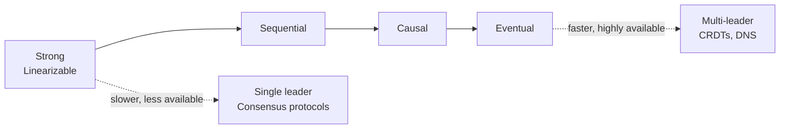
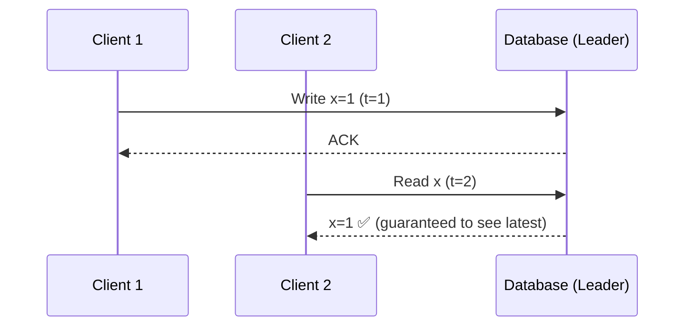
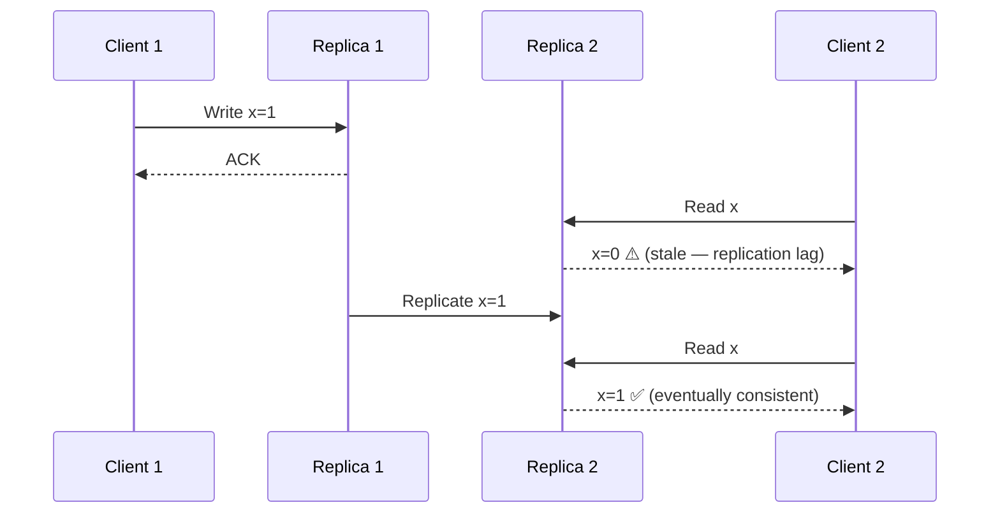
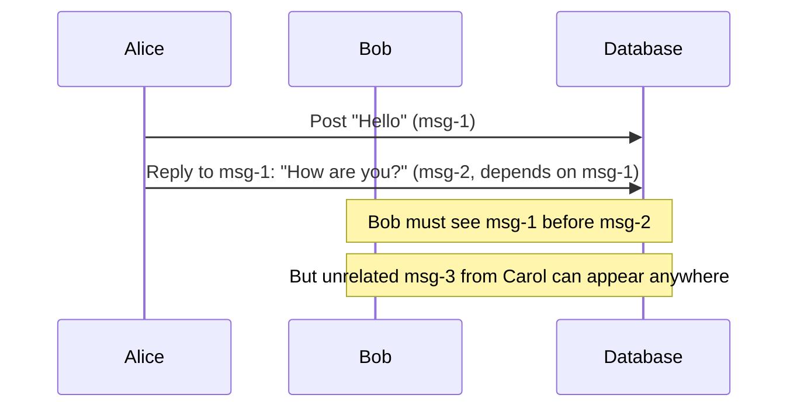
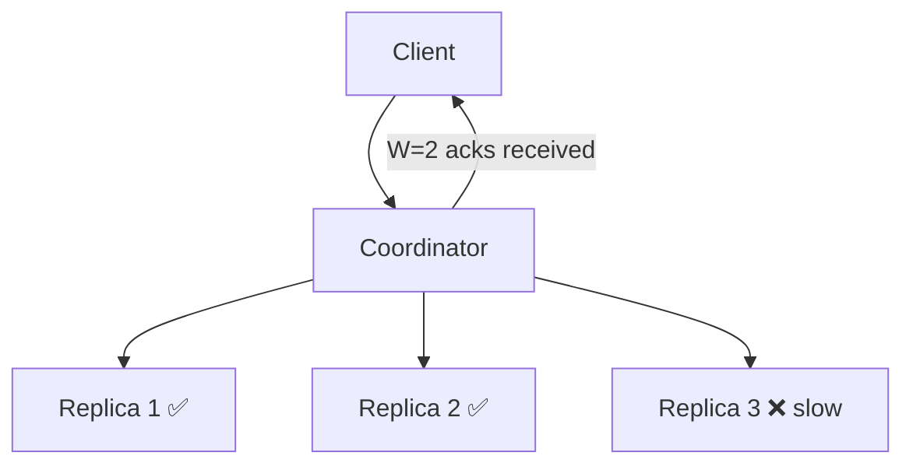
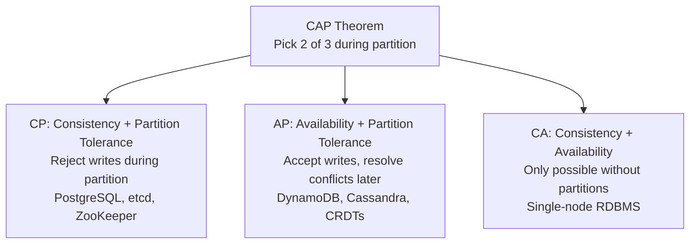

# Consistency Models

Strong vs eventual vs causal consistency, linearizability, quorum reads/writes, and how to choose for your system.

---

## Spectrum of Consistency



---

## Consistency Models Explained

### Strong Consistency (Linearizability)

Every read returns the most recent write. The system behaves as if there's a single copy of data.



**Examples**: PostgreSQL (single node), Raft consensus, Google Spanner
**Cost**: Higher latency, lower availability during partitions

### Eventual Consistency

If no new writes occur, all replicas will eventually converge to the same value. Reads may return stale data.



**Examples**: DynamoDB (default), Cassandra, DNS, CDN caches
**Cost**: Stale reads possible, conflicts possible

### Causal Consistency

If operation A causally precedes B, everyone sees A before B. Concurrent operations may be seen in different orders.



**Examples**: MongoDB (with causal sessions), NATS JetStream
**Use case**: Social feeds, comment threads

---

## Quorum Reads/Writes



```
N = total replicas
W = write quorum (acks needed for write success)
R = read quorum (replicas queried for read)

Strong consistency if: W + R > N
```

| Config | Behavior |
|--------|----------|
| N=3, W=2, R=2 | Strong (2+2 > 3) — overlap guarantees latest |
| N=3, W=1, R=1 | Eventual — fast but may read stale |
| N=3, W=3, R=1 | Strong reads, slow writes |
| N=3, W=1, R=3 | Fast writes, slow reads |

### Example: DynamoDB

```go
// Strong read (reads from leader)
result, _ := client.GetItem(ctx, &dynamodb.GetItemInput{
    TableName:      aws.String("users"),
    Key:            key,
    ConsistentRead: aws.Bool(true), // strong consistency
})

// Eventual read (default — may hit any replica)
result, _ := client.GetItem(ctx, &dynamodb.GetItemInput{
    TableName: aws.String("users"),
    Key:       key,
    // ConsistentRead defaults to false
})
```

---

## CAP Theorem in Practice



**Reality**: Network partitions WILL happen. The real choice is CP vs AP.

---

## Choosing a Consistency Model

| Use Case | Model | Why |
|----------|-------|-----|
| Bank balance | Strong | Can't show wrong balance |
| Shopping cart | Eventual | Merge conflicts OK, availability matters |
| Social feed | Causal | Comments must appear in order |
| Inventory count | Strong | Overselling is expensive |
| User profile | Eventual | Stale name for 1s is fine |
| Leader election | Strong (consensus) | Must agree on one leader |
| DNS | Eventual | TTL-based, propagation delay OK |
| Analytics counters | Eventual | Approximate is fine |

---

## Conflict Resolution Strategies

When eventual consistency leads to conflicts:

| Strategy | How | Example |
|----------|-----|---------|
| Last-Writer-Wins (LWW) | Highest timestamp wins | DynamoDB, Cassandra |
| Application-level merge | Custom logic | Shopping cart union |
| CRDTs | Mathematically conflict-free | Counters, sets |
| Vector clocks | Detect conflicts, ask user | Riak (deprecated) |

---

## Go Implementation: Read-Your-Writes

```go
// Problem: user writes to leader, reads from replica (stale)
// Solution: read-your-writes consistency

type SessionConsistency struct {
    lastWriteTime map[string]time.Time // per-user
}

func (s *SessionConsistency) AfterWrite(userID string) {
    s.lastWriteTime[userID] = time.Now()
}

func (s *SessionConsistency) ShouldReadFromLeader(userID string) bool {
    lastWrite, ok := s.lastWriteTime[userID]
    if !ok {
        return false // no recent write, replica is fine
    }
    // Read from leader for 5s after write (replication lag window)
    return time.Since(lastWrite) < 5*time.Second
}
```
