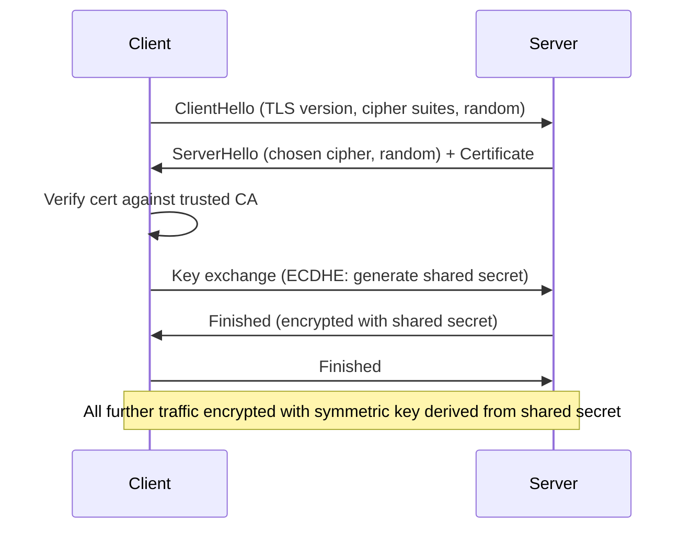
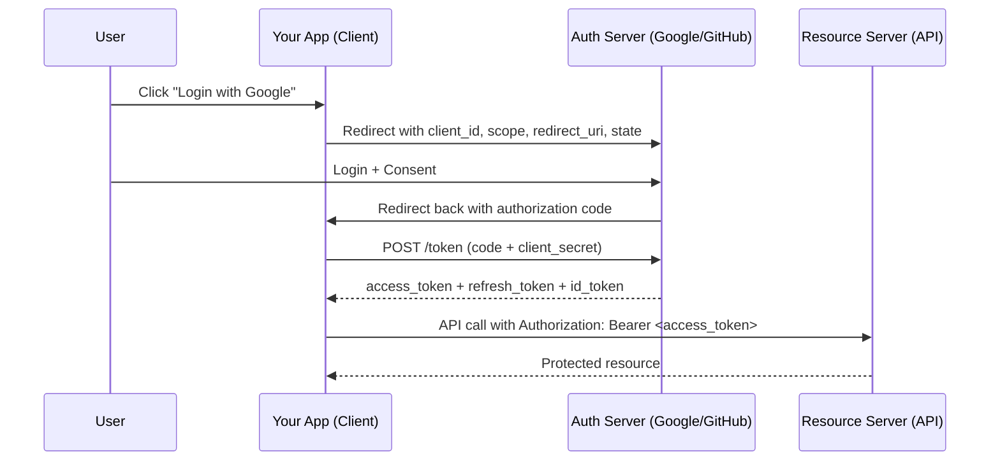

# Cybersecurity Concepts

Core security concepts every backend engineer needs — not just for interviews, but for writing secure systems.

---

## The Fundamentals

### CIA Triad

| Pillar | Meaning | Example breach |
|--------|---------|---------------|
| **Confidentiality** | Data accessible only to authorized parties | Unencrypted DB exposed to internet |
| **Integrity** | Data hasn't been tampered with | MITM modifies API response in transit |
| **Availability** | System accessible when needed | DDoS brings down the service |

### Defence in Depth

Never rely on a single security control. Layer them so that a breach of one doesn't compromise everything.

```
Internet
  └── WAF (block known attack patterns)
        └── Load Balancer (TLS termination, rate limiting)
              └── API Gateway (auth, input validation)
                    └── Service (business logic, least-privilege)
                          └── Database (encrypted at rest, VPC-only, audit logs)
```

Each layer assumes the layer above it may be compromised.

---

## Authentication vs Authorisation

| | Authentication (AuthN) | Authorisation (AuthZ) |
|--|----------------------|----------------------|
| **Question** | Who are you? | What are you allowed to do? |
| **Mechanism** | Password, OAuth2, mTLS, SAML | RBAC, ABAC, IAM policies, ACLs |
| **Example** | JWT proves you are user alice | JWT claims say alice has `role: admin` |
| **Failure** | 401 Unauthorized | 403 Forbidden |

---

## Common Attack Vectors

### Injection (OWASP #1)

Untrusted input interpreted as code/commands.

```go
// VULNERABLE: user input directly in query
query := "SELECT * FROM users WHERE name = '" + userInput + "'"
// Input: ' OR '1'='1  → returns all users

// SAFE: parameterized query
row := db.QueryRow("SELECT * FROM users WHERE name = $1", userInput)
```

Same principle applies to: SQL injection, NoSQL injection, OS command injection, LDAP injection, XPath injection.

### Cross-Site Scripting (XSS)

Malicious script injected into a page served to other users.

```
Stored XSS: attacker posts <script>document.cookie</script> as a comment
            → every user who views the comment executes it

Reflected XSS: https://site.com/search?q=<script>...</script>
               → server reflects input back unescaped

DOM XSS: JavaScript reads location.hash and writes to innerHTML without sanitization
```

**Fix:** escape output, Content-Security-Policy header, HttpOnly cookies.

### Cross-Site Request Forgery (CSRF)

Forces a logged-in user's browser to make an unintended request.

```
1. User is logged into bank.com (has session cookie)
2. User visits evil.com
3. evil.com contains: 
4. Browser sends GET with the bank.com session cookie
5. Transfer executes
```

**Fix:** CSRF tokens (synchronizer pattern), SameSite cookie attribute, check Origin/Referer header.

### SSRF (Server-Side Request Forgery)

Attacker tricks server into making requests to internal resources.

```
POST /fetch-url
{"url": "http://169.254.169.254/latest/meta-data/iam/security-credentials/"}
                    ↑ AWS EC2 metadata endpoint — returns IAM credentials
```

**Fix:** allowlist of permitted domains/IPs, block RFC1918 + link-local ranges, use IMDSv2 on EC2.

### Path Traversal

```
GET /files?name=../../../../etc/passwd
```

**Fix:** canonicalize path, verify it starts with the expected base directory.

### Insecure Deserialization

Deserializing attacker-controlled data triggers code execution (common in Java, PHP, Python pickle).

```python
# VULNERABLE
import pickle
data = receive_from_user()
obj = pickle.loads(data)   # arbitrary code execution if data is crafted
```

**Fix:** never deserialize untrusted data with native serializers; use JSON with explicit schema validation.

---

## Cryptography Basics

### Symmetric vs Asymmetric

| | Symmetric | Asymmetric |
|--|-----------|-----------|
| **Keys** | Same key encrypts + decrypts | Public key encrypts, private key decrypts |
| **Speed** | Fast (AES: GBps) | Slow (RSA: 1000x slower) |
| **Key exchange problem** | How do you share the key securely? | Solved — public key can be shared openly |
| **Use case** | Bulk data encryption (AES-256-GCM) | Key exchange, signatures (RSA, ECDSA) |
| **In TLS** | Session data encrypted with symmetric key | Handshake uses asymmetric to exchange the symmetric key |

### Hashing

One-way function. Same input → same output, but you can't reverse it.

```
MD5:    broken (collisions trivially found) — never use for security
SHA-1:  broken — never use for security
SHA-256: safe for integrity checks, HMAC
SHA-3:  safe
bcrypt/scrypt/argon2: slow by design — use for passwords (adds cost factor + salt)
```

**Never store plaintext passwords. Never store MD5/SHA-1 of passwords.**

```go
// WRONG
db.Save(sha256(password))       // rainbow table attack

// RIGHT
hash, _ := bcrypt.GenerateFromPassword([]byte(password), bcrypt.DefaultCost)
db.Save(hash)
```

### HMAC (Hash-based Message Authentication Code)

Proves a message was created by someone with the secret key AND wasn't tampered with.

```
HMAC-SHA256(key, message) = signature
```

Used in: JWT signatures (HS256), AWS request signing (SigV4), webhook verification.

### TLS Handshake (simplified)



**Forward secrecy:** ECDHE generates a new key pair per session. Even if the server's private key is stolen later, past sessions can't be decrypted.

---

## JWT (JSON Web Token)

```
Header.Payload.Signature
eyJhbGc...  .eyJ1c2VyX2lk...  .SflKxwRJSMeKKF2QT4fwpMeJf36POk6yJV_adQssw5c
```

```json
// Payload (base64 decoded — NOT encrypted, just encoded)
{
  "sub": "user_123",
  "role": "admin",
  "exp": 1718000000,
  "iat": 1717996400
}
```

**Key properties:**
- Stateless — server doesn't need to store session
- Signed (HS256/RS256) — tampering detectable
- NOT encrypted by default — payload is readable by anyone (use JWE for sensitive claims)
- **Expiry (`exp`) is critical** — short-lived tokens limit blast radius of theft

**Common mistakes:**

```
1. Algorithm confusion: server accepts "alg: none" → no signature check
   Fix: explicitly validate alg in verification code

2. Storing in localStorage → XSS can steal it
   Fix: HttpOnly cookie (XSS-proof, but then need CSRF protection)

3. No expiry or very long expiry (exp: year 2099)
   Fix: short TTL (15min access token) + refresh token rotation

4. Trusting claims without verifying signature
   Fix: ALWAYS verify signature before reading claims
```

---

## OAuth2 / OIDC



**Flows:**
| Flow | Use case |
|------|---------|
| Authorization Code + PKCE | Web apps, mobile apps (most common) |
| Client Credentials | Machine-to-machine (no user) |
| Device Code | CLI tools, smart TVs |
| ~~Implicit~~ | Deprecated — don't use |
| ~~Password Grant~~ | Deprecated — don't use |

**OIDC** adds identity on top of OAuth2 — the `id_token` is a JWT with user info (sub, email, name).

---

## Zero Trust

Traditional model: "inside the network = trusted." Zero Trust: **never trust, always verify.**

```
Perimeter model (old):
  Internet → Firewall → Internal network (everything trusted)
  Problem: once attacker is inside, lateral movement is easy

Zero Trust:
  Every request authenticated + authorized regardless of network location
  Principles:
  1. Verify explicitly — always authenticate + authorize (identity, device, location)
  2. Least privilege — JIT/JEA (just-in-time, just-enough-access)
  3. Assume breach — minimize blast radius, encrypt everything, audit everything
```

In Kubernetes: mTLS between all pods (Istio/Cilium), NetworkPolicy, RBAC, IRSA (no static credentials).

---

## OWASP Top 10 (2021)

| # | Category | Quick description |
|---|---------|------------------|
| A01 | Broken Access Control | Users accessing others' data, privilege escalation |
| A02 | Cryptographic Failures | Plaintext passwords, weak ciphers, HTTP instead of HTTPS |
| A03 | Injection | SQL, NoSQL, OS command, LDAP injection |
| A04 | Insecure Design | Missing threat modelling, insecure design patterns |
| A05 | Security Misconfiguration | Default creds, open S3 buckets, verbose errors in prod |
| A06 | Vulnerable Components | Outdated libraries with known CVEs |
| A07 | Auth Failures | Weak passwords, no MFA, session fixation, credential stuffing |
| A08 | Software Integrity Failures | Unsigned updates, insecure CI/CD, deserialization |
| A09 | Logging Failures | No audit logs, not alerting on attacks |
| A10 | SSRF | Server fetching attacker-controlled URLs |

---

## Secrets Management

**Never commit secrets to git.**

```bash
# Detect secrets before commit
git secrets --install
trufflehog git file://. --only-verified

# If a secret is committed:
# 1. Rotate it IMMEDIATELY (assume compromised)
# 2. Use git-filter-repo to scrub history
# 3. Force-push (inform all collaborators)
```

### Secret storage options

| Tool | Where secrets live | Use case |
|------|--------------------|---------|
| AWS Secrets Manager | AWS managed | RDS passwords, API keys with auto-rotation |
| HashiCorp Vault | Self-hosted or HCP | Dynamic secrets, PKI, multi-cloud |
| Kubernetes Secrets | etcd (encrypt at rest) | Pod env vars, mounted files |
| External Secrets Operator | K8s + external store | Sync Vault/AWS SM into K8s Secrets |
| SOPS | Encrypted files in git | GitOps-friendly, encrypted with KMS/age |

**Least privilege:** each service gets its own secret with only the permissions it needs. No shared DB passwords.

---

## Network Security

### Ports and protocols to know

| Port | Protocol | Notes |
|------|---------|-------|
| 22 | SSH | Never expose to 0.0.0.0 — use bastion or SSM |
| 80 | HTTP | Redirect to 443, never serve sensitive content |
| 443 | HTTPS | TLS 1.2 minimum, prefer TLS 1.3 |
| 3306/5432 | MySQL/PostgreSQL | VPC-only, never public |
| 6379 | Redis | No auth by default — always in private subnet + requirepass |
| 27017 | MongoDB | Auth disabled by default in old versions |

### Security Headers

```
Strict-Transport-Security: max-age=31536000; includeSubDomains  # HSTS
Content-Security-Policy: default-src 'self'                      # XSS mitigation
X-Frame-Options: DENY                                            # Clickjacking
X-Content-Type-Options: nosniff                                  # MIME sniffing
Referrer-Policy: strict-origin-when-cross-origin
Permissions-Policy: geolocation=(), camera=()
```

---

## Threat Modelling (STRIDE)

Before building a system, ask: what can go wrong?

| Threat | Meaning | Example |
|--------|---------|---------|
| **S**poofing | Pretending to be someone else | Forged JWT, ARP spoofing |
| **T**ampering | Modifying data in transit or at rest | MITM modifying API response |
| **R**epudiation | Denying an action occurred | No audit logs, user claims they didn't delete data |
| **I**nformation disclosure | Data leakage | Verbose error messages exposing stack trace, S3 bucket public |
| **D**enial of Service | Making system unavailable | DDoS, regex DoS (ReDoS), resource exhaustion |
| **E**levation of privilege | Gaining more access than allowed | IDOR, SQL injection → admin access |

For each component in your system diagram, go through STRIDE and ask "how could an attacker exploit this?"

---

## Secure Coding Checklist

```
Input validation
  □ Validate all input on the server side (never trust client)
  □ Use parameterized queries for DB
  □ Whitelist allowed characters where possible

Authentication
  □ Passwords: bcrypt/argon2 with cost factor ≥ 12
  □ Tokens: short TTL, signed, verified on every request
  □ MFA for admin/privileged accounts
  □ Rate-limit login attempts (prevent brute force)

Authorization
  □ Check permissions on every request, not just at login
  □ Default deny — require explicit grant
  □ Validate ownership (user can only access their own data)

Transport
  □ HTTPS everywhere, HSTS header
  □ TLS 1.2 minimum (TLS 1.3 preferred)
  □ Certificate pinning for mobile apps (high-value targets)

Secrets
  □ No secrets in code, env files in git, or logs
  □ Rotate regularly, rotate immediately on suspected exposure
  □ Least-privilege service accounts

Dependencies
  □ Pin versions, audit with govulncheck / npm audit / trivy
  □ Don't import packages you don't understand

Logging & monitoring
  □ Log auth events (success + failure)
  □ Log privilege escalation attempts
  □ Alert on anomalies (spike in 401s, unusual data access patterns)
  □ Never log sensitive data (passwords, tokens, PII)
```

---

## SSH Hardening

See **[`ssh-hardening.md`](./ssh-hardening.md)** for the full deep-dive: weak algorithm analysis, ETM vs non-ETM, post-quantum KEX, sshd_config hardening block, and host key regeneration.

| Section | What's covered |
|---------|---------------|
| Why each algorithm is flagged | NIST curve backdoor concern, SHA-1 collision math, padding oracle, birthday bound for umac-64, harvest-now-decrypt-later |
| ETM vs non-ETM | Step-by-step padding oracle attack, O(256×block) complexity, why ETM stops it |
| SSH handshake diagram | Full algorithm negotiation sequence |
| sshd_config block | Drop-in config removing all flagged algorithms |
| Host key regeneration | Remove ECDSA, generate Ed25519 + RSA-4096 |

---

## Index

| File | Topics |
|------|--------|
| [README.md](./README.md) | CIA triad, AuthN vs AuthZ, OWASP Top 10, JWT, OAuth2, Zero Trust, CSRF, XSS, SSRF, secrets management |
| [ssh-hardening.md](./ssh-hardening.md) | Weak algorithm analysis, ETM math, post-quantum KEX, sshd_config, key regeneration |
| [tls-hardening.md](./tls-hardening.md) | TLS 1.2 vs 1.3 handshake, cipher suites, forward secrecy DH math, cert chain, HSTS, security bits table |
| [mtls.md](./mtls.md) | One-way vs mutual TLS, SPIFFE/SPIRE, X.509 signature math, mTLS handshake, Istio/Envoy, Go code |
| [dns-security.md](./dns-security.md) | DNS resolution flow, Kaminsky attack math, DNSSEC chain of trust, DoH vs DoT, DNS rebinding |
| [pki-certificates.md](./pki-certificates.md) | PKI hierarchy, RSA math, X.509 structure, CT Merkle proofs, CRL vs OCSP vs stapling, cert-manager |
| [api-security.md](./api-security.md) | API auth comparison, token bucket math, OWASP API Top 10, HMAC request signing, Go middleware chain |
| [supply-chain-security.md](./supply-chain-security.md) | Dependency confusion, typosquatting, SBOMs, Sigstore/cosign math, SLSA levels, Go govulncheck |
| [container-security.md](./container-security.md) | Namespaces + cgroups, capabilities, seccomp, privileged escape, rootless uid math, Falco |
| [cloud-misconfigurations.md](./cloud-misconfigurations.md) | S3 exposure, IMDSv1 SSRF math, IAM privilege escalation, RDS snapshots, GuardDuty auto-remediation |
| [kubernetes-security.md](./kubernetes-security.md) | API server attack surface, RBAC, PodSecurity, NetworkPolicy, etcd encryption, audit logging |
| [privilege-escalation.md](./privilege-escalation.md) | SUID math, sudo LD_PRELOAD, cron wildcard injection, PATH hijacking, dirty cow race condition |
| [incident-response.md](./incident-response.md) | IR lifecycle, z-score anomaly detection, order of volatility, IOC/beaconing math, MTTD/MTTR |
