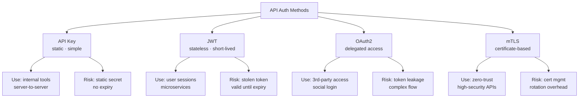
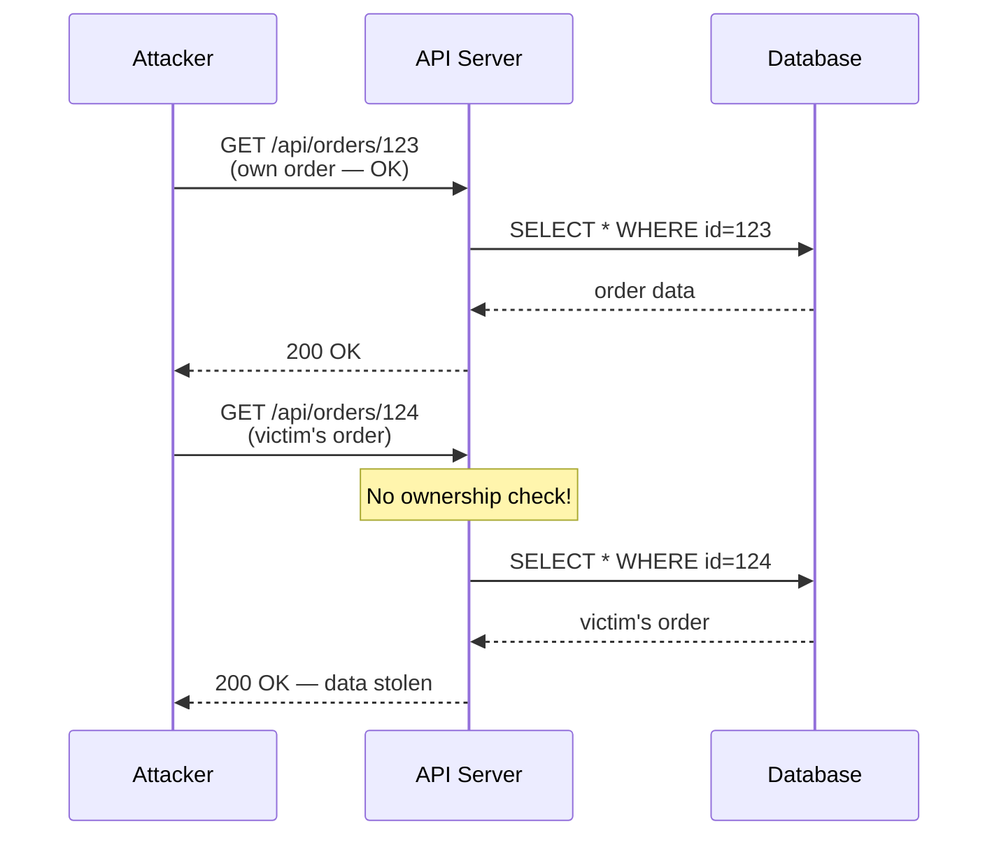
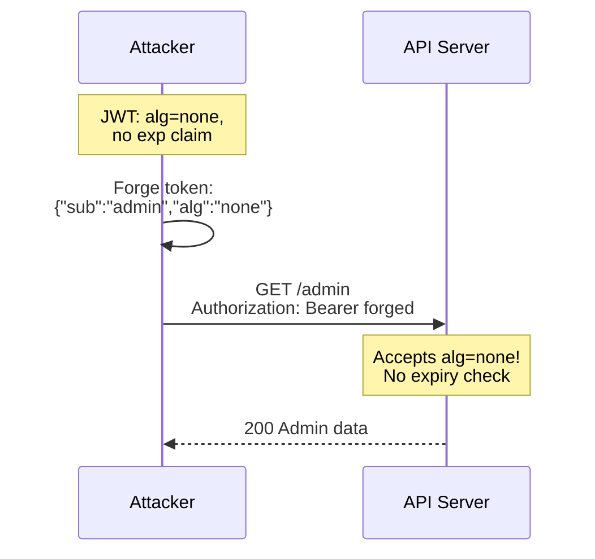
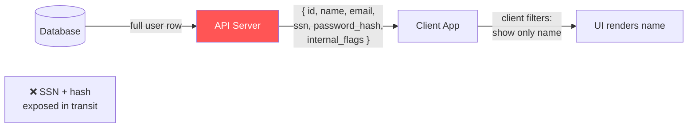
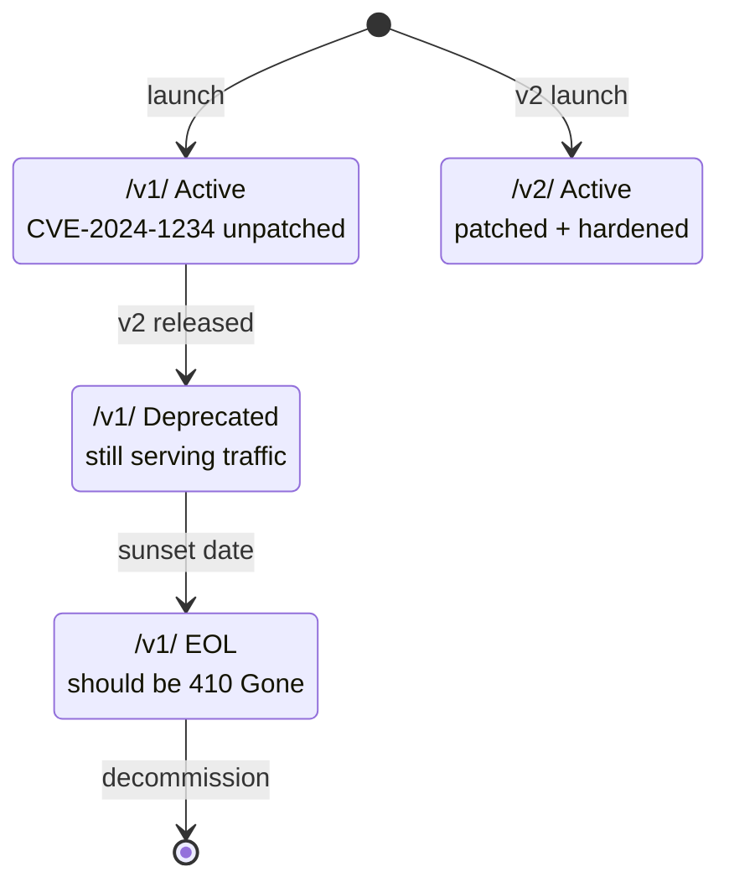
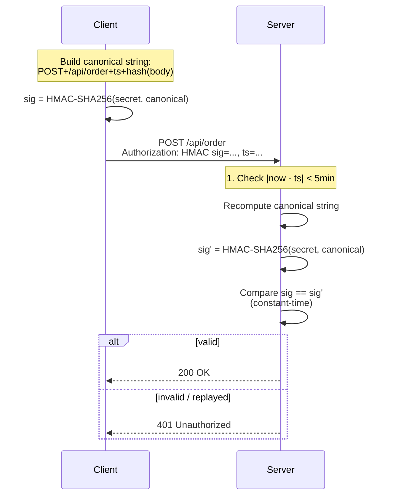
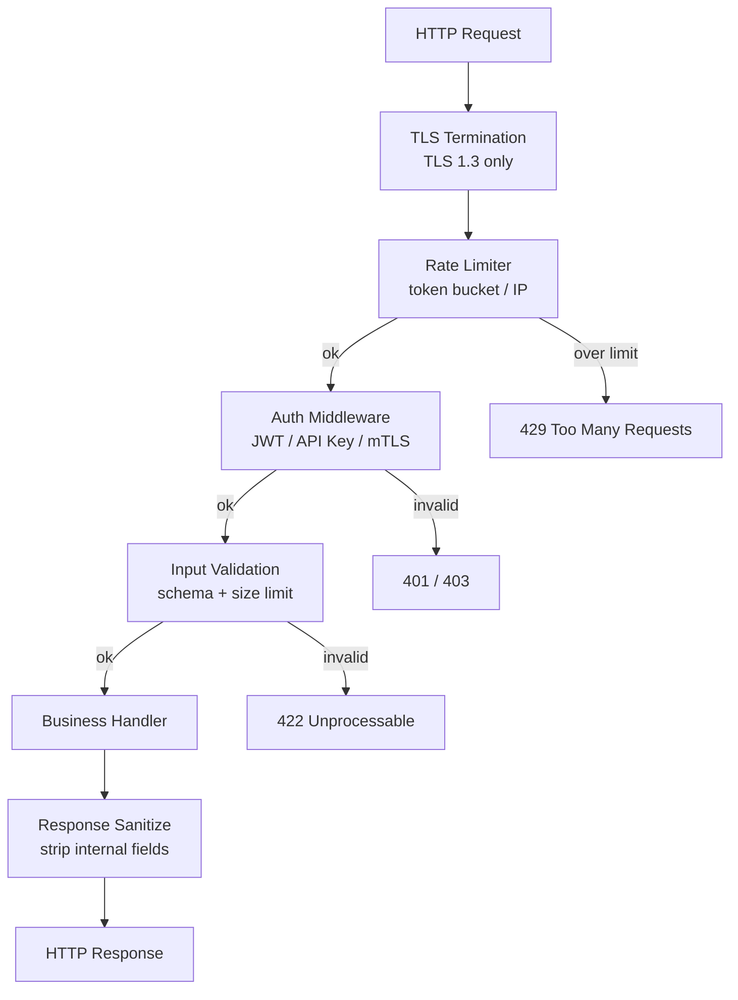

# API Security

## 1. API Authentication Comparison



| Method | Stateless | Expiry | Delegation | Complexity |
|--------|-----------|--------|------------|------------|
| API Key | ✅ | ❌ manual | ❌ | Low |
| JWT | ✅ | ✅ exp claim | ❌ | Medium |
| OAuth2 | ✅ | ✅ access token | ✅ | High |
| mTLS | ✅ | ✅ cert expiry | ❌ | Very High |

**Decision rule:**
- Internal scripts / CI → **API Key**
- User-facing sessions / microservices → **JWT**
- Third-party integrations (GitHub, Google) → **OAuth2**
- Financial / healthcare / zero-trust service mesh → **mTLS**

---

## 2. Rate Limiting — Token Bucket

### Algorithm

```
tokens = min(capacity, tokens + rate × elapsed)

if tokens >= 1:
    tokens -= 1
    allow request
else:
    reject 429 Too Many Requests
```

**Burst capacity:** the bucket holds up to `capacity` tokens. A burst of requests drains it instantly; the refill rate `rate` (tokens/sec) governs sustained throughput.

```mermaid
flowchart TD
    REQ[Incoming Request]
    CALC[tokens = min(cap,<br/>tokens + rate×Δt)]
    CHECK{tokens >= 1?}
    ALLOW[Allow<br/>tokens -= 1]
    REJECT[Reject 429]
    STORE[Store tokens<br/>+ timestamp]

    REQ --> CALC --> CHECK
    CHECK -->|yes| ALLOW --> STORE
    CHECK -->|no| REJECT
```

**Example — burst=10, rate=2/sec:**

| t (s) | Tokens before | Requests | Tokens after |
|-------|--------------|----------|--------------|
| 0 | 10 | 10 burst | 0 |
| 1 | 2 | 2 | 0 |
| 3 | 4 | 1 | 3 |

```go
type TokenBucket struct {
    capacity float64
    tokens   float64
    rate     float64 // tokens per second
    last     time.Time
    mu       sync.Mutex
}

func (b *TokenBucket) Allow() bool {
    b.mu.Lock()
    defer b.mu.Unlock()
    elapsed := time.Since(b.last).Seconds()
    b.last = time.Now()
    b.tokens = math.Min(b.capacity, b.tokens+b.rate*elapsed)
    if b.tokens >= 1 {
        b.tokens--
        return true
    }
    return false
}
```

---

## 3. OWASP API Top 10

| # | Name | Impact |
|---|------|--------|
| API1 | Broken Object Level Auth (BOLA) | Horizontal privilege escalation |
| API2 | Broken Authentication | Account takeover |
| API3 | Broken Object Property Level Auth | Mass assignment, over-exposure |
| API4 | Unrestricted Resource Consumption | DoS, cost explosion |
| API5 | Broken Function Level Auth | Vertical privilege escalation |
| API6 | Unrestricted Access to Sensitive Flows | OTP bypass, brute-force |
| API7 | Server-Side Request Forgery (SSRF) | Internal network access |
| API8 | Security Misconfiguration | Data leakage, RCE |
| API9 | Improper Inventory Management | Stale /v1/ with unpatched vulns |
| API10 | Unsafe Consumption of APIs | Supply-chain attacks |

### Attack Flow: BOLA (API1)



**Fix:** always check `order.userID == authenticatedUserID` before returning.

### Attack Flow: Broken Auth (API2)



**Fix:** reject `alg=none`, enforce `exp`, use short TTLs (15 min), rotate signing keys.

### Attack Flow: Excessive Data Exposure (API3)



**Fix:** use response DTOs / projections — never serialize full ORM objects.

---

## 4. Input Validation

### Regex Injection Attack

```
# Attacker sends: username = "a(b+)+c"
# Server runs:   regexp.MatchString("^" + input + "$", longString)
# Result:        ReDoS — catastrophic backtracking, CPU 100%
```

**Fix:** never interpolate user input into regex patterns. Compile patterns statically.

### JSON Schema Validation

```json
{
  "$schema": "http://json-schema.org/draft-07/schema",
  "type": "object",
  "required": ["email", "age"],
  "additionalProperties": false,
  "properties": {
    "email": { "type": "string", "format": "email", "maxLength": 254 },
    "age":   { "type": "integer", "minimum": 0, "maximum": 150 }
  }
}
```

`additionalProperties: false` blocks mass-assignment attacks.

### Go — Validation with `go-playground/validator`

```go
import (
    "github.com/go-playground/validator/v10"
)

type CreateUserReq struct {
    Email string `json:"email" validate:"required,email,max=254"`
    Age   int    `json:"age"   validate:"required,min=0,max=150"`
    Name  string `json:"name"  validate:"required,alphanum,max=50"`
}

var validate = validator.New()

func handleCreateUser(w http.ResponseWriter, r *http.Request) {
    var req CreateUserReq
    if err := json.NewDecoder(r.Body).Decode(&req); err != nil {
        http.Error(w, "bad JSON", http.StatusBadRequest)
        return
    }
    if err := validate.Struct(req); err != nil {
        http.Error(w, err.Error(), http.StatusUnprocessableEntity)
        return
    }
    // safe to use req
}
```

**Additional rules:**
- Whitelist allowed characters; reject on fail
- Set `http.MaxBytesReader` to cap body size (e.g., 1 MB)
- Sanitize HTML output with `html/template` (auto-escaping)

---

## 5. API Versioning Exposure



**Typical failure:** `/v1/` stays live indefinitely. Attackers enumerate versions:

```
GET /v1/admin/users   → 200 (unpatched BOLA)
GET /v2/admin/users   → 403 (patched)
```

**Mitigations:**
- Set hard sunset dates; return `Sunset` response header
- Return `410 Gone` after EOL (not 404 — be explicit)
- Monitor traffic to deprecated endpoints; alert on usage
- Rotate secrets that existed in v1

---

## 6. Request Signing (HMAC / AWS SigV4-style)

### Signature Construction

```
canonical_request = METHOD + "\n"
                  + PATH   + "\n"
                  + TIMESTAMP + "\n"
                  + hex(SHA256(body))

signature = HMAC-SHA256(secret_key, canonical_request)

Authorization: HMAC-SHA256 key=<key_id>, sig=<signature>, ts=<timestamp>
```



**Replay protection:** reject requests where `|server_time - timestamp| > 5 minutes`. Optionally cache seen nonces.

```go
func sign(secret, method, path, timestamp, body string) string {
    h := sha256.Sum256([]byte(body))
    canonical := method + "\n" + path + "\n" + timestamp + "\n" + hex.EncodeToString(h[:])
    mac := hmac.New(sha256.New, []byte(secret))
    mac.Write([]byte(canonical))
    return hex.EncodeToString(mac.Sum(nil))
}

func verify(secret, method, path, timestamp, body, receivedSig string) bool {
    ts, _ := strconv.ParseInt(timestamp, 10, 64)
    if time.Now().Unix()-ts > 300 { // 5-minute window
        return false
    }
    expected := sign(secret, method, path, timestamp, body)
    return hmac.Equal([]byte(expected), []byte(receivedSig))
}
```

---

## 7. Go Secure API Middleware Chain



### Implementation Skeleton

```go
func SecureChain(rl *TokenBucket, secret string) http.Handler {
    return http.HandlerFunc(func(w http.ResponseWriter, r *http.Request) {
        // 1. Rate limit
        if !rl.Allow() {
            w.Header().Set("Retry-After", "1")
            http.Error(w, "rate limit exceeded", http.StatusTooManyRequests)
            return
        }
        // 2. Auth
        claims, err := parseJWT(r.Header.Get("Authorization"), secret)
        if err != nil {
            http.Error(w, "unauthorized", http.StatusUnauthorized)
            return
        }
        // 3. Input validation (per-handler, shown here generically)
        r = r.WithContext(context.WithValue(r.Context(), claimsKey, claims))
        // 4. Handler (injected)
        businessHandler(w, r)
        // 5. Response sanitization handled inside businessHandler via DTO
    })
}

// Security headers added via separate middleware
func SecurityHeaders(next http.Handler) http.Handler {
    return http.HandlerFunc(func(w http.ResponseWriter, r *http.Request) {
        w.Header().Set("X-Content-Type-Options", "nosniff")
        w.Header().Set("X-Frame-Options", "DENY")
        w.Header().Set("Content-Security-Policy", "default-src 'none'")
        w.Header().Set("Strict-Transport-Security", "max-age=31536000; includeSubDomains")
        next.ServeHTTP(w, r)
    })
}
```

---

## Quick Reference Checklist

| Category | Check |
|----------|-------|
| Auth | JWT: short exp, strong alg (RS256/ES256), reject alg=none |
| Auth | mTLS for service-to-service in zero-trust environments |
| Rate limiting | Token bucket per IP + per API key |
| Rate limiting | Return `Retry-After` header on 429 |
| BOLA | Always filter by authenticated user ID, not just URL param |
| Input | Validate schema, types, ranges; `additionalProperties: false` |
| Input | `MaxBytesReader(1MB)` on all request bodies |
| Signing | HMAC-SHA256 + timestamp window (5 min) for sensitive mutations |
| Versioning | Sunset headers; hard 410 after EOL; monitor deprecated routes |
| Headers | HSTS, X-Content-Type-Options, CSP, X-Frame-Options |
| Logging | Log auth failures with IP; alert on spike; never log secrets |
