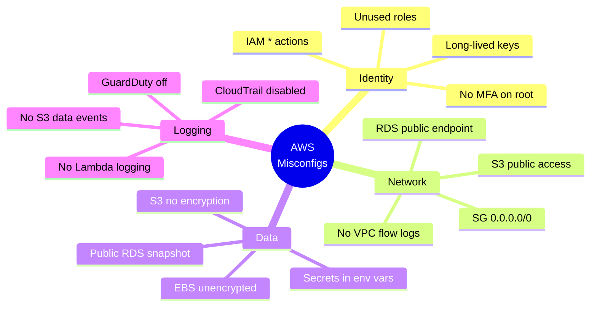
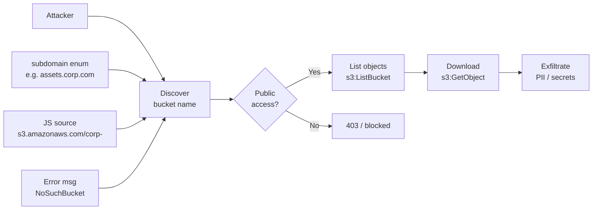
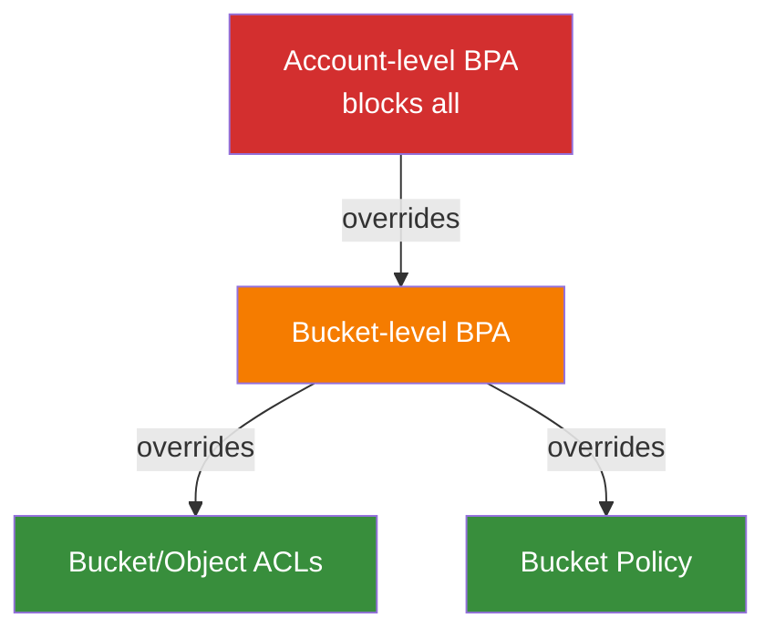
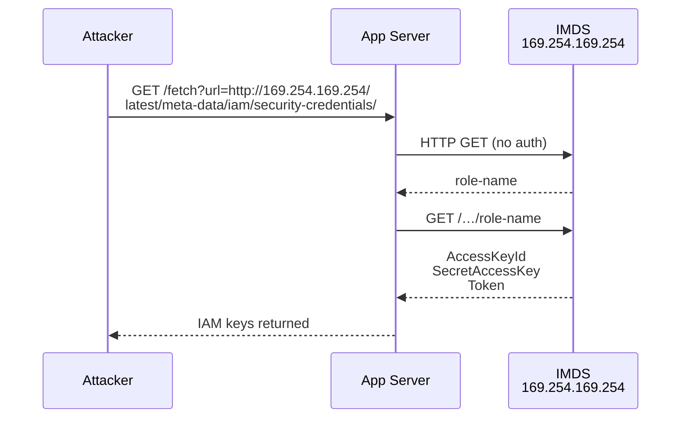
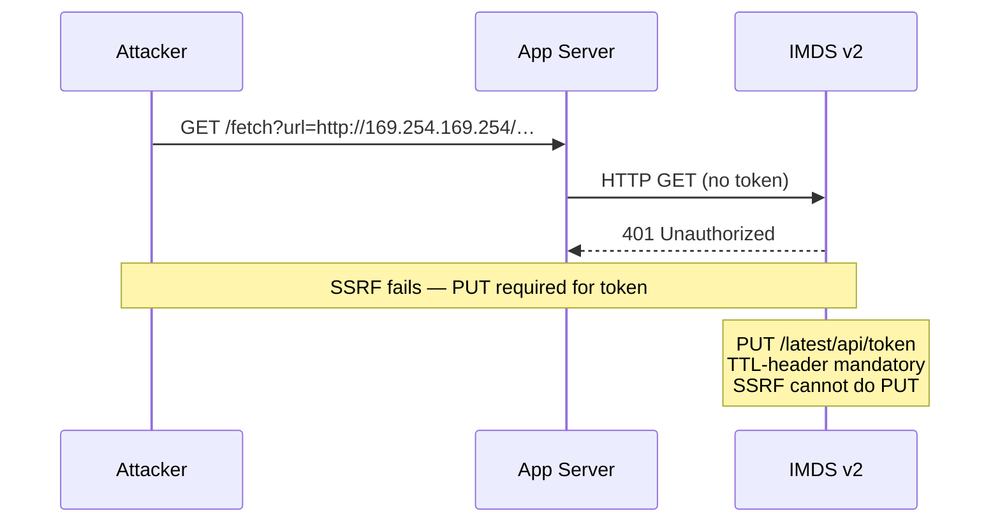
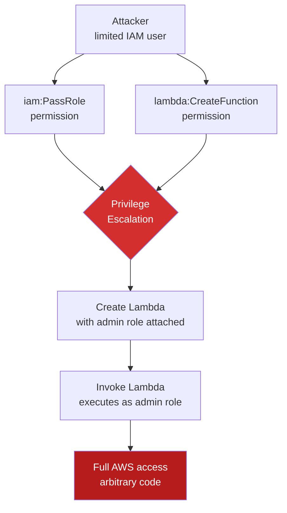
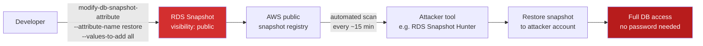
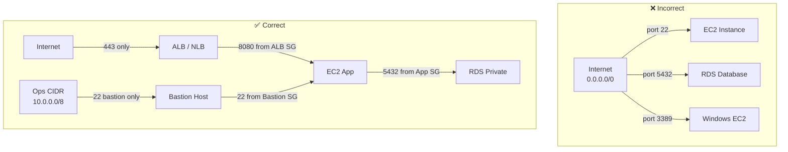
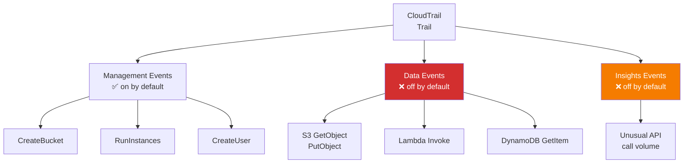
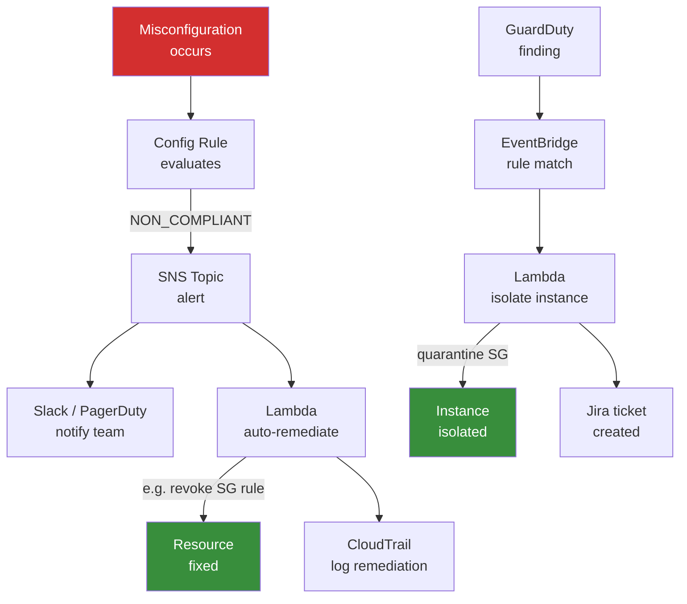

# AWS Cloud Misconfigurations

> **Level:** SDE-2 | **Domain:** Security / Cloud

---

## 1. Misconfiguration Taxonomy



| Category | Top Risk | Quick Fix |
|----------|----------|-----------|
| Identity | `"Action": "*"` IAM policies | Least-privilege; SCPs |
| Network | SG port 22 open to world | Restrict to known CIDRs / bastion |
| Data | Public S3 bucket | Block Public Access at account level |
| Logging | CloudTrail management-only | Enable data events for S3 + Lambda |

---

## 2. S3 Bucket Misconfiguration

### Attack Flow



### Block Public Access — Settings Hierarchy



**Four BPA flags** (all should be `true`):

| Flag | Blocks |
|------|--------|
| `BlockPublicAcls` | New public ACLs |
| `IgnorePublicAcls` | Existing public ACLs |
| `BlockPublicPolicy` | New public bucket policies |
| `RestrictPublicBuckets` | Cross-account public access |

```bash
# Enforce at account level
aws s3control put-public-access-block \
  --account-id 123456789012 \
  --public-access-block-configuration \
    BlockPublicAcls=true,IgnorePublicAcls=true,\
    BlockPublicPolicy=true,RestrictPublicBuckets=true
```

---

## 3. IMDSv1 vs IMDSv2 — SSRF Attack Path

### IMDSv1 SSRF (no token required)



### IMDSv2 Blocks SSRF



### Risk Model

```
IMDSv1 risk = P(SSRF exists) × P(metadata reachable)
                                 ↑ ~1.0 (always reachable)

IMDSv2 risk = P(SSRF exists) × P(SSRF can do PUT with headers)
                                 ↑ ~0.0 (standard SSRF is GET-only)
```

**Enforcement:**

```bash
# Require IMDSv2 on existing instance
aws ec2 modify-instance-metadata-options \
  --instance-id i-1234567890abcdef0 \
  --http-tokens required \
  --http-put-response-hop-limit 1

# Enforce via Launch Template
aws ec2 create-launch-template-version \
  --launch-template-id lt-xxx \
  --launch-template-data '{"MetadataOptions":{"HttpTokens":"required"}}'
```

---

## 4. Overpermissioned IAM

### Dangerous vs Least-Privilege Policy

```json
// ❌ Wildcard — grants everything
{
  "Effect": "Allow",
  "Action": "*",
  "Resource": "*"
}

// ✅ Least-privilege
{
  "Effect": "Allow",
  "Action": ["s3:GetObject", "s3:PutObject"],
  "Resource": "arn:aws:s3:::my-bucket/*"
}
```

### Privilege Escalation: PassRole + CreateFunction



**Other dangerous permission combos:**

| Permission A | Permission B | Result |
|---|---|---|
| `iam:PassRole` | `ec2:RunInstances` | Launch EC2 as any role |
| `iam:PassRole` | `glue:CreateJob` | Run Glue job as any role |
| `iam:CreatePolicyVersion` | — | Overwrite policy with `*` |
| `iam:AttachUserPolicy` | — | Attach managed admin policy to self |

**Detection:** AWS IAM Access Analyzer + `cloudsplaining` tool.

---

## 5. Public RDS Snapshots

### Exposure Mechanism



### Attacker Enumeration

```bash
# Attackers run this to find public snapshots
aws rds describe-db-snapshots \
  --snapshot-type public \
  --region us-east-1 \
  --query 'DBSnapshots[?contains(DBSnapshotIdentifier,`corp`)]'
```

### AWS Config Rule Detection

```json
{
  "ConfigRuleName": "rds-snapshots-public-prohibited",
  "Source": {
    "Owner": "AWS",
    "SourceIdentifier": "RDS_SNAPSHOTS_PUBLIC_PROHIBITED"
  }
}
```

**Auto-remediation SSM document:** `AWS-DisablePublicAccessForRDSSnapshot`

---

## 6. Security Group Misconfigurations

### Dangerous Open Ports

| Port | Service | Risk |
|------|---------|------|
| 22 | SSH | Brute-force, credential stuffing |
| 3389 | RDP | BlueKeep, ransomware entry |
| 5432 | PostgreSQL | Direct DB access, SQL injection |
| 27017 | MongoDB | Unauthenticated access common |
| 0 | All traffic | Full exposure |

### Correct vs Incorrect SG Design



```bash
# Detect with AWS Config managed rule
aws configservice put-config-rule --config-rule '{
  "ConfigRuleName": "restricted-ssh",
  "Source": {"Owner":"AWS","SourceIdentifier":"INCOMING_SSH_DISABLED"}
}'

# Audit open SGs with CLI
aws ec2 describe-security-groups \
  --filters Name=ip-permission.cidr,Values='0.0.0.0/0' \
  --query 'SecurityGroups[*].[GroupId,GroupName,IpPermissions]'
```

---

## 7. CloudTrail Gaps

### What Is / Isn't Logged by Default



### Attacker Blind Spots

| Action | Logged? | Attacker Advantage |
|--------|---------|-------------------|
| `s3:GetObject` (data exfil) | ❌ default | Silently download all objects |
| `lambda:InvokeFunction` | ❌ default | Run malicious Lambda undetected |
| `dynamodb:GetItem` | ❌ default | Query DB without trace |
| `ec2:DescribeInstances` | ✅ | Recon is visible |
| `iam:CreateUser` | ✅ | Persistence attempt visible |

### Enable Data Events

```bash
aws cloudtrail put-event-selectors \
  --trail-name my-trail \
  --event-selectors '[
    {
      "ReadWriteType": "All",
      "IncludeManagementEvents": true,
      "DataResources": [
        {"Type": "AWS::S3::Object", "Values": ["arn:aws:s3:::"]},
        {"Type": "AWS::Lambda::Function", "Values": ["arn:aws:lambda"]}
      ]
    }
  ]'
```

**Additional gaps:**
- Route53 DNS query logs (off by default)
- VPC Flow Logs (off by default — set to `ACCEPT/REJECT ALL`)
- RDS slow query / error logs
- CloudFront access logs

---

## 8. Detection: AWS Config + GuardDuty Auto-Remediation

### Detection & Response Pipeline



### Key GuardDuty Finding Types

| Finding | Indicates |
|---------|-----------|
| `UnauthorizedAccess:IAMUser/ConsoleLoginSuccess.B` | Login from unusual location |
| `Recon:IAMUser/MaliciousIPCaller` | Recon from known bad IP |
| `CredentialAccess:EC2/MetadataDNSRebind` | IMDS DNS rebind attack |
| `Exfiltration:S3/MaliciousIPCaller` | Data exfil to bad IP |
| `Persistence:IAMUser/UserPermissions` | Attacker adding permissions |

### Lambda Auto-Remediation Skeleton

```python
import boto3, json

def handler(event, context):
    detail = event['detail']
    config_item = detail['configurationItem']
    resource_type = config_item['resourceType']

    if resource_type == 'AWS::EC2::SecurityGroup':
        remediate_sg(config_item['resourceId'])
    elif resource_type == 'AWS::S3::Bucket':
        remediate_s3(config_item['resourceId'])

def remediate_sg(sg_id):
    ec2 = boto3.client('ec2')
    sg = ec2.describe_security_groups(GroupIds=[sg_id])['SecurityGroups'][0]
    for perm in sg['IpPermissions']:
        for r in perm.get('IpRanges', []):
            if r['CidrIp'] in ('0.0.0.0/0', '::/0') and perm.get('FromPort') == 22:
                ec2.revoke_security_group_ingress(GroupId=sg_id, IpPermissions=[perm])

def remediate_s3(bucket):
    s3 = boto3.client('s3control',
        region_name='us-east-1')
    # Enable BPA on bucket
    boto3.client('s3').put_public_access_block(
        Bucket=bucket,
        PublicAccessBlockConfiguration={
            'BlockPublicAcls': True, 'IgnorePublicAcls': True,
            'BlockPublicPolicy': True, 'RestrictPublicBuckets': True
        }
    )
```

---

## Quick-Reference Checklist

```
Identity
  [ ] No IAM wildcard Action/Resource in policies
  [ ] MFA on root + all human users
  [ ] Rotate/delete unused access keys (>90 days)
  [ ] Use IAM roles for EC2/Lambda (no embedded keys)
  [ ] Enable IAM Access Analyzer

Network
  [ ] No SG inbound 0.0.0.0/0 on 22/3389/5432
  [ ] S3 Block Public Access ON at account level
  [ ] VPC Flow Logs enabled (ACCEPT + REJECT)
  [ ] RDS not publicly accessible

Data
  [ ] S3 default encryption (SSE-S3 minimum, SSE-KMS preferred)
  [ ] EBS volumes encrypted at launch
  [ ] RDS snapshots private
  [ ] Secrets in Secrets Manager, not env vars

Logging
  [ ] CloudTrail in all regions + S3 data events
  [ ] GuardDuty enabled in all regions
  [ ] AWS Config rules deployed
  [ ] CloudWatch alarms on root login, config changes

Compute
  [ ] IMDSv2 required (HttpTokens=required)
  [ ] IMDS hop limit = 1 (blocks container escape)
  [ ] No public ECR repositories with sensitive images
```
