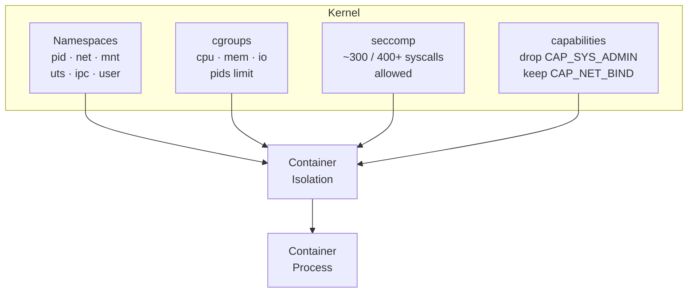
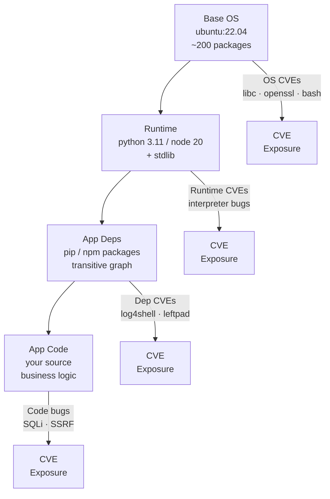
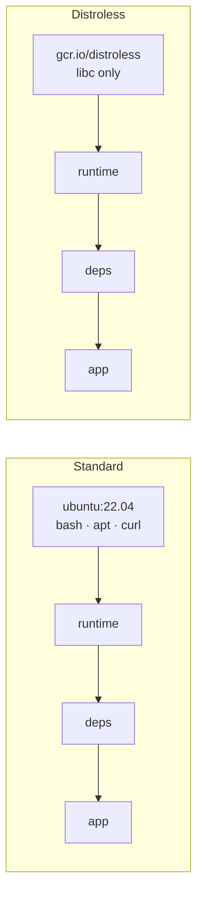
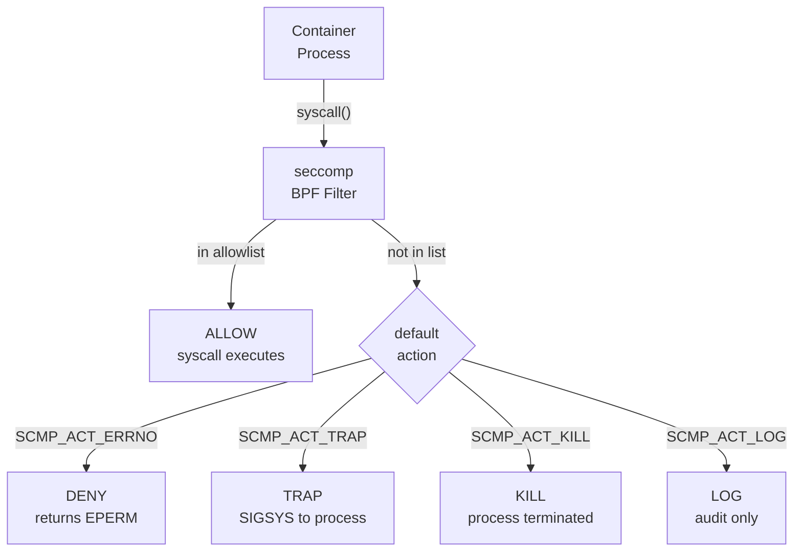
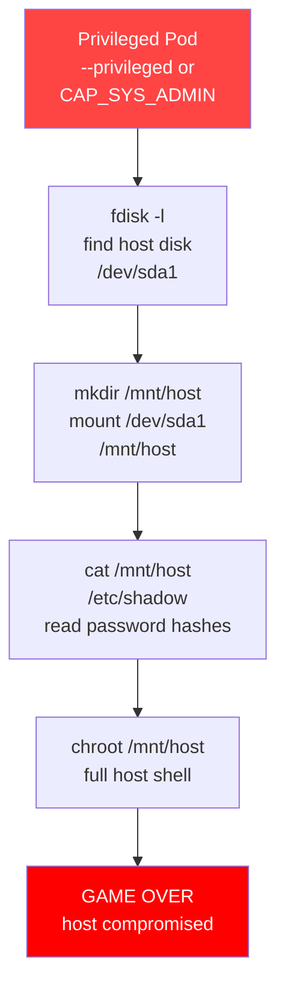
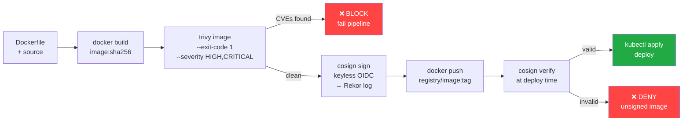
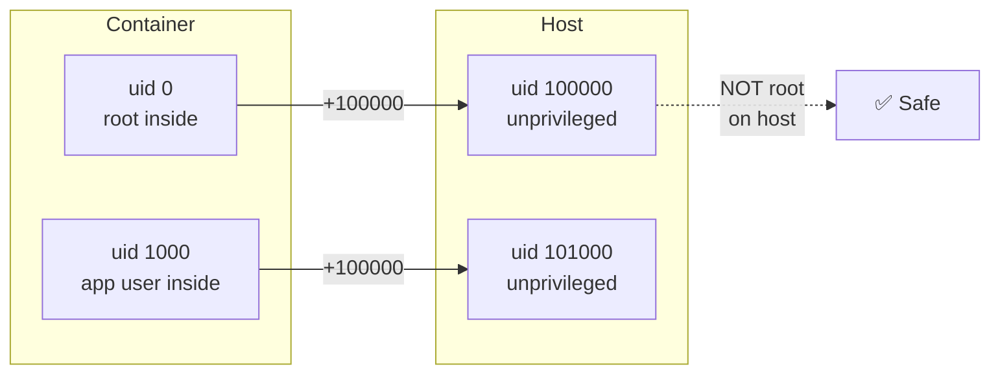

# Container Security

> How containers are isolated, where they fail, and how to harden them.

---

## 1. Container Isolation Model

A container is **not a VM**. It is a process on the host kernel, isolated by a stack of Linux primitives.

```
isolation = namespaces + cgroups + seccomp + capabilities
```



### What each primitive does

| Primitive | What it isolates |
|-----------|-----------------|
| **pid namespace** | Process tree — container PID 1 ≠ host PID 1 |
| **net namespace** | Network stack — own interfaces, routes, iptables |
| **mnt namespace** | Filesystem mount points |
| **uts namespace** | Hostname and domain name |
| **ipc namespace** | POSIX message queues, SysV semaphores |
| **user namespace** | UID/GID mapping (root inside ≠ root outside) |
| **cgroups** | Resource limits — CPU, memory, pids, blkio |
| **seccomp** | Syscall allowlist — block dangerous kernel calls |
| **capabilities** | Fine-grained privilege — split root into 40 caps |

### seccomp math

```
Total Linux syscalls (x86_64):  ~440
Docker default profile allows:  ~300
Blocked by default:             ~140

Reduction = (440 - 300) / 440 ≈ 32% of attack surface removed
```

Blocked examples: `ptrace`, `kexec_load`, `mount`, `reboot`, `swapon`, `clone` (with CLONE_NEWUSER without privilege).

---

## 2. Image Attack Surface

Every layer in a container image is a potential source of CVEs.



### Distroless removes the base OS layer



**Distroless** (`gcr.io/distroless/base`) ships only the C runtime and CA certs — no shell, no package manager, no coreutils. An attacker who gains code execution has no `bash`, `curl`, or `wget` to pivot with.

```dockerfile
# Multi-stage: build in full image, run in distroless
FROM golang:1.22 AS builder
WORKDIR /app
COPY . .
RUN CGO_ENABLED=0 go build -o server .

FROM gcr.io/distroless/static:nonroot
COPY --from=builder /app/server /server
USER nonroot
ENTRYPOINT ["/server"]
```

### CVE exposure by layer

| Layer | Example CVE | Impact |
|-------|------------|--------|
| Base OS (libc) | CVE-2023-4911 (Looney Tunables) | LPE via GLIBC_TUNABLES |
| Base OS (openssl) | CVE-2022-0778 (infinite loop) | DoS |
| Runtime (Python) | CVE-2023-40217 (TLS bypass) | Auth bypass |
| App dep (log4j) | CVE-2021-44228 (Log4Shell) | RCE |

---

## 3. Linux Capabilities Model

Before capabilities, Linux had a binary: **root** (uid=0) or **non-root**. Capabilities split root privilege into ~40 independent units.

```
root ≡ ALL capabilities granted
non-root ≡ NO capabilities (by default)
container ≡ subset of capabilities (principle of least privilege)
```

### Docker default capability set (granted)

`CHOWN`, `DAC_OVERRIDE`, `FSETID`, `FOWNER`, `MKNOD`, `NET_RAW`, `SETGID`, `SETUID`, `SETFCAP`, `SETPCAP`, `NET_BIND_SERVICE`, `SYS_CHROOT`, `KILL`, `AUDIT_WRITE`

### Dangerous capabilities

| Capability | What it allows | Risk |
|------------|---------------|------|
| `CAP_SYS_ADMIN` | Mount filesystems, set hostname, load kernel modules, `ptrace`, `perf_event_open` | Near-full root. Container escape trivial. |
| `CAP_NET_ADMIN` | Modify routing, configure interfaces, packet sniffing | Intercept host/cluster traffic |
| `CAP_SYS_PTRACE` | `ptrace()` any process in namespace | Dump secrets from other containers on same host |
| `CAP_SYS_MODULE` | Load/unload kernel modules | Own the kernel |
| `CAP_DAC_READ_SEARCH` | Bypass file read permissions | Read any file on host if combined with escape |
| `CAP_NET_RAW` | Raw sockets, packet injection | ARP spoofing, MITM |
| `CAP_SYS_BOOT` | `reboot()` syscall | DoS the host |
| `CAP_MKNOD` | Create device files | Access raw block devices → read host filesystem |

### Principle of least privilege in practice

```yaml
# Kubernetes SecurityContext — drop all, add only what's needed
securityContext:
  runAsNonRoot: true
  runAsUser: 10001
  allowPrivilegeEscalation: false
  capabilities:
    drop: ["ALL"]
    add: ["NET_BIND_SERVICE"]  # only if binding port < 1024
  readOnlyRootFilesystem: true
```

```bash
# Docker equivalent
docker run --cap-drop ALL --cap-add NET_BIND_SERVICE myimage
```

---

## 4. seccomp Profiles

seccomp (Secure Computing Mode) installs a BPF filter on the process's syscall table. Every syscall is checked before it reaches the kernel.



### Syscalls blocked by Docker default profile (examples)

| Syscall | Why blocked |
|---------|------------|
| `ptrace` | Debug/inject into other processes |
| `kexec_load` | Load new kernel |
| `mount` | Mount filesystems |
| `umount2` | Unmount |
| `reboot` | Reboot host |
| `swapon/swapoff` | Modify swap |
| `syslog` | Read kernel ring buffer |
| `acct` | Process accounting |
| `add_key` / `keyctl` | Kernel keyring access |
| `bpf` | Load eBPF programs |
| `clone` + CLONE_NEWUSER | Create user namespaces |

### Custom seccomp profile

```json
{
  "defaultAction": "SCMP_ACT_ERRNO",
  "architectures": ["SCMP_ARCH_X86_64"],
  "syscalls": [
    {
      "names": [
        "read", "write", "open", "close", "fstat", "mmap",
        "mprotect", "munmap", "brk", "rt_sigaction",
        "rt_sigprocmask", "ioctl", "access", "pipe",
        "select", "sched_yield", "mremap", "msync",
        "mincore", "madvise", "dup", "dup2", "nanosleep",
        "getpid", "socket", "connect", "accept", "sendto",
        "recvfrom", "bind", "listen", "getsockname",
        "getpeername", "socketpair", "setsockopt", "getsockopt",
        "clone", "fork", "vfork", "execve", "exit", "wait4",
        "kill", "uname", "fcntl", "flock", "fsync",
        "getdents", "getcwd", "chdir", "rename", "mkdir",
        "rmdir", "unlink", "readlink", "chmod", "chown",
        "umask", "gettimeofday", "getrlimit", "getuid",
        "getgid", "getgroups", "setuid", "setgid",
        "arch_prctl", "futex", "set_tid_address",
        "set_robust_list", "exit_group"
      ],
      "action": "SCMP_ACT_ALLOW"
    }
  ]
}
```

```bash
# Apply custom profile
docker run --security-opt seccomp=./my-profile.json myimage

# Disable seccomp entirely (dangerous)
docker run --security-opt seccomp=unconfined myimage
```

---

## 5. Privileged Containers

`--privileged` is the nuclear option. It disables **all** isolation layers simultaneously.

### What `--privileged` removes

| Protection | Normal container | --privileged |
|------------|-----------------|--------------|
| seccomp | ~300 syscall allowlist | ❌ disabled |
| Capabilities | ~14 caps granted | ❌ ALL caps granted |
| Device access | /dev filtered | ❌ full /dev access |
| AppArmor/SELinux | enforced | ❌ disabled |
| Namespace isolation | isolated | ⚠️ mostly intact* |

*Namespaces still exist but with full capabilities you can escape them.

### Container escape path



```bash
# Escape script (for awareness — shows why --privileged is dangerous)
# 1. Find host disk
fdisk -l | grep "^/dev"

# 2. Mount it
mkdir /mnt/escape
mount /dev/xvda1 /mnt/escape

# 3. Read host secrets
cat /mnt/escape/etc/shadow
cat /mnt/escape/root/.ssh/id_rsa

# 4. Chroot to host
chroot /mnt/escape /bin/bash
```

### Kubernetes: never allow privileged

```yaml
# PodSecurityPolicy (deprecated) / Pod Security Standards
# Use "restricted" profile:
apiVersion: v1
kind: Namespace
metadata:
  name: production
  labels:
    pod-security.kubernetes.io/enforce: restricted
    pod-security.kubernetes.io/audit: restricted
    pod-security.kubernetes.io/warn: restricted
```

```yaml
# OPA/Gatekeeper constraint
apiVersion: constraints.gatekeeper.sh/v1beta1
kind: K8sPSPPrivilegedContainer
metadata:
  name: no-privileged-containers
spec:
  match:
    kinds:
      - apiGroups: [""]
        kinds: ["Pod"]
```

---

## 6. Image Scanning Pipeline

Never deploy an unscanned image. Block on HIGH/CRITICAL CVEs in CI.



### GitHub Actions pipeline

```yaml
name: build-scan-push

on: [push]

jobs:
  build:
    runs-on: ubuntu-latest
    permissions:
      contents: read
      packages: write
      id-token: write   # for cosign keyless

    steps:
      - uses: actions/checkout@v4

      - name: Build image
        run: docker build -t ghcr.io/${{ github.repository }}:${{ github.sha }} .

      - name: Scan with Trivy
        uses: aquasecurity/trivy-action@main
        with:
          image-ref: ghcr.io/${{ github.repository }}:${{ github.sha }}
          format: table
          exit-code: 1                    # fail on findings
          severity: HIGH,CRITICAL
          ignore-unfixed: false

      - name: Install cosign
        uses: sigstore/cosign-installer@v3

      - name: Log in to GHCR
        uses: docker/login-action@v3
        with:
          registry: ghcr.io
          username: ${{ github.actor }}
          password: ${{ secrets.GITHUB_TOKEN }}

      - name: Push image
        run: docker push ghcr.io/${{ github.repository }}:${{ github.sha }}

      - name: Sign image (keyless)
        run: |
          cosign sign --yes \
            ghcr.io/${{ github.repository }}:${{ github.sha }}
```

### Trivy output interpretation

```bash
# Scan locally
trivy image --severity HIGH,CRITICAL ubuntu:22.04

# Output:
# ubuntu:22.04 (ubuntu 22.04)
# Total: 12 (HIGH: 8, CRITICAL: 4)
# ┌─────────────┬────────────────┬──────────┬───────────────────┐
# │   Library   │ Vulnerability  │ Severity │     Title         │
# ├─────────────┼────────────────┼──────────┼───────────────────┤
# │ libc-bin    │ CVE-2022-23218 │ HIGH     │ buffer overflow   │
# └─────────────┴────────────────┴──────────┴───────────────────┘
```

---

## 7. Rootless Containers

Running containers as root inside means UID 0 maps to UID 0 on the host if user namespaces are not used. Rootless containers fix this.

### User namespace UID mapping

```
uid_outside = uid_inside + uid_map_start

Example mapping: 0 100000 65536
  uid 0   inside → uid 100000 outside
  uid 1   inside → uid 100001 outside
  uid 999 inside → uid 100999 outside
  uid 1000 inside → uid 101000 outside

/proc/<pid>/uid_map:
  <inside_start>  <outside_start>  <count>
         0            100000         65536
```



### Running rootless

```bash
# Docker rootless (run as regular user)
dockerd-rootless-setuptool.sh install
export DOCKER_HOST=unix://$XDG_RUNTIME_DIR/docker.sock
docker run --rm alpine id
# uid=0(root) gid=0(root) — inside
# but maps to uid=100000 on host

# Podman (rootless by default)
podman run --rm alpine id

# Check UID map
cat /proc/$(pgrep -f "alpine")/uid_map
# 0  100000  65536
```

### Why it matters

| Scenario | Root container (no userns) | Rootless container |
|----------|---------------------------|-------------------|
| Escape to host | uid 0 = host root → full compromise | uid 100000 = unprivileged user |
| Write to host volume | ✅ can overwrite any file | ❌ EPERM on root-owned files |
| Load kernel module | ✅ with CAP_SYS_MODULE | ❌ no real root |
| Breakout via kernel bug | Critical — lands as root | Medium — lands as uid 100000 |

---

## 8. Runtime Security with Falco

Static scanning catches known CVEs at build time. Falco catches **anomalous behavior at runtime** — even zero-days.

### Architecture

```
syscall → eBPF probe → Falco engine → rules evaluation → alert
```

Falco ships a kernel module or eBPF probe that intercepts every syscall and evaluates rules written in a YAML DSL.

### Rule: shell spawned inside container

```yaml
- rule: shell_in_container
  desc: A shell was spawned inside a container
  condition: >
    spawned_process
    and container
    and container.image.repository != "allowed-debug-image"
    and proc.name in (shell_binaries)
  output: >
    Shell spawned in container
    (user=%user.name container=%container.name
     image=%container.image.repository
     shell=%proc.name parent=%proc.pname
     cmdline=%proc.cmdline)
  priority: WARNING
  tags: [container, shell, mitre_execution]
```

### Rule: write to /etc inside container

```yaml
- rule: write_etc_in_container
  desc: Detect write to /etc inside a running container
  condition: >
    open_write
    and container
    and fd.name startswith /etc
  output: >
    Write to /etc in container
    (user=%user.name container=%container.name
     file=%fd.name image=%container.image.repository)
  priority: ERROR
  tags: [container, filesystem, mitre_persistence]
```

### Rule: unexpected outbound connection

```yaml
- rule: unexpected_outbound_connection
  desc: Container made outbound connection to unexpected destination
  condition: >
    outbound
    and container
    and not (fd.sport in (allowed_outbound_ports))
    and not (fd.sip in (allowed_outbound_ips))
  output: >
    Unexpected outbound connection from container
    (user=%user.name container=%container.name
     image=%container.image.repository
     connection=%fd.name)
  priority: WARNING
  tags: [container, network, mitre_exfiltration]
```

### Rule: privilege escalation attempt

```yaml
- rule: container_privilege_escalation
  desc: Process attempted to gain privileges
  condition: >
    evt.type = setuid
    and container
    and evt.arg.uid = 0
    and not proc.name in (known_setuid_binaries)
  output: >
    Privilege escalation in container
    (user=%user.name container=%container.name
     proc=%proc.name uid=%evt.arg.uid)
  priority: CRITICAL
  tags: [container, privilege_escalation]
```

### Falco deployment (Kubernetes)

```bash
# Install via Helm
helm repo add falcosecurity https://falcosecurity.github.io/charts
helm install falco falcosecurity/falco \
  --namespace falco \
  --create-namespace \
  --set driver.kind=ebpf \
  --set falcosidekick.enabled=true \
  --set falcosidekick.config.slack.webhookurl="https://hooks.slack.com/..."
```

---

## Quick Reference

| Threat | Mechanism | Mitigation |
|--------|-----------|-----------|
| Container escape via syscall | Dangerous kernel call exposed | seccomp profile, drop caps |
| Escape via `--privileged` | Full host access | Never use; OPA policy to block |
| CVE in base image | Vulnerable OS packages | Distroless + Trivy scan |
| Credential theft via root | uid 0 = host root | Rootless containers / user namespaces |
| Lateral movement via CAP_NET_ADMIN | Sniff cluster traffic | Drop all caps, add only needed |
| Malicious dep in image | Supply chain attack | SBOM + sigstore attestation |
| Shell spawned post-exploit | RCE → interactive session | Falco alert + distroless (no shell) |
| Write to /etc | Persistence mechanism | ReadOnlyRootFilesystem + Falco |
| Unsigned image deployed | Tampered image in registry | cosign verify at admission |
| Kernel module load | Full kernel compromise | seccomp block `init_module` + no CAP_SYS_MODULE |
