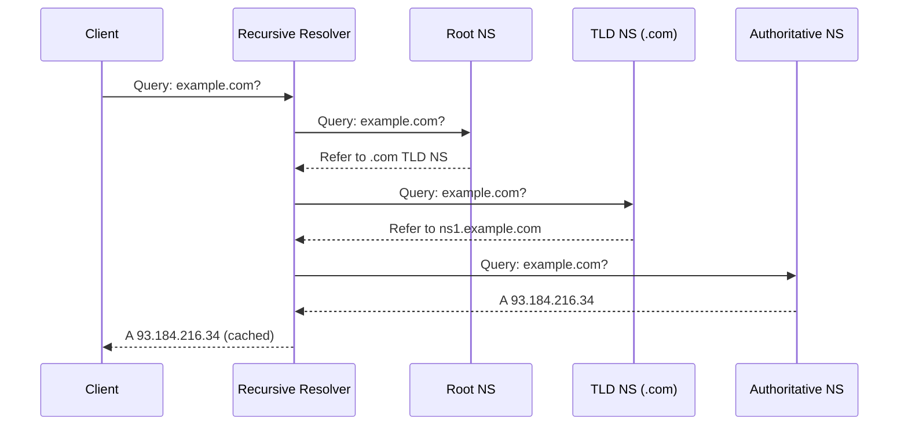
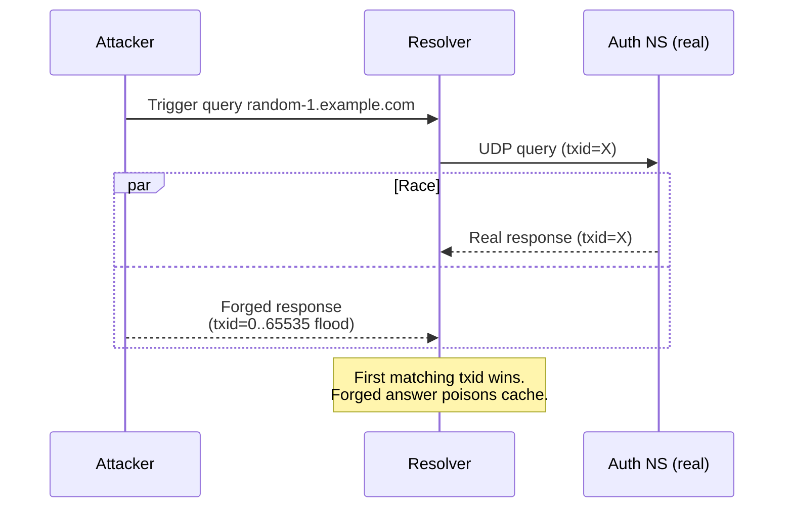
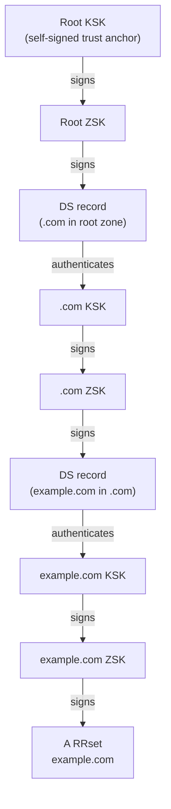
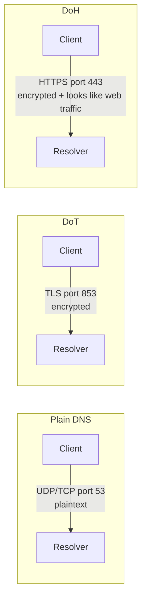
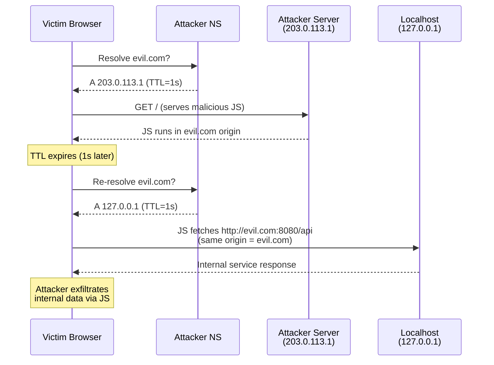
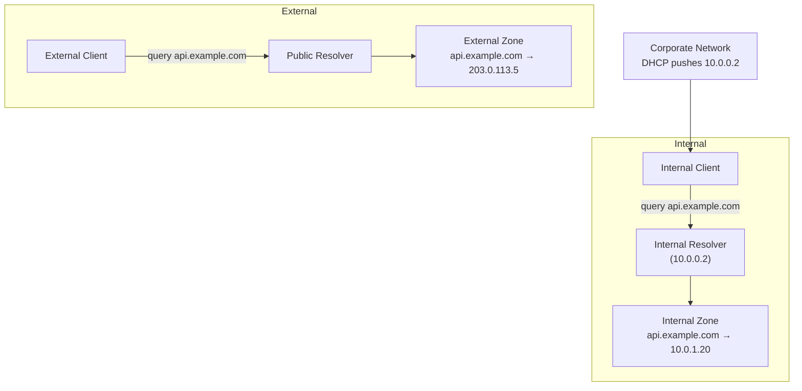

# DNS Security

## 1. DNS Resolution Flow



The resolver caches each response per its TTL, short-circuiting future queries.

---

## 2. DNS Cache Poisoning — Kaminsky Attack

### How It Works

1. Attacker triggers the resolver to query `random-<id>.example.com` (uncached).
2. Resolver sends UDP query with a random 16-bit transaction ID to the authoritative NS.
3. Attacker floods the resolver with forged responses guessing the transaction ID **before** the real response arrives.
4. If a forged response wins, it poisons the cache for the entire `example.com` zone.



### Probability Math

Single attempt (guessing 16-bit txid):

```
P(win one attempt) = 1 / 65535 ≈ 0.0015%
```

With **n** parallel forged packets (birthday-paradox style):

```
P(success with n packets) = 1 - (1 - 1/65535)^n
```

| n (forged packets) | P(success) |
|--------------------|------------|
| 100                | ~0.15%     |
| 1,000              | ~1.5%      |
| 10,000             | ~14%       |
| 65,535             | ~63%       |

Kaminsky's insight: by querying **new subdomains** each time, the attacker resets the cache window and can repeat until successful, making the cumulative probability approach 1 over multiple rounds.

### Defences

- **Source port randomisation** — adds ~16 bits of entropy → P(win) = 1 / (65535 × 65535) ≈ 2.3×10⁻¹⁰
- **0x20 encoding** — randomise case in query name, verify in response
- **DNSSEC** — cryptographic validation (see §3)

---

## 3. DNSSEC — Chain of Trust

### Record Types

| Record | Purpose |
|--------|---------|
| `DNSKEY` | Public key for a zone (KSK or ZSK) |
| `RRSIG`  | Cryptographic signature over an RRset |
| `DS`     | Hash of child zone's KSK, stored in parent zone |
| `NSEC/NSEC3` | Authenticated denial of existence |

### Zone Signing

```
RRSIG = Sign(ZSK_private, RRset)
```

Each RRset (e.g., all A records for `example.com`) is signed with the Zone Signing Key (ZSK). The ZSK itself is signed by the Key Signing Key (KSK), whose hash (DS record) is published in the parent zone.

### Chain of Trust Diagram



### Validation Steps (Resolver)

1. Fetch `DNSKEY` for the queried zone.
2. Verify `RRSIG` on the RRset using the ZSK.
3. Verify `RRSIG` on the `DNSKEY` RRset using the KSK.
4. Verify the KSK matches the `DS` record in the parent zone.
5. Repeat up to the root trust anchor (pre-configured in resolvers).

---

## 4. DoH vs DoT



| | DoT (RFC 7858) | DoH (RFC 8484) |
|---|---|---|
| Port | 853 | 443 |
| Protocol | TLS over TCP | HTTP/2 or HTTP/3 over TLS |
| Visibility | ISP can see DNS traffic (distinct port) | Blends with HTTPS traffic |
| Blocking | Easy to block (port 853) | Hard to block without breaking HTTPS |
| Latency | Lower (persistent TLS connection) | Slightly higher (HTTP overhead) |
| Browser support | OS-level only | Native in Firefox, Chrome |

### Privacy Implications

- **Plain DNS**: Fully visible to ISPs, on-path attackers, and network operators.
- **DoT**: Encrypts queries but the dedicated port lets network operators identify and potentially block or monitor DNS-specific flows.
- **DoH**: Queries hidden inside HTTPS — ISPs cannot distinguish DNS from web traffic. Shifts trust from ISP to the DoH provider (e.g., Cloudflare `1.1.1.1`, Google `8.8.8.8`).

---

## 5. DNS Rebinding Attack

### Attack Flow

Attacker controls a domain (`evil.com`) and its authoritative NS. They set TTL = 1 second.



### Why It Works

The browser's same-origin policy binds to the **hostname** (`evil.com`), not the IP. Once the DNS rebind occurs, JS running under `evil.com` origin can make requests that resolve to `127.0.0.1`, bypassing the same-origin restriction conceptually — the browser sees only `evil.com`.

---

## 6. Mitigations

### DNS Rebinding Protection

**Option A — Check the `Host` header in services:**

```go
func rebindingProtection(next http.Handler) http.Handler {
    allowed := map[string]bool{
        "localhost":       true,
        "127.0.0.1":       true,
        "::1":             true,
    }
    return http.HandlerFunc(func(w http.ResponseWriter, r *http.Request) {
        host, _, _ := net.SplitHostPort(r.Host)
        if host == "" {
            host = r.Host
        }
        if !allowed[host] {
            http.Error(w, "Forbidden: rebinding attempt", http.StatusForbidden)
            return
        }
        next.ServeHTTP(w, r)
    })
}
```

**Option B — Bind services to `127.0.0.1` only**, not `0.0.0.0`.

**Option C — Browser DNS pinning**: Chrome and Firefox pin resolved IPs for the tab's lifetime, preventing mid-session rebinding (though not always reliable).

### DNSSEC Validation

Enable validation on your resolver (e.g., Unbound):

```conf
# /etc/unbound/unbound.conf
server:
    auto-trust-anchor-file: "/var/lib/unbound/root.key"
    val-permissive-mode: no   # hard-fail on DNSSEC errors
```

### DoH / DoT Configuration

**systemd-resolved (DoT):**

```ini
# /etc/systemd/resolved.conf
[Resolve]
DNS=1.1.1.1#cloudflare-dns.com 8.8.8.8#dns.google
DNSOverTLS=yes
```

**Go HTTP client using DoH:**

```go
import "github.com/miekg/dns"

// Use a custom dialer that sends DNS queries over HTTPS
// to https://cloudflare-dns.com/dns-query
resolver := &net.Resolver{
    PreferGo: true,
    Dial: func(ctx context.Context, network, address string) (net.Conn, error) {
        // Route through DoH provider
        return dohDial(ctx, "https://cloudflare-dns.com/dns-query")
    },
}
```

---

## 7. Split-Horizon DNS

Split-horizon (split-brain) DNS serves **different answers** to the same query depending on the source — internal clients get internal IPs, external clients get public IPs.



### Common Use Cases

| Scenario | External Answer | Internal Answer |
|----------|----------------|-----------------|
| `api.example.com` | Public ALB IP | Private service IP |
| `db.example.com` | NXDOMAIN (hidden) | RDS private endpoint |
| `vpn.example.com` | Public VPN endpoint | Same (no split needed) |

### Implementation (BIND / named)

```conf
// named.conf
view "internal" {
    match-clients { 10.0.0.0/8; };
    zone "example.com" { type master; file "internal.example.com.zone"; };
};

view "external" {
    match-clients { any; };
    zone "example.com" { type master; file "external.example.com.zone"; };
};
```

### Security Considerations

- Internal zone leakage: if internal DNS is accidentally exposed, attackers learn private topology.
- DNSSEC incompatibility: split-horizon can conflict with DNSSEC because the same name returns different RRsets with different signatures — resolver validation will fail. Mitigation: don't sign internal zones, or use separate domain names internally (e.g., `api.internal.example.com`).

---

## Quick Reference

| Attack | Root Cause | Mitigation |
|--------|-----------|------------|
| Cache poisoning | Predictable txid + UDP | Source port randomisation, DNSSEC |
| DNS rebinding | TTL expiry + same-origin on hostname | Host header check, bind to loopback |
| MITM on queries | Plaintext UDP/TCP port 53 | DoT (port 853) or DoH (port 443) |
| Zone data tampering | No integrity on responses | DNSSEC (RRSIG + chain of trust) |
| Internal topology leak | Split-horizon misconfiguration | Separate internal domain, firewall DNS port |
