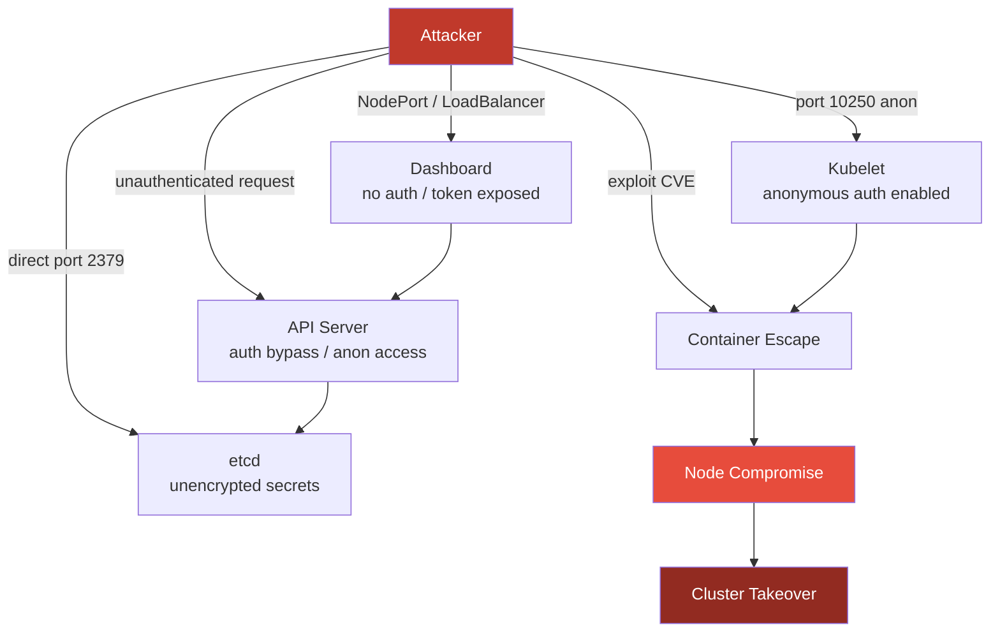
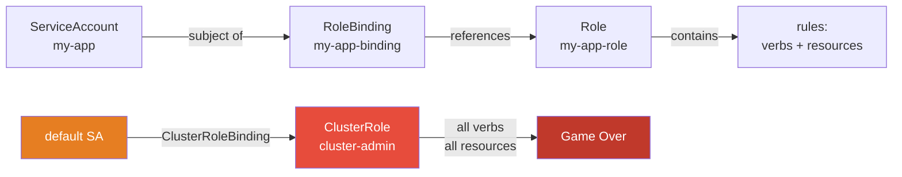
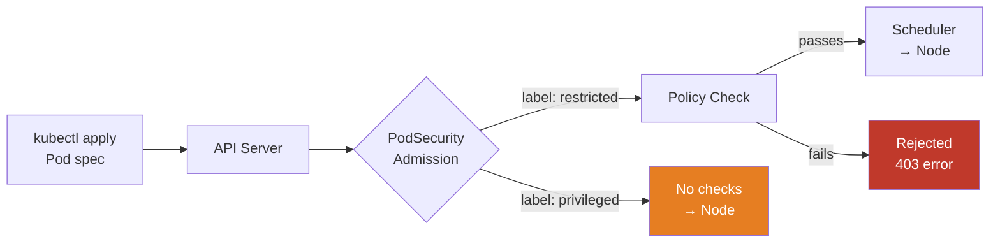
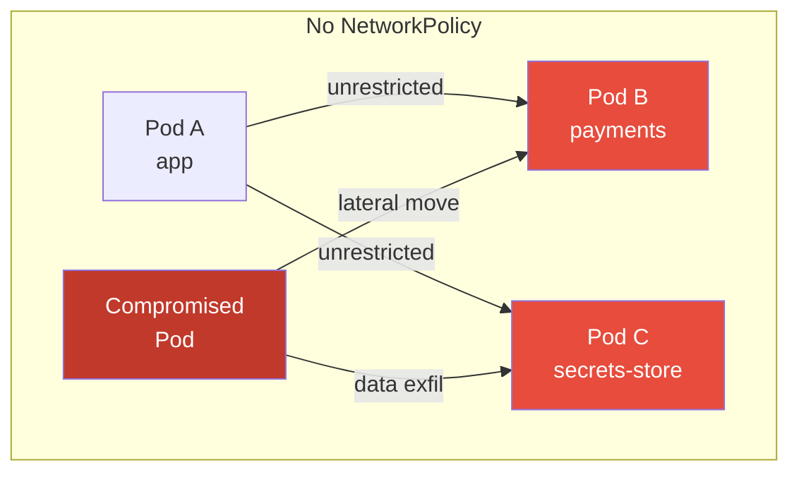
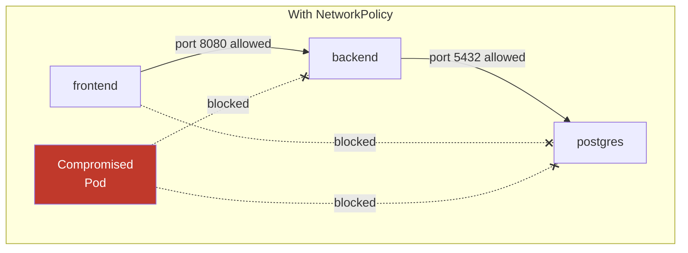
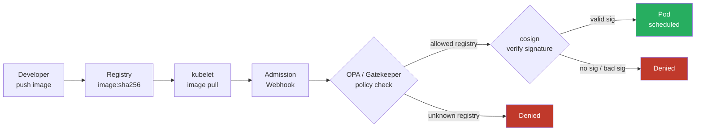

# Kubernetes Security

> Level: SDE-2 | Prerequisites: container-security, cloud-misconfig

---

## 1. K8s Attack Surface

Every component in the control plane and data plane is a potential entry point.



### Attack Vectors

| Component | Default Risk | CVE / Technique |
|-----------|-------------|-----------------|
| API Server | Anonymous auth on some versions | `--anonymous-auth=true` |
| etcd | No encryption at rest | Secrets stored as base64 |
| Kubelet | `--anonymous-auth=true` default (pre-1.17) | `/exec`, `/run` endpoints |
| Dashboard | ClusterAdmin token in older installs | CVE-2018-18264 |
| Container runtime | Privileged escape, runc CVEs | CVE-2019-5736 (runc), CVE-2022-0492 |

### Kubelet Anonymous Auth — Direct Exec

```bash
# attacker with network access to port 10250
curl -sk https://<node-ip>:10250/exec/<namespace>/<pod>/<container> \
  -d 'command[]=id' --insecure

# fix: disable anonymous auth in kubelet config
# /var/lib/kubelet/config.yaml
authentication:
  anonymous:
    enabled: false
  webhook:
    enabled: true
authorization:
  mode: Webhook
```

---

## 2. RBAC Hardening

### Binding Model



### Wildcard Danger

```yaml
# ❌ DANGEROUS — wildcard verbs and resources
rules:
- apiGroups: ["*"]
  resources: ["*"]
  verbs: ["*"]

# ✅ SAFE — least privilege
rules:
- apiGroups: ["apps"]
  resources: ["deployments"]
  verbs: ["get", "list", "watch"]
```

### Default SA Cluster-Admin = Game Over

```bash
# what attackers look for
kubectl get clusterrolebindings -o json | \
  jq '.items[] | select(.subjects[]?.name == "default") | .metadata.name'

# attacker inside a pod can hit the API server using the auto-mounted token
TOKEN=$(cat /var/run/secrets/kubernetes.io/serviceaccount/token)
curl -sk -H "Authorization: Bearer $TOKEN" \
  https://kubernetes.default.svc/api/v1/secrets

# fix: disable auto-mount for pods that don't need it
apiVersion: v1
kind: ServiceAccount
metadata:
  name: my-app
automountServiceAccountToken: false
```

### RBAC Audit Commands

```bash
# who can do what
kubectl auth can-i list secrets --as=system:serviceaccount:default:default
kubectl auth can-i create pods --all-namespaces

# find risky bindings (cluster-admin grants)
kubectl get clusterrolebindings -o wide | grep cluster-admin

# enumerate all permissions for a SA
kubectl auth can-i --list --as=system:serviceaccount:prod:my-app
```

### Dangerous Permission Combinations

| Permission | Risk |
|------------|------|
| `pods/exec` create | Remote code exec in any pod |
| `secrets` get/list | Read all credentials |
| `clusterrolebindings` create | Self-escalate to cluster-admin |
| `pods` create + `hostPID: true` | Node escape |
| `configmaps` create in `kube-system` | Overwrite scheduler / controller config |

---

## 3. Pod Security

### Admission Controller Flow



### Namespace Label

```bash
# enforce restricted policy on a namespace
kubectl label namespace prod \
  pod-security.kubernetes.io/enforce=restricted \
  pod-security.kubernetes.io/enforce-version=latest \
  pod-security.kubernetes.io/warn=restricted \
  pod-security.kubernetes.io/audit=restricted
```

### Policy Level Comparison

| Check | privileged | baseline | restricted |
|-------|-----------|----------|------------|
| Privileged containers | ✅ allowed | ❌ blocked | ❌ blocked |
| hostPID / hostIPC | ✅ allowed | ❌ blocked | ❌ blocked |
| hostNetwork | ✅ allowed | ❌ blocked | ❌ blocked |
| hostPath volumes | ✅ allowed | ❌ blocked | ❌ blocked |
| Privilege escalation | ✅ allowed | ✅ allowed | ❌ blocked |
| Run as root | ✅ allowed | ✅ allowed | ❌ blocked |
| Non-default capabilities | ✅ allowed | some blocked | ❌ all dropped |
| seccomp profile | any | any | RuntimeDefault required |
| AppArmor / SELinux | any | limited | restricted |

### Minimal Restricted Pod Spec

```yaml
apiVersion: v1
kind: Pod
spec:
  securityContext:
    runAsNonRoot: true
    runAsUser: 10000
    seccompProfile:
      type: RuntimeDefault
  containers:
  - name: app
    image: my-app:1.0.0
    securityContext:
      allowPrivilegeEscalation: false
      readOnlyRootFilesystem: true
      capabilities:
        drop: ["ALL"]
```

---

## 4. NetworkPolicy

### Default State: Allow-All

Without any NetworkPolicy, every pod can reach every other pod — a compromised pod has full lateral movement.



### Deny-All + Explicit Allow



### Default Deny All (apply first)

```yaml
# deny all ingress and egress in namespace
apiVersion: networking.k8s.io/v1
kind: NetworkPolicy
metadata:
  name: default-deny-all
  namespace: prod
spec:
  podSelector: {}       # matches all pods
  policyTypes:
  - Ingress
  - Egress
```

### Explicit Allow: Frontend → Backend

```yaml
apiVersion: networking.k8s.io/v1
kind: NetworkPolicy
metadata:
  name: allow-frontend-to-backend
  namespace: prod
spec:
  podSelector:
    matchLabels:
      app: backend
  policyTypes:
  - Ingress
  ingress:
  - from:
    - podSelector:
        matchLabels:
          app: frontend
    ports:
    - port: 8080
```

### DNS Egress (required for service discovery)

```yaml
apiVersion: networking.k8s.io/v1
kind: NetworkPolicy
metadata:
  name: allow-dns
  namespace: prod
spec:
  podSelector: {}
  policyTypes:
  - Egress
  egress:
  - to:
    - namespaceSelector:
        matchLabels:
          kubernetes.io/metadata.name: kube-system
    ports:
    - port: 53
      protocol: UDP
    - port: 53
      protocol: TCP
```

> **Note:** NetworkPolicy requires a CNI plugin that supports it (Calico, Cilium, Weave). The default `kubenet` does **not** enforce NetworkPolicy.

---

## 5. Secret Encryption at Rest

### The base64 Problem

```
# etcd stores secrets as base64 — NOT encrypted
echo "cGFzc3dvcmQxMjM=" | base64 -d
# → password123

# base64 is ENCODING, not ENCRYPTION
# encoding: reversible transformation with no key
# encryption: requires secret key to reverse

# attacker with etcd access
ETCDCTL_API=3 etcdctl get /registry/secrets/prod/db-password \
  --endpoints=https://127.0.0.1:2379 \
  --cacert=/etc/kubernetes/pki/etcd/ca.crt \
  --cert=/etc/kubernetes/pki/etcd/server.crt \
  --key=/etc/kubernetes/pki/etcd/server.key \
  | strings | grep -A1 password
# → plaintext secret visible
```

### EncryptionConfiguration with AES-GCM

```yaml
# /etc/kubernetes/encryption-config.yaml
apiVersion: apiserver.config.k8s.io/v1
kind: EncryptionConfiguration
resources:
- resources:
  - secrets
  - configmaps          # optionally encrypt configmaps too
  providers:
  - aesgcm:             # AES-GCM: authenticated encryption (AEAD)
      keys:
      - name: key1
        secret: <base64-encoded-32-byte-key>   # openssl rand -base64 32
  - identity: {}        # fallback for reading unencrypted (during migration)
```

```bash
# generate a strong key
openssl rand -base64 32

# reference in kube-apiserver (kubeadm: /etc/kubernetes/manifests/kube-apiserver.yaml)
- --encryption-provider-config=/etc/kubernetes/encryption-config.yaml

# verify: after enabling, re-encrypt all existing secrets
kubectl get secrets --all-namespaces -o json | kubectl replace -f -

# verify: read directly from etcd — should now show encrypted blob
ETCDCTL_API=3 etcdctl get /registry/secrets/prod/db-password ... | hexdump
# → binary ciphertext, not readable base64
```

### Encryption Math

```
AES-GCM (256-bit):
  Key space = 2^256 ≈ 1.16 × 10^77
  Brute force at 10^18 keys/sec = 3.67 × 10^51 years

base64:
  Decode time = O(n) — microseconds
  No key required
  "Security" = zero
```

### KMS Integration (production recommended)

```yaml
# use AWS KMS / GCP KMS instead of local key
providers:
- kms:
    name: aws-kms
    endpoint: unix:///var/run/kmsplugin/socket.sock
    cachesize: 1000
    timeout: 3s
- identity: {}
```

---

## 6. Supply Chain Security

### Admission Webhook Flow



### OPA/Gatekeeper: Require Trusted Registry

```yaml
# ConstraintTemplate
apiVersion: templates.gatekeeper.sh/v1
kind: ConstraintTemplate
metadata:
  name: requiretrustedregistry
spec:
  crd:
    spec:
      names:
        kind: RequireTrustedRegistry
  targets:
  - target: admission.k8s.gatekeeper.sh
    rego: |
      package requiretrustedregistry
      violation[{"msg": msg}] {
        container := input.review.object.spec.containers[_]
        not startswith(container.image, "my-registry.example.com/")
        msg := sprintf("image %v not from trusted registry", [container.image])
      }
---
# Constraint (apply the policy)
apiVersion: constraints.gatekeeper.sh/v1beta1
kind: RequireTrustedRegistry
metadata:
  name: require-trusted-registry
spec:
  match:
    kinds:
    - apiGroups: [""]
      kinds: ["Pod"]
```

### ImagePolicyWebhook

```yaml
# kube-apiserver flag
- --enable-admission-plugins=ImagePolicyWebhook
- --admission-control-config-file=/etc/kubernetes/admission-config.yaml

# admission-config.yaml
apiVersion: apiserver.config.k8s.io/v1
kind: AdmissionConfiguration
plugins:
- name: ImagePolicyWebhook
  configuration:
    imagePolicy:
      kubeConfigFile: /etc/kubernetes/image-policy-webhook.kubeconfig
      allowTTL: 50
      denyTTL: 50
      retryBackoff: 500
      defaultAllow: false    # deny if webhook unreachable
```

### cosign Image Signing

```bash
# sign on push (keyless via OIDC / Sigstore)
cosign sign --yes my-registry.example.com/my-app:1.0.0@sha256:<digest>

# verify before deploy
cosign verify \
  --certificate-identity=https://github.com/myorg/myrepo/.github/workflows/build.yml@refs/heads/main \
  --certificate-oidc-issuer=https://token.actions.githubusercontent.com \
  my-registry.example.com/my-app:1.0.0

# policy: deny unsigned images (Kyverno)
apiVersion: kyverno.io/v1
kind: ClusterPolicy
metadata:
  name: require-signed-images
spec:
  validationFailureAction: Enforce
  rules:
  - name: check-image-signature
    match:
      resources:
        kinds: [Pod]
    verifyImages:
    - imageReferences: ["my-registry.example.com/*"]
      attestors:
      - count: 1
        entries:
        - keyless:
            subject: "https://github.com/myorg/*"
            issuer: "https://token.actions.githubusercontent.com"
```

---

## 7. Privilege Escalation Paths

### Escape Routes

```mermaid
graph TD
    subgraph hostPID Path
        P1[Pod<br/>hostPID: true] --> P2[See all<br/>host processes]
        P2 --> P3[ptrace into<br/>privileged process]
        P3 --> P4[Node<br/>code exec]
    end

    subgraph hostNetwork Path
        N1[Pod<br/>hostNetwork: true] --> N2[Bind to<br/>host interfaces]
        N2 --> N3[Sniff cluster<br/>traffic / ARP]
        N3 --> N4[Steal tokens<br/>& creds]
    end

    subgraph hostPath Path
        H1[Pod<br/>hostPath: /] --> H2[Read/write<br/>node filesystem]
        H2 --> H3[Read /etc/shadow<br/>kubectl configs]
        H3 --> H4[Write cron/<br/>systemd unit]
        H4 --> H5[Persistent<br/>node backdoor]
    end

    style P4 fill:#c0392b,color:#fff
    style N4 fill:#c0392b,color:#fff
    style H5 fill:#c0392b,color:#fff
```



### hostPID Escape

```bash
# pod spec enabling hostPID (never do this)
spec:
  hostPID: true
  containers:
  - name: attacker
    image: busybox
    command: ["sleep", "infinity"]

# inside the pod: see all node processes
ps aux | grep kubelet
# → kubelet PID visible

# nsenter into host PID namespace
nsenter -t 1 -m -u -i -n -p -- bash
# → now running in host's PID 1 namespace = full node access
```

### hostPath: / Escape

```yaml
# dangerous pod spec
spec:
  containers:
  - name: escape
    image: alpine
    volumeMounts:
    - name: host-root
      mountPath: /host
  volumes:
  - name: host-root
    hostPath:
      path: /
      type: Directory
```

```bash
# inside pod
chroot /host bash
# → now in host filesystem as root
cat /etc/kubernetes/admin.conf    # steal kubeconfig
crontab -e                        # add persistence
```

### hostNetwork: Traffic Sniffing

```bash
# pod with hostNetwork: true
spec:
  hostNetwork: true

# inside pod — can listen on ALL node interfaces
tcpdump -i any -w /tmp/capture.pcap &
# captures: pod-to-pod traffic, API server calls, etcd traffic
# extracts: bearer tokens from HTTP headers, credentials in transit
```

### Prevention: OPA Constraint

```yaml
# deny hostPID, hostNetwork, hostPath
apiVersion: constraints.gatekeeper.sh/v1beta1
kind: K8sPSPHostNamespace
metadata:
  name: psp-host-namespace
spec:
  match:
    kinds:
    - apiGroups: [""]
      kinds: ["Pod"]
```

### Escalation Risk Matrix

| Field | Risk | Blocks with |
|-------|------|-------------|
| `hostPID: true` | Critical — see/inject host procs | PodSecurity baseline |
| `hostNetwork: true` | Critical — sniff all traffic | PodSecurity baseline |
| `hostIPC: true` | High — IPC with host processes | PodSecurity baseline |
| `hostPath: /` | Critical — full node FS access | PodSecurity baseline |
| `privileged: true` | Critical — kernel access | PodSecurity baseline |
| `allowPrivilegeEscalation: true` | High — setuid binaries | PodSecurity restricted |
| `runAsRoot: true` | Medium — UID 0 in container | PodSecurity restricted |
| `capabilities.add: SYS_ADMIN` | Critical — kernel escape | PodSecurity restricted |

---

## 8. Audit Logging

### Log Levels

| Level | What is recorded |
|-------|-----------------|
| `None` | Nothing — event discarded |
| `Metadata` | Request metadata only (user, verb, resource, time) — no body |
| `Request` | Metadata + request body |
| `RequestResponse` | Metadata + request body + response body |

### Audit Policy

```yaml
# /etc/kubernetes/audit-policy.yaml
apiVersion: audit.k8s.io/v1
kind: Policy
rules:
# alert-worthy: log full request+response
- level: RequestResponse
  resources:
  - group: ""
    resources: ["secrets"]          # any secret read/write
  verbs: ["get", "list", "watch", "create", "update", "patch", "delete"]

- level: RequestResponse
  resources:
  - group: "rbac.authorization.k8s.io"
    resources: ["roles", "rolebindings", "clusterroles", "clusterrolebindings"]

# exec into pods — high value forensic signal
- level: RequestResponse
  resources:
  - group: ""
    resources: ["pods/exec", "pods/attach", "pods/portforward"]

# RBAC changes by any user
- level: Request
  users: ["system:anonymous"]       # any anonymous request is suspicious

# default: metadata only for everything else
- level: Metadata
  omitStages:
  - RequestReceived
```

### Enable in kube-apiserver

```yaml
# /etc/kubernetes/manifests/kube-apiserver.yaml
- --audit-log-path=/var/log/kubernetes/audit.log
- --audit-log-maxage=30
- --audit-log-maxbackup=10
- --audit-log-maxsize=100
- --audit-policy-file=/etc/kubernetes/audit-policy.yaml
```

### Alert On These Events

```bash
# 1. exec into pods (possible attacker shell)
jq 'select(.verb == "create" and .objectRef.subresource == "exec")' audit.log

# 2. secret reads (possible credential theft)
jq 'select(.objectRef.resource == "secrets" and .verb == "get")' audit.log

# 3. RBAC mutations (privilege escalation attempt)
jq 'select(.objectRef.apiGroup == "rbac.authorization.k8s.io" and
           (.verb == "create" or .verb == "update" or .verb == "patch"))' audit.log

# 4. anonymous requests (auth bypass attempt)
jq 'select(.user.username == "system:anonymous")' audit.log

# 5. service account token requests at unusual times
jq 'select(.objectRef.resource == "serviceaccounts" and .verb == "create")' audit.log
```

### Falco Rule: Alert on Audit Events

```yaml
# Falco rule to catch exec into pods
- rule: K8s Pod Exec
  desc: Exec or attach to a pod
  condition: >
    ka.verb in (create) and
    ka.target.subresource in (exec, attach)
  output: >
    Pod exec/attach by user=%ka.user.name
    pod=%ka.target.name ns=%ka.target.namespace
    cmd=%ka.req.pod.containers.image
  priority: WARNING
  source: k8s_audit

# Falco rule: secret access
- rule: K8s Secret Access
  desc: Secret read by non-system user
  condition: >
    ka.verb in (get, list, watch) and
    ka.target.resource = secrets and
    not ka.user.name startswith "system:"
  output: >
    Secret accessed user=%ka.user.name
    secret=%ka.target.name ns=%ka.target.namespace
  priority: WARNING
  source: k8s_audit
```

### Centralized Log Pipeline

```
kube-apiserver audit log
    → Fluent Bit / Fluentd (tail /var/log/kubernetes/audit.log)
    → Elasticsearch / Loki
    → Grafana / Kibana dashboards
    → AlertManager / PagerDuty on HIGH priority rules
```

---

## Quick Reference: Threat → Mitigation

| Threat | Attack Vector | Mitigation |
|--------|--------------|------------|
| API server auth bypass | Anonymous auth enabled | `--anonymous-auth=false` + RBAC |
| etcd secret theft | base64 plaintext in etcd | EncryptionConfiguration + AES-GCM |
| Kubelet RCE | Anonymous port 10250 | `authentication.anonymous.enabled: false` |
| Dashboard takeover | Exposed + ClusterAdmin token | Remove or restrict; no ClusterAdmin SA |
| Lateral movement | No NetworkPolicy | Default-deny + explicit NetworkPolicy |
| RBAC escalation | Wildcard or cluster-admin on default SA | Least-privilege + SA audit |
| Container escape via hostPID | `hostPID: true` in spec | PodSecurity baseline enforcement |
| Node FS access | `hostPath: /` volume | PodSecurity baseline enforcement |
| Untrusted image | Unsigned / public image | OPA + cosign + ImagePolicyWebhook |
| Undetected intrusion | No audit logging | Audit policy + Falco + centralized logs |
