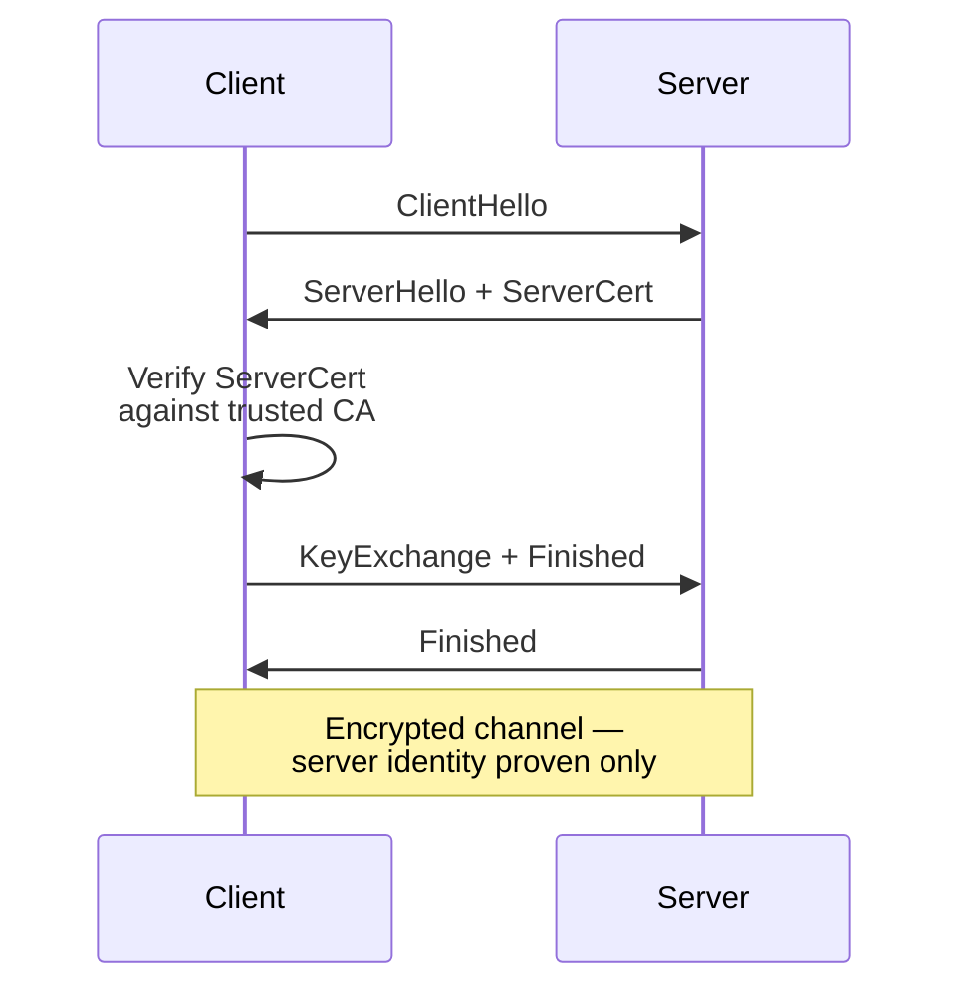
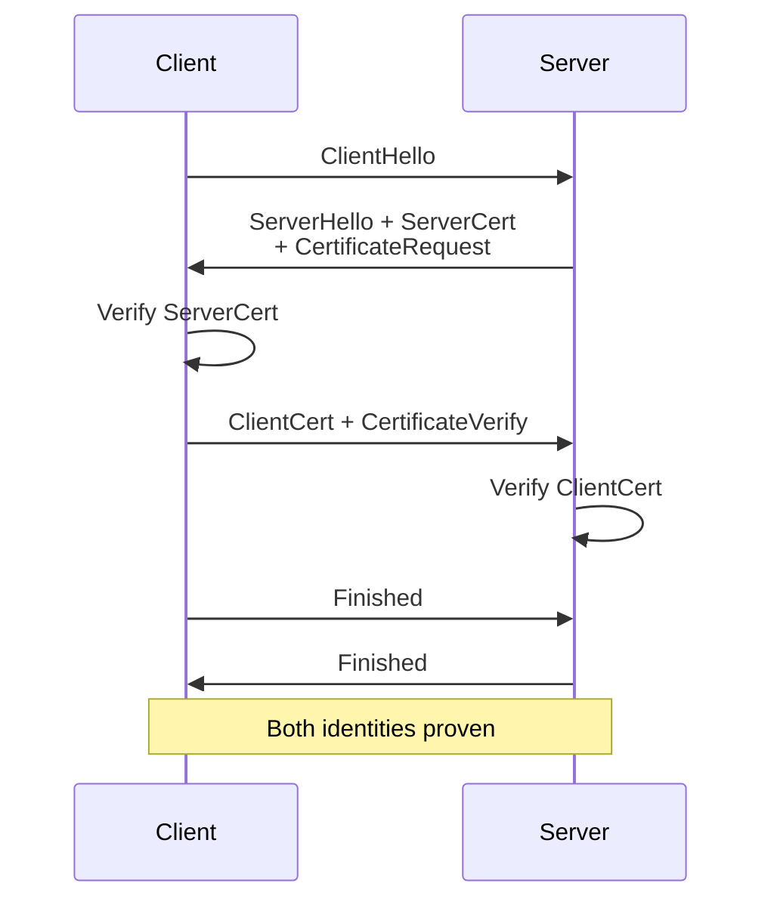
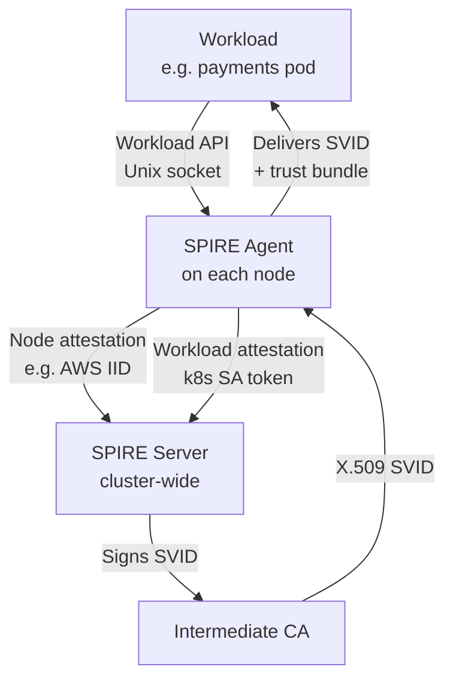
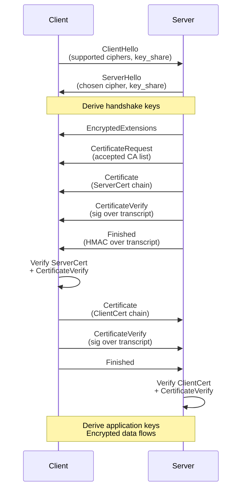
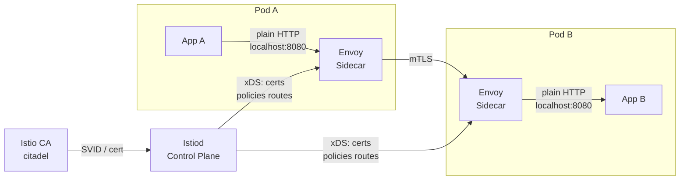
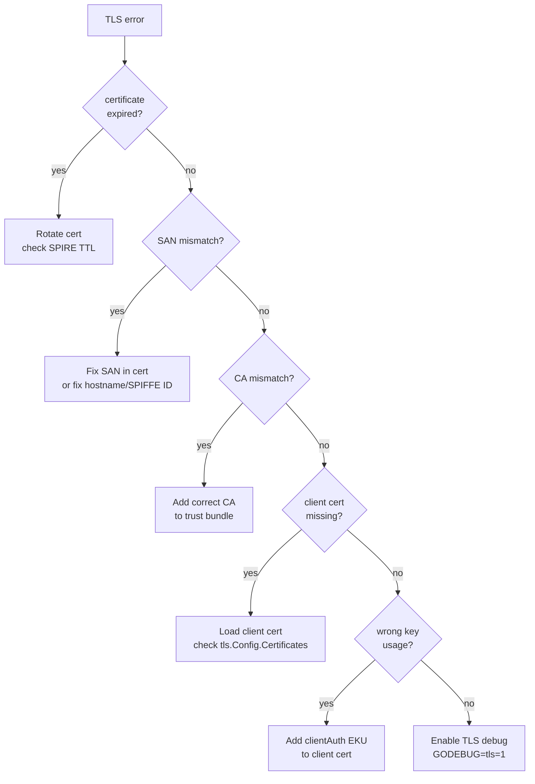

# mTLS — Mutual TLS

> **Level:** SDE-2 | **Track:** Security / Service Mesh

---

## 1. TLS vs mTLS

In standard TLS the client verifies the server. In mTLS both sides present and verify a certificate.

### One-Way TLS



### Mutual TLS (mTLS)



Key difference: the server sends `CertificateRequest` and the client responds with its own certificate chain.

---

## 2. SPIFFE / SPIRE

**SPIFFE** (Secure Production Identity Framework For Everyone) standardises workload identity. A SPIFFE ID is a URI:

```
spiffe://cluster.local/ns/default/sa/payments
└─ scheme ──┘└─ trust domain ──┘└─── path (workload) ───┘
```

The path encodes namespace + service account (or any opaque workload selector). An **SVID** (SPIFFE Verifiable Identity Document) is the X.509 cert that carries the SPIFFE ID in the SAN URI field.

**SPIRE** is the reference implementation.



**Attestation flow:**
1. SPIRE Agent proves the *node* it runs on (node attestation — AWS instance identity, TPM, etc.).
2. For each workload, the agent checks selectors (pod UID, SA token, process UID) against SPIRE Server registration entries.
3. Server signs an X.509 SVID scoped to the workload's SPIFFE ID.
4. SVID is short-lived (default 1 h) and rotated automatically.

---

## 3. Certificate Math

### X.509 Structure

```
Certificate
├── tbsCertificate  ← "to be signed" — the data
│   ├── Version        (v3)
│   ├── SerialNumber
│   ├── Issuer         (CA distinguished name)
│   ├── Validity       (NotBefore / NotAfter)
│   ├── Subject        (entity distinguished name)
│   ├── SubjectPublicKeyInfo  (algorithm + public key)
│   └── Extensions
│       ├── SubjectAltName (SAN)  ← DNS names, IPs, URIs (SPIFFE)
│       ├── KeyUsage
│       ├── ExtendedKeyUsage  (TLS client / server auth)
│       └── BasicConstraints  (isCA flag)
├── signatureAlgorithm  (e.g. sha256WithRSAEncryption)
└── signature           ← CA's digital signature over tbsCertificate
```

### Signature Verification

The CA signs the DER-encoded `tbsCertificate`:

```
signature = Sign(CA_privkey, SHA256(tbsCertificate))
```

Verification by any party holding the CA public key:

```
valid = Verify(CA_pubkey, cert.signature, SHA256(cert.tbsCertificate))
```

If `valid == true`, the cert was issued by the CA and the content has not been tampered with. The chain walks up: leaf cert → intermediate CA(s) → root CA (self-signed, in the trust store).

---

## 4. Full mTLS Handshake (TLS 1.3)



**Key points:**
- In TLS 1.3 the server certificate is encrypted (unlike TLS 1.2).
- `CertificateVerify` proves possession of the private key — the sender signs a hash of the full handshake transcript so far.
- Both `Finished` messages include a MAC over the transcript, preventing downgrade attacks.

---

## 5. Service Mesh — Envoy / Istio



**How transparent mTLS works:**
1. `iptables` rules (injected by Istio CNI or init container) redirect all inbound/outbound traffic through Envoy on port 15001/15006.
2. Envoy holds an X.509 cert provisioned by Istiod (backed by the mesh CA).
3. Envoy performs the mTLS handshake transparently — the app only sees plaintext on loopback.
4. `PeerAuthentication` policy sets `STRICT` mode, rejecting any non-mTLS connection.
5. `AuthorizationPolicy` enforces which SPIFFE IDs may call which paths.

---

## 6. Go Implementation

```go
package main

import (
	"crypto/tls"
	"crypto/x509"
	"fmt"
	"net/http"
	"os"
)

func mtlsClient(caCertPath, clientCertPath, clientKeyPath, url string) error {
	// Load client cert + key
	clientCert, err := tls.LoadX509KeyPair(clientCertPath, clientKeyPath)
	if err != nil {
		return fmt.Errorf("load client cert: %w", err)
	}

	// Build CA pool the client trusts for server verification
	caPEM, err := os.ReadFile(caCertPath)
	if err != nil {
		return fmt.Errorf("read CA: %w", err)
	}
	caPool := x509.NewCertPool()
	if !caPool.AppendCertsFromPEM(caPEM) {
		return fmt.Errorf("parse CA cert")
	}

	client := &http.Client{
		Transport: &http.Transport{
			TLSClientConfig: &tls.Config{
				Certificates: []tls.Certificate{clientCert}, // present to server
				RootCAs:      caPool,                        // verify server cert
				MinVersion:   tls.VersionTLS13,
			},
		},
	}

	resp, err := client.Get(url)
	if err != nil {
		return err
	}
	defer resp.Body.Close()
	fmt.Printf("status: %s<br>", resp.Status)
	return nil
}
```

**Server side** — require and verify client certs:

```go
func mtlsServer(caCertPath, serverCertPath, serverKeyPath string) (*http.Server, error) {
	caPEM, _ := os.ReadFile(caCertPath)
	caPool := x509.NewCertPool()
	caPool.AppendCertsFromPEM(caPEM)

	serverCert, _ := tls.LoadX509KeyPair(serverCertPath, serverKeyPath)

	srv := &http.Server{
		Addr: ":8443",
		TLSConfig: &tls.Config{
			Certificates: []tls.Certificate{serverCert},
			ClientCAs:    caPool,
			ClientAuth:   tls.RequireAndVerifyClientCert, // enforce mTLS
			MinVersion:   tls.VersionTLS13,
		},
	}
	return srv, nil
}
```

`tls.RequireAndVerifyClientCert` — server rejects connections where the client does not present a cert signed by `ClientCAs`.

---

## 7. Common Failure Modes



| Error message | Cause | Fix |
|---|---|---|
| `x509: certificate has expired` | NotAfter in the past | Rotate; shorten TTL with SPIRE |
| `x509: certificate is valid for X, not Y` | SAN does not match hostname or SPIFFE ID | Re-issue cert with correct SAN |
| `x509: certificate signed by unknown authority` | Server/client CA not in trust bundle | Add issuing CA to `RootCAs` / `ClientCAs` |
| `tls: bad certificate` | Client cert required but not sent | Populate `tls.Config.Certificates` |
| `tls: certificate required` | Server set `RequireAndVerifyClientCert`, client sent none | Provide client cert |
| `x509: certificate specifies an incompatible key usage` | Cert lacks `clientAuth` EKU | Re-issue with correct extended key usage |

**Debug commands:**

```bash
# inspect a cert
openssl x509 -in cert.pem -noout -text | grep -A5 'Subject\|SAN\|Validity\|Key Usage'

# test mTLS handshake
openssl s_client -connect host:443 \
  -cert client.pem -key client-key.pem \
  -CAfile ca.pem -tls1_3

# dump Go TLS debug output
GODEBUG=tls=1 go run main.go
```

---

## Quick Reference

| Concept | One-liner |
|---|---|
| SPIFFE ID | URI identity for a workload: `spiffe://trust-domain/path` |
| SVID | X.509 cert carrying SPIFFE ID in SAN URI extension |
| SPIRE Agent | Per-node daemon that attests workloads and delivers SVIDs |
| `CertificateRequest` | TLS message from server asking the client for its cert |
| `CertificateVerify` | Proof of private key possession via transcript signature |
| `tls.RequireAndVerifyClientCert` | Go constant that enforces mTLS on a server |
| `ClientCAs` | CA pool the server uses to validate incoming client certs |
| `RootCAs` | CA pool the client uses to validate the server cert |
