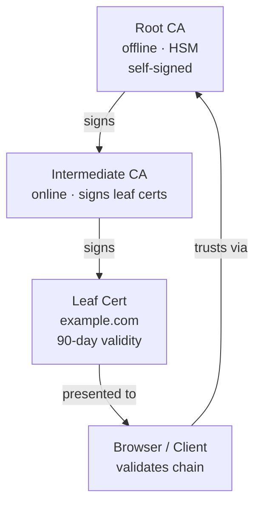
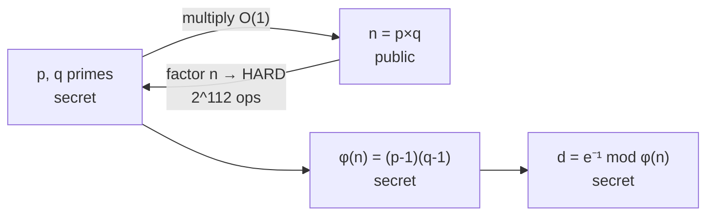
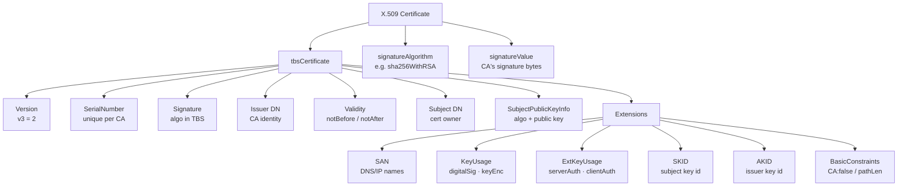
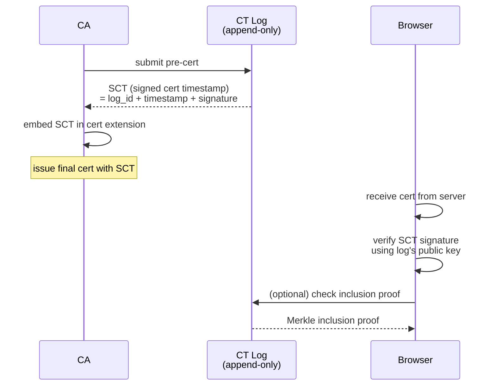
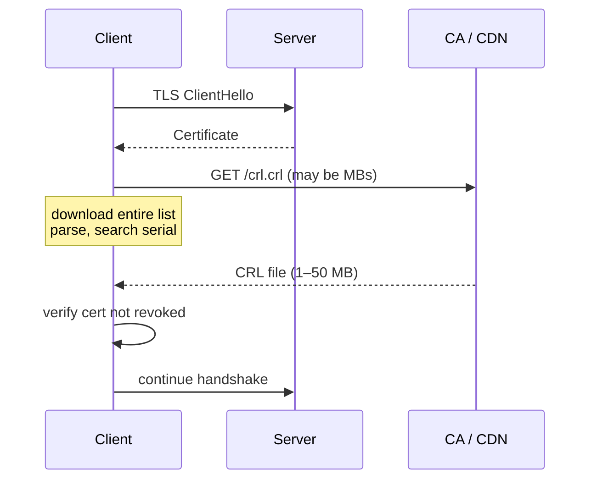
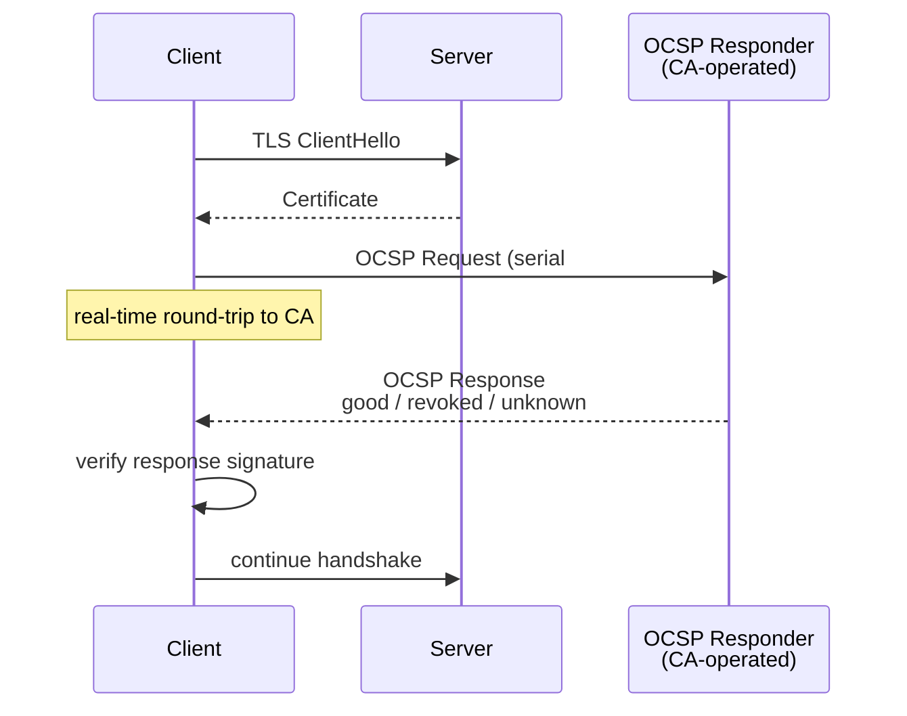
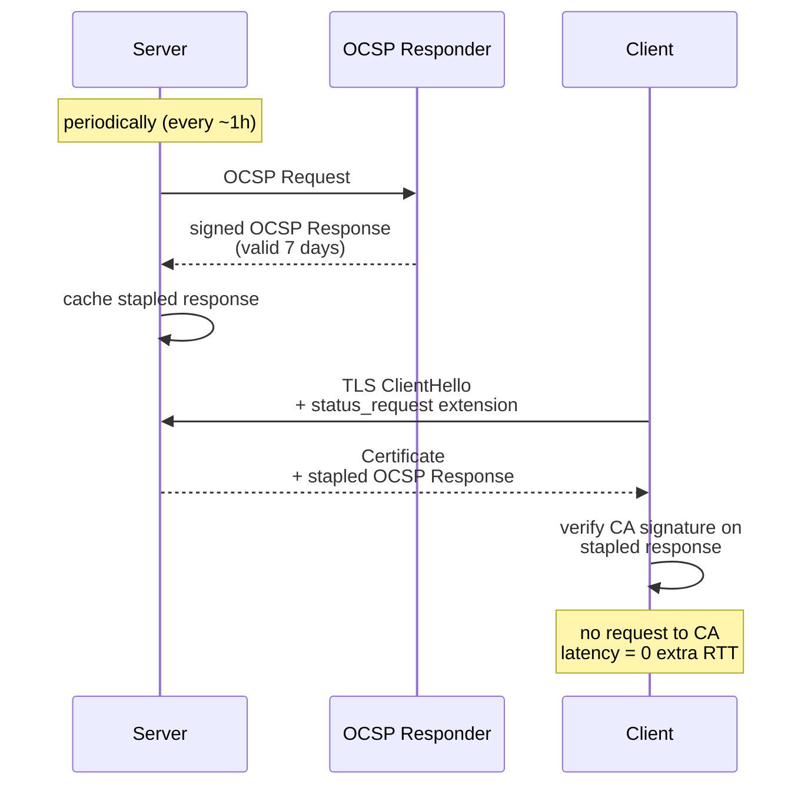
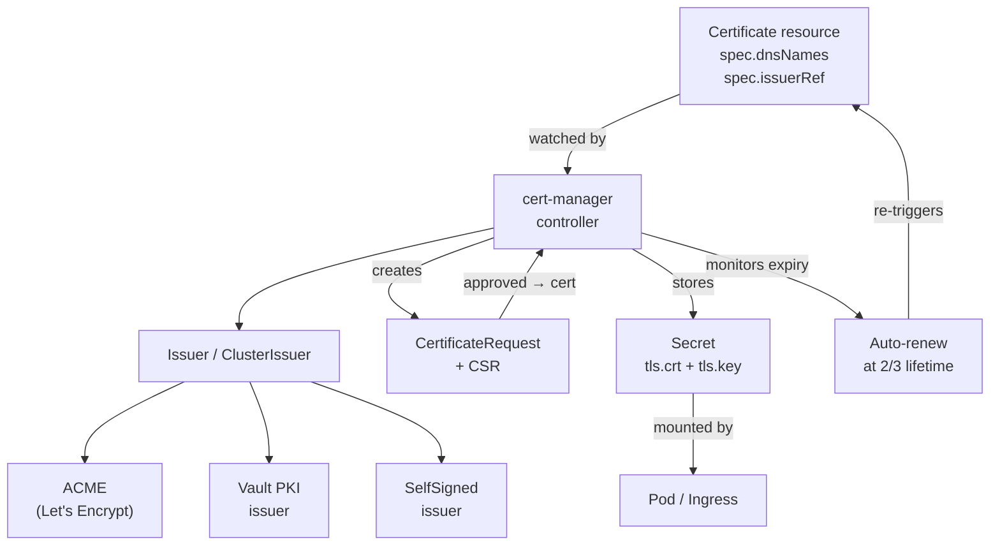

# PKI & Certificate Lifecycle

## 1. PKI Hierarchy



**Why two levels?**

| Concern | Root CA | Intermediate CA |
|---------|---------|-----------------|
| Storage | Air-gapped, HSM | Online server |
| Key usage | Signs intermediate certs only | Signs leaf certs daily |
| Compromise | Catastrophic — all certs invalid | Revoke intermediate, re-issue leaves; Root untouched |
| Ceremony | Annual/rare | Automated |

If the intermediate CA key leaks, the root CA can revoke that intermediate and cross-certify a new one. The root key never touches an online system, so stealing the intermediate doesn't let an attacker forge root-signed certificates.

---

## 2. RSA Math

### Key Generation

```
1. Choose two large primes:  p = 61,  q = 53
2. Modulus:                  n = p × q = 3233
3. Euler's totient:          φ(n) = (p-1)(q-1) = 60 × 52 = 3120
4. Public exponent:          e = 65537  (fixed standard; gcd(e, φ(n)) = 1)
5. Private exponent:         d = e⁻¹ mod φ(n)
                             d × 65537 ≡ 1 (mod 3120)
                             d = 2753  (for tiny example above)

Public key:  (n, e) = (3233, 65537)
Private key: (n, d) = (3233, 2753)
```

### Encryption & Decryption

```
Encrypt:  c = m^e mod n
Decrypt:  m = c^d mod n

Example (m = 65):
  c = 65^65537 mod 3233 = 2790
  m = 2790^2753 mod 3233 = 65  ✓
```

### Why You Can't Find d Without Factoring n

```
Public info:  n = p × q,  e = 65537
Goal:         find d = e⁻¹ mod φ(n)

To compute φ(n) = (p-1)(q-1) you need p and q.
To get p and q you must factor n.

Factoring a 2048-bit n ≈ 2^112 operations with best known algorithms.
At 10^15 ops/sec (modern cluster) → ~10^18 years.

The one-way function: n = p×q is easy; p,q from n is hard.
```



---

## 3. X.509 Certificate Structure



**Signature verification:**

```
Verify = CA_pubkey.Verify(
    signature = cert.signatureValue,
    message   = SHA256(cert.tbsCertificate)
)
```

---

## 4. Certificate Transparency

### Flow



### Merkle Tree Inclusion Proof — O(log n)

```
Leaf nodes: H(cert_0), H(cert_1), ..., H(cert_n)

Tree:
          Root
         /    \
       H01    H23
      /   \  /   \
    H0   H1 H2   H3

To prove cert_1 is in tree of 4 leaves:
  Provide: [H0, H23]   (2 hashes = log₂ 4)
  Verifier computes:
    H01 = Hash(H0 || H1)
    Root = Hash(H01 || H23)
  Compare computed Root with signed Root in SCT.

Proof size: O(log n) hashes — ~17 hashes for 100k certs.
```

---

## 5. CRL vs OCSP vs OCSP Stapling

### CRL (Certificate Revocation List)



Latency: **100 ms – 2 s** (large file download, cached up to 7 days → stale risk).

### OCSP (Online Certificate Status Protocol)



Latency: **50–200 ms** per handshake + CA availability dependency + privacy leak (CA sees which sites you visit).

### OCSP Stapling



| Method | Latency | Privacy | Freshness | CA Dependency |
|--------|---------|---------|-----------|---------------|
| CRL | high (MB download) | ok | stale (days) | CDN only |
| OCSP | +50–200 ms | poor (CA sees clients) | real-time | CA must be up |
| OCSP Stapling | 0 extra RTT | good | ~1 hr | none at handshake |

---

## 6. Short-Lived Certs — No Revocation Needed

### SPIFFE SVIDs

SPIFFE (Secure Production Identity Framework For Everyone) issues X.509 SVIDs with:
- **SAN URI**: `spiffe://trust-domain/path/workload-id`
- **TTL**: 1 hour (configurable, often 3600 s)
- **Auto-rotation**: SPIRE agent re-issues before expiry

### Harm Window Math

```
Cert valid for T seconds.
Attacker steals cert at random time t ∈ [0, T].
Remaining valid time = T - t.
Expected remaining time = E[T - t] = T/2.

T = 90 days  → expected harm = 45 days   (traditional cert)
T = 1 hour   → expected harm = 30 minutes (SPIFFE SVID)
T = 24 hours → expected harm = 12 hours

Formula: expected_harm_window = T / 2
```

### Comparison

| Approach | TTL | Revocation needed | Harm window |
|----------|-----|-------------------|-------------|
| Traditional TLS cert | 90 days | Yes (OCSP/CRL) | 45 days |
| SPIFFE SVID | 1 hour | No | 30 minutes |
| Ephemeral (CI/CD) | 5 min | No | 2.5 minutes |

**Trade-off:** short TTL requires reliable issuance infrastructure — if the SPIRE server is down, new SVIDs can't be issued and workloads lose identity.

---

## 7. cert-manager in Kubernetes



**Renewal timing:**

```
cert lifetime = 90 days = 7,776,000 s
renew at      = 2/3 × 90 = 60 days
buffer        = 30 days before expiry

cert-manager checks every 5 minutes:
  if now > notBefore + (2/3 × duration):
      trigger renewal
```

**Example Certificate resource:**

```yaml
apiVersion: cert-manager.io/v1
kind: Certificate
metadata:
  name: example-tls
spec:
  secretName: example-tls-secret
  duration: 2160h        # 90 days
  renewBefore: 720h      # 30 days = renew at 60d mark
  dnsNames:
    - example.com
    - www.example.com
  issuerRef:
    name: letsencrypt-prod
    kind: ClusterIssuer
```

---

## 8. Common Certificate Errors & Debugging

### Error Reference

| Error | Cause | Fix |
|-------|-------|-----|
| `x509: certificate has expired` | `notAfter` in the past | Renew cert |
| `x509: certificate is not valid for 'api.example.com'` | SAN missing hostname | Re-issue with correct SAN |
| `x509: certificate signed by unknown authority` | Root CA not in trust store | Install CA cert in trust store |
| `x509: certificate chain incomplete` | Intermediate not served | Add intermediate to server config |
| `tls: no supported versions` | Client/server TLS version mismatch | Align min/max TLS versions |

### Debugging Commands

**Check expiry:**
```bash
openssl s_client -connect example.com:443 -servername example.com </dev/null 2>/dev/null \
  | openssl x509 -noout -dates
# notBefore=Jun  1 00:00:00 2025 GMT
# notAfter =Aug 30 00:00:00 2025 GMT
```

**Check SAN (Subject Alternative Names):**
```bash
openssl s_client -connect example.com:443 -servername example.com </dev/null 2>/dev/null \
  | openssl x509 -noout -ext subjectAltName
# X509v3 Subject Alternative Name:
#   DNS:example.com, DNS:www.example.com
```

**Inspect full cert chain:**
```bash
openssl s_client -connect example.com:443 -showcerts </dev/null 2>/dev/null
# shows all certs in chain; count -----BEGIN CERTIFICATE----- blocks
# 1 block = leaf only (missing intermediate) → chain incomplete error
```

**Verify cert against CA:**
```bash
openssl verify -CAfile ca-chain.pem leaf.crt
# leaf.crt: OK
```

**Check cert fingerprint (match what browser shows):**
```bash
openssl x509 -in leaf.crt -noout -fingerprint -sha256
```

**Decode any cert field:**
```bash
openssl x509 -in leaf.crt -noout -text | grep -A5 "Subject Alternative\|Validity\|Issuer\|Key Usage"
```

**Test OCSP stapling:**
```bash
openssl s_client -connect example.com:443 -status </dev/null 2>/dev/null \
  | grep -A5 "OCSP Response"
# OCSP Response Status: successful (0x0)
# Cert Status: good
```

**Diagnose chain completeness:**
```bash
# Download intermediate and verify manually
openssl s_client -connect example.com:443 -showcerts </dev/null 2>/dev/null \
  | awk '/BEGIN CERT/,/END CERT/' > chain.pem
openssl verify -CAfile /etc/ssl/cert.pem chain.pem
```

---

## Quick Reference

```
PKI chain:     Root CA (HSM, offline) → Intermediate CA → Leaf cert
RSA security:  factor n to get φ(n) to get d — infeasible at 2048+ bits
CT logs:       every public cert must appear; browsers verify SCT
Revocation:    OCSP Stapling = best (0 RTT, private, fresh)
Short-lived:   TTL ≤ 1h → skip revocation; harm window = T/2
cert-manager:  auto-renews at 2/3 lifetime; stores in K8s Secret
Debug:         openssl s_client -connect host:443 -showcerts -status
```
