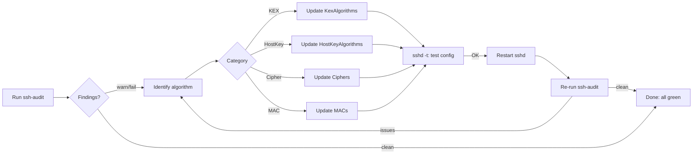
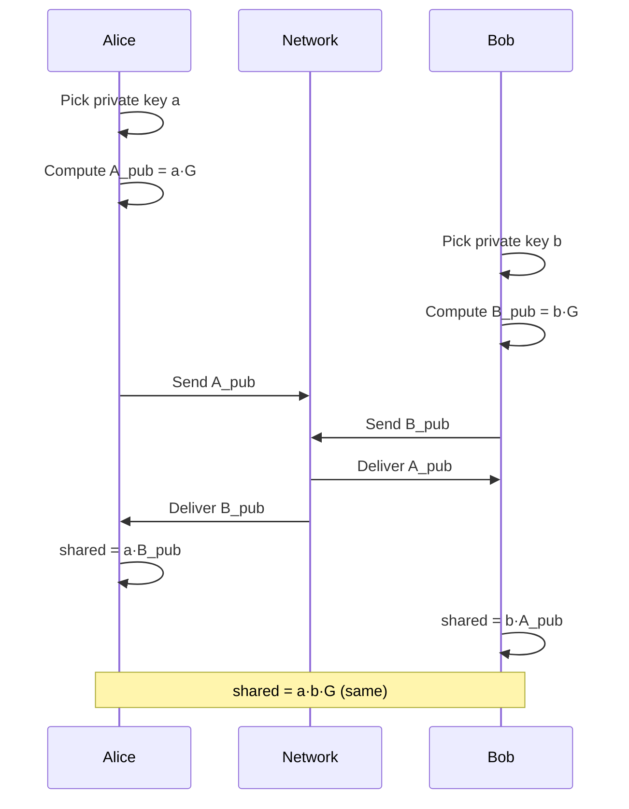
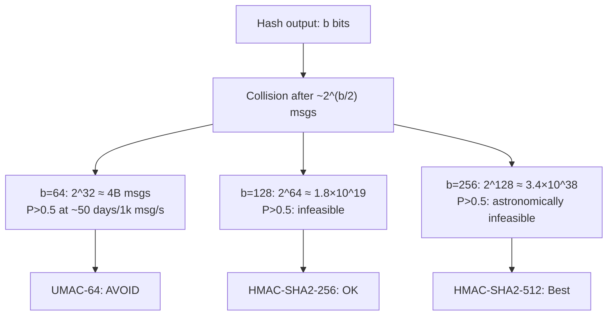
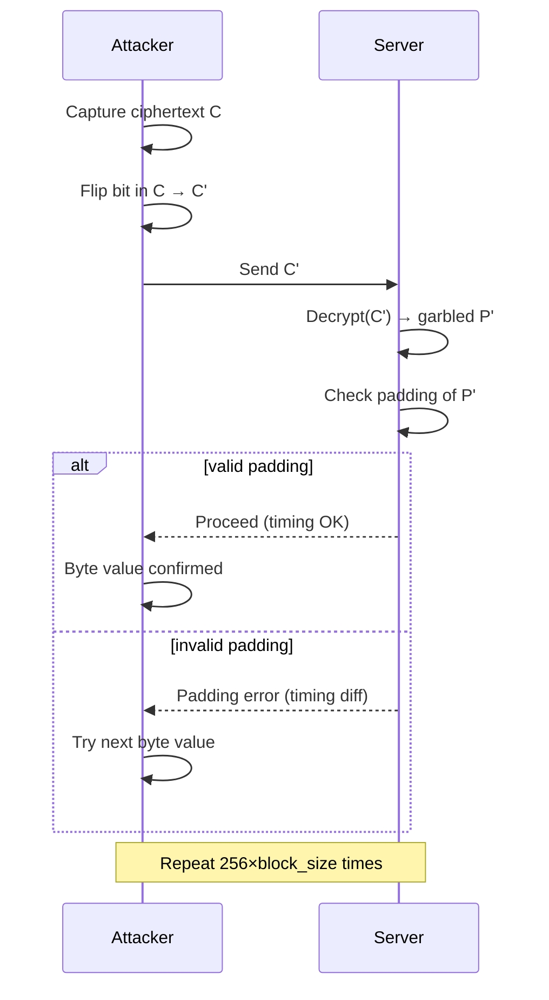
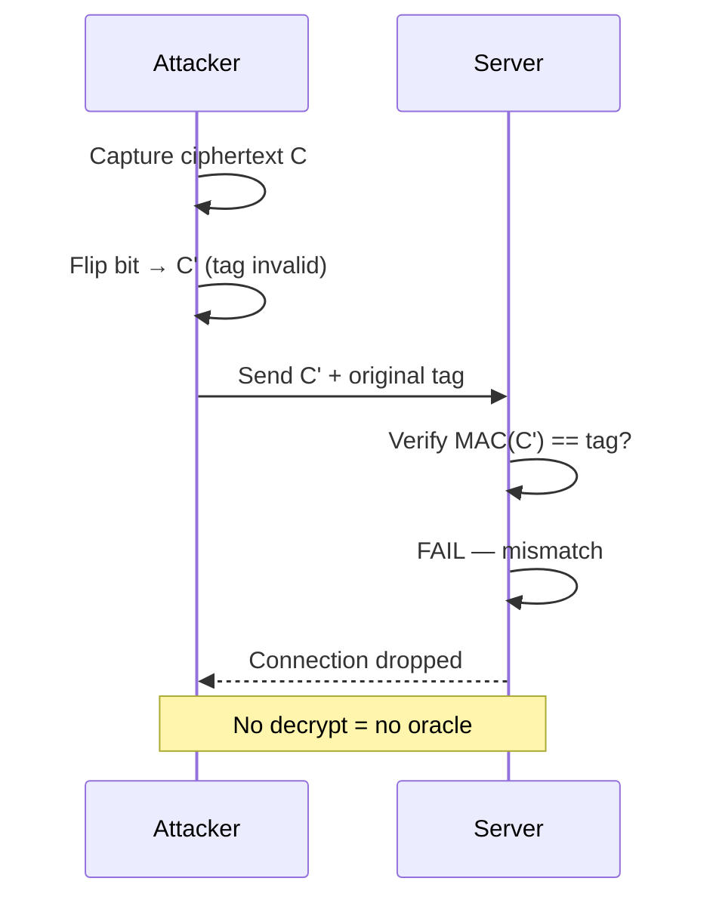
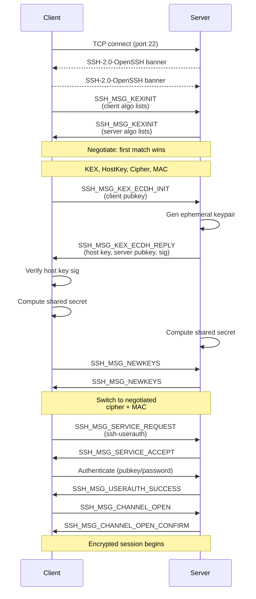

# SSH Hardening

Triggered by `ssh-audit` findings: NIST ECDH KEX, ECDSA host key, SHA-1 MACs, non-ETM MACs, and weak UMAC variants.



---

## Why Each Weak Algorithm is Flagged

### NIST ECDH / ECDSA (ecdh-sha2-nistp*, ecdsa-sha2-nistp*)

NIST P-256/P-384/P-521 curves are standardized by NIST, which has historically been influenced by the NSA. The concern is the **Dual_EC_DRBG backdoor** — in 2013, Snowden documents confirmed the NSA inserted a backdoor into that NIST-standardized PRNG. While the elliptic curves themselves haven't had a confirmed backdoor, the constants defining the curves (the "seeds") are unexplained — nobody knows how they were chosen, which is a red flag in cryptography ("nothing up my sleeve" numbers).

Additionally, NIST curves require careful constant-time implementation to avoid side-channel attacks. OpenSSL has had vulnerabilities here. Curve25519 was designed by Bernstein specifically to be **safe by default** — its constants are fully explained, and it's hard to implement incorrectly.

```
NIST P-256 curve seed: c49d3608 86e70493 6a6678e1 139d26b7 819f7e90
                       ↑ Where did this come from? Unknown.

Curve25519: y² = x³ + 486662x² + x  (mod 2²⁵⁵ - 19)
                       ↑ 486662 = (A-2)/4 where A=486664, chosen for performance. Fully explained.
```

**Point multiplication math:**

```
NIST P-256 (Weierstrass form):
  y² = x³ + ax + b  (mod p)
  a = -3, b = 41058363725152142129326129780047268409114441015993725554835256314039467401291
  Constants: opaque — origin unknown

Curve25519 (Montgomery form):
  y² = x³ + 486662x² + x  (mod 2²⁵⁵ - 19)
  Scalar mult: P = k·G  (k = private key, G = base point)
  Uses ladder algorithm — constant-time by construction
  No special-case branches → side-channel resistant by design

Security equivalence:
  P-256:      ~128-bit security  (field size 256-bit)
  Curve25519: ~128-bit security  (field size 255-bit, ~2¹²⁵·⁸ group order)
```



**Verdict:** Not confirmed broken, but trust is low. Curve25519 provides equivalent security with full transparency.

---

### SHA-1 MACs (hmac-sha1, hmac-sha1-96)

SHA-1 was **practically broken in 2017** when Google's SHAttered attack demonstrated the first real SHA-1 collision — two different PDF files with the same SHA-1 hash, costing ~$110k in cloud compute.

```
SHA-1 collision:
  SHA1(file_A) = SHA1(file_B) = 38762cf7f55934b34d179ae6a4c80cadccbb7f0a
  where file_A ≠ file_B
```

For HMAC-SHA1 specifically: HMAC construction provides some protection (collision ≠ forgery), but:
- Chosen-prefix collision attacks on SHA-1 are now feasible
- HMAC-SHA1 is no longer considered safe for new deployments
- CA/Browser Forum has banned SHA-1 certificates since 2017
- Git migrated away from SHA-1 due to this

**Verdict:** Broken for integrity purposes. SHA-256 minimum.

**Birthday paradox collision probability:**

```
P(collision) ≈ 1 - e^(-n²/2^(b+1))

where n = number of messages, b = hash output bits

P > 0.5 when n ≈ 2^(b/2):
  SHA-1  (b=160): n ≈ 2⁸⁰  ≈ 1.2 × 10²⁴  — still large, but SHAttered bypassed this
  HMAC64 (b=64):  n ≈ 2³²  ≈ 4.3 × 10⁹   — feasible at high traffic
  HMAC128(b=128): n ≈ 2⁶⁴  ≈ 1.8 × 10¹⁹  — infeasible
  HMAC256(b=256): n ≈ 2¹²⁸ ≈ 3.4 × 10³⁸  — astronomically infeasible
```



---

### Non-ETM MACs (hmac-sha2-256, hmac-sha2-512 without -etm suffix)

This is about **ordering**, not the hash strength. SSH has two ways to combine encryption and MAC:

#### MAC-then-Encrypt (non-ETM) — vulnerable

```
1. Compute MAC over plaintext:    tag = MAC(key_mac, plaintext)
2. Encrypt plaintext + tag:       ciphertext = Encrypt(key_enc, plaintext || tag)

Attack: attacker modifies ciphertext
→ server decrypts (getting garbled plaintext)
→ server checks MAC against the garbled plaintext
→ MAC check fails, but timing/error differences leak info about the plaintext
→ Padding Oracle: attacker can determine plaintext byte-by-byte
```



The **POODLE attack** (2014) on SSLv3 and **Lucky13** on TLS 1.x both exploit MAC-then-Encrypt. Lucky13 applies to SSH as well.

#### Encrypt-then-MAC (ETM) — safe

```
1. Encrypt plaintext:             ciphertext = Encrypt(key_enc, plaintext)
2. Compute MAC over ciphertext:   tag = MAC(key_mac, ciphertext)

Attacker modifies ciphertext
→ server checks MAC(ciphertext) first → FAILS immediately
→ decryption never happens → no timing oracle
→ ciphertext is authenticated before any processing
```



**Verdict:** Non-ETM MACs are vulnerable to padding oracle attacks even with strong hash functions. Always use `-etm` variants.

---

### Weak UMAC (umac-64, umac-64-etm)

UMAC is a fast MAC based on universal hashing. The number after umac- is the **output tag size in bits**.

**Birthday bound:** for a MAC with `n`-bit tags, a collision is expected after ~`2^(n/2)` messages (birthday paradox).

```
umac-64:  64-bit tag → birthday collision after ~2³² messages (~4 billion)
          At 1000 msg/sec: ~50 days before collision probability reaches 50%
          At high-traffic server: feasible in practice

umac-128: 128-bit tag → birthday collision after ~2⁶⁴ messages
          Completely infeasible — ~580 billion years at 1 billion msg/sec
```

For an attacker performing an active MITM collecting billions of SSH messages to a busy server, `umac-64` is a realistic target.

**Verdict:** `umac-64` tag too short. Use `umac-128-etm`.

---

### Missing ML-KEM / sntrup (post-quantum KEX)

Current Diffie-Hellman and ECDH are broken by **Shor's algorithm** on a sufficiently large quantum computer. A cryptographically relevant quantum computer doesn't exist yet, but the threat is **"harvest now, decrypt later"**:

```
Attacker captures encrypted SSH sessions today (just the key exchange)
           ↓
Quantum computer becomes available in ~10-15 years
           ↓
Attacker decrypts the harvested sessions retroactively
           ↓
Any long-term secret (private keys, credentials) transmitted is compromised
```

`mlkem768x25519-sha256` and `sntrup761x25519-sha512` are **hybrid KEX** — they combine:
- Classical Curve25519 (secure against classical computers today)
- Post-quantum ML-KEM/sntrup761 (secure against quantum computers)

The hybrid approach means: if either component is broken, the other still protects you.

**Verdict:** Add post-quantum KEX now for forward secrecy against future quantum attacks.

---

## ETM vs Non-ETM: Padding Oracle Deep Dive

### How a padding oracle attack works

Block ciphers in CBC mode require plaintext to be padded to a block boundary. The padding follows a specific format (PKCS#7): if 3 bytes of padding needed, add `\x03\x03\x03`.

```
Ciphertext block Cᵢ is decrypted as:
    Pᵢ = Decrypt(Cᵢ) XOR Cᵢ₋₁

Attacker wants to know Pᵢ without the key.
```

**Step 1:** Attacker flips bits in `Cᵢ₋₁` and sends modified ciphertext to server.

**Step 2:** Server decrypts. If the last byte happens to become `\x01` (valid 1-byte padding), server proceeds. If not, server returns a padding error.

**Step 3:** The error response (or timing difference) tells the attacker whether `\x01` appeared.

**Step 4:** By flipping one byte at a time, attacker can determine the exact decrypted value of each byte of the ciphertext. Full plaintext recovered.

```
Attack complexity: O(256 × block_size) requests

  Per byte: up to 256 guesses (0x00–0xFF)
  16-byte AES block: 256 × 16 = 4,096 requests
  Full 1KB payload: 256 × 64 blocks = ~16,384 requests

  Time at 100 req/s: ~164 seconds to recover 1KB plaintext
  Fully automated tools (POODLE, BEAST, Lucky13) do this in seconds
```

### Why ETM stops this completely

With Encrypt-then-MAC:
```
Server receives: ciphertext || MAC
Server checks:   MAC(ciphertext) == received_MAC   ← this happens FIRST
Attacker modified ciphertext → MAC check fails → connection dropped
Server never attempts decryption → no oracle
```

The MAC is computed over the ciphertext, so any modification is detected before decryption occurs. There is no oracle.

---

## SSH Handshake: Algorithm Negotiation Flow



---

## Algorithm Rationale

| Category | Weak (removed) | Strong (kept) | Why the change |
|----------|---------------|---------------|----------------|
| **KEX** | ecdh-sha2-nistp256/384/521 | curve25519-sha256 | No NIST curve concerns, faster, side-channel resistant by design |
| **KEX** | diffie-hellman-group14-sha1 | — (not in config) | DH-1024/2048 + SHA-1, both weak |
| **KEX** | — | mlkem768x25519-sha256, sntrup761x25519-sha512 | Post-quantum hybrid, harvest-now-decrypt-later protection |
| **Host key** | ecdsa-sha2-nistp256/384/521 | ssh-ed25519 | Ed25519: Bernstein curve, 256-bit key = 128-bit security, fast |
| **Host key** | ssh-dss (DSA) | rsa-sha2-512, rsa-sha2-256 | DSA: 1024-bit only, broken. RSA-SHA2: strong with 4096-bit key |
| **Cipher** | aes128-cbc, aes192-cbc, aes256-cbc | aes256-gcm, aes128-gcm | GCM is AEAD (auth + encryption in one), CBC vulnerable to padding oracles |
| **Cipher** | 3des-cbc | — | 3DES: 64-bit block (SWEET32 attack), slow, obsolete |
| **Cipher** | arcfour (RC4) | — | RC4: broken, biased keystream |
| **MAC** | hmac-sha1, hmac-sha1-96 | hmac-sha2-512-etm, hmac-sha2-256-etm | SHA-1 broken, must use SHA-2 |
| **MAC** | hmac-sha2-256, hmac-sha2-512 (non-ETM) | hmac-sha2-256-etm, hmac-sha2-512-etm | ETM ordering prevents padding oracle |
| **MAC** | umac-64, umac-64-etm | umac-128-etm | 64-bit tag: birthday bound too low at scale |

### Ed25519 vs RSA vs ECDSA

```
Ed25519:
  Key size:     32 bytes (256-bit)
  Security:     ~128-bit equivalent
  Speed:        ~20,000 sign/sec (10x faster than RSA-2048)
  Side-channel: inherently constant-time
  Curve:        Curve25519 (Bernstein, fully explained constants)

RSA-4096:
  Key size:     512 bytes
  Security:     ~140-bit equivalent
  Speed:        ~2,000 sign/sec
  Side-channel: requires careful implementation
  Use case:     Compatibility with older clients that don't support Ed25519

ECDSA-P256:
  Key size:     64 bytes
  Security:     ~128-bit equivalent
  Speed:        ~8,000 sign/sec
  Side-channel: vulnerable if RNG is weak (Sony PS3 private key was extracted this way)
  AVOID because: NIST curve, random nonce required (nonce reuse = key recovery)
```

**Rule:** Ed25519 for everything new. RSA-4096 for legacy compatibility. Never ECDSA.

---

## Complete sshd_config Hardening Block

```bash
# /etc/ssh/sshd_config hardening
# Based on ssh-audit findings — removes all flagged weak algorithms

# ── Key Exchange ─────────────────────────────────────────────────────────────
# Post-quantum hybrids first, then Curve25519 fallback
# Removes: ecdh-sha2-nistp*, diffie-hellman-group14-sha1, diffie-hellman-group1-sha1
KexAlgorithms mlkem768x25519-sha256,sntrup761x25519-sha512,sntrup761x25519-sha512@openssh.com,curve25519-sha256,curve25519-sha256@libssh.org

# ── Host Keys ────────────────────────────────────────────────────────────────
# Ed25519 preferred, RSA-SHA2 for compatibility
# Removes: ecdsa-sha2-nistp*, ssh-dss, rsa-sha2-256 with SHA-1
HostKeyAlgorithms rsa-sha2-512,rsa-sha2-256,ssh-ed25519
HostKey /etc/ssh/ssh_host_ed25519_key
HostKey /etc/ssh/ssh_host_rsa_key
# Do NOT include: HostKey /etc/ssh/ssh_host_ecdsa_key

# ── Ciphers ──────────────────────────────────────────────────────────────────
# AEAD (GCM) preferred, CTR fallback
# Removes: *-cbc, 3des-cbc, arcfour, blowfish
Ciphers aes256-gcm@openssh.com,aes128-gcm@openssh.com,aes256-ctr,aes192-ctr,aes128-ctr

# ── MACs ─────────────────────────────────────────────────────────────────────
# ETM-only, SHA-2, 128-bit UMAC minimum
# Removes: hmac-sha1*, hmac-sha2-*-96, umac-64*, non-ETM variants
MACs hmac-sha2-512-etm@openssh.com,hmac-sha2-256-etm@openssh.com,umac-128-etm@openssh.com

# ── Public Key Auth ──────────────────────────────────────────────────────────
PubkeyAcceptedAlgorithms rsa-sha2-512,rsa-sha2-256,ssh-ed25519

# ── Additional hardening ─────────────────────────────────────────────────────
PasswordAuthentication no          # keys only — brute force becomes impossible
ChallengeResponseAuthentication no
PermitRootLogin no                 # never allow direct root SSH
MaxAuthTries 3                     # limit brute-force attempts before disconnect
LoginGraceTime 30                  # 30s to authenticate, then disconnect
ClientAliveInterval 300            # send keepalive every 5min
ClientAliveCountMax 2              # disconnect after 2 missed keepalives (~10min idle)
X11Forwarding no                   # X11 forwarding is a lateral movement risk
AllowTcpForwarding no              # disable unless you specifically need tunneling
PermitTunnel no
PrintMotd no
```

### Regenerate host keys

```bash
# 1. Remove weak ECDSA host key
sudo rm -f /etc/ssh/ssh_host_ecdsa_key /etc/ssh/ssh_host_ecdsa_key.pub

# 2. Generate Ed25519 (if not present)
sudo ssh-keygen -t ed25519 -f /etc/ssh/ssh_host_ed25519_key -N ""

# 3. Regenerate RSA at 4096-bit (if existing key is 2048)
sudo ssh-keygen -t rsa -b 4096 -f /etc/ssh/ssh_host_rsa_key -N ""

# 4. Set correct permissions
sudo chmod 600 /etc/ssh/ssh_host_*_key
sudo chmod 644 /etc/ssh/ssh_host_*_key.pub

# 5. Test config before restart (critical — prevents lockout)
sudo sshd -t && echo "Config OK"

# 6. Restart sshd (keep existing session open until you verify login works)
sudo systemctl restart sshd

# 7. Verify from a new terminal
ssh -v user@host 2>&1 | grep -E "kex|cipher|mac|host key"

# 8. Re-run ssh-audit
ssh-audit host
# Target output: all green, no [warn] or [fail]
```

### Known host key change warning

After regenerating host keys, existing clients will see:
```
@@@@@@@@@@@@@@@@@@@@@@@@@@@@@@@@@@@@@@@@@@@@@@@@@@@
@ WARNING: REMOTE HOST IDENTIFICATION HAS CHANGED! @
@@@@@@@@@@@@@@@@@@@@@@@@@@@@@@@@@@@@@@@@@@@@@@@@@@@
```

This is expected. Update known_hosts on each client:
```bash
ssh-keygen -R hostname
# or
sed -i '/hostname/d' ~/.ssh/known_hosts
```

---

## Quick Verification

```bash
# Check what algorithms the server actually offers (without connecting)
ssh-audit hostname

# Check cipher negotiated in an actual connection
ssh -vvv user@host 2>&1 | grep -E "kex: algorithm|cipher|MAC"
# Expected output:
# kex: algorithm: curve25519-sha256
# kex: server->client cipher: aes256-gcm@openssh.com MAC: <implicit> ...
# kex: client->server cipher: aes256-gcm@openssh.com MAC: <implicit> ...
# (GCM is AEAD so MAC shows <implicit> — this is correct)

# Confirm no weak algorithms remain
ssh-audit hostname | grep -E "\[warn\]|\[fail\]"
# Should return nothing
```
