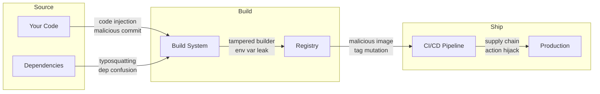
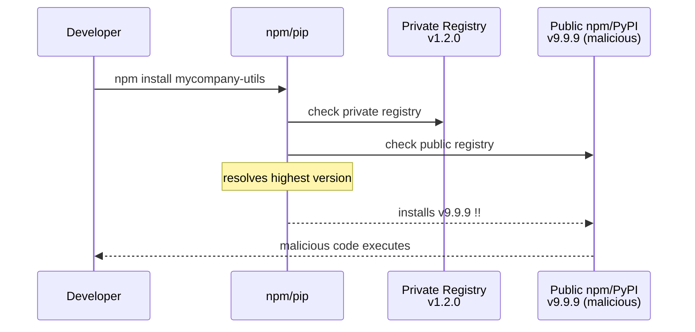
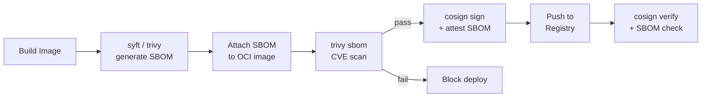
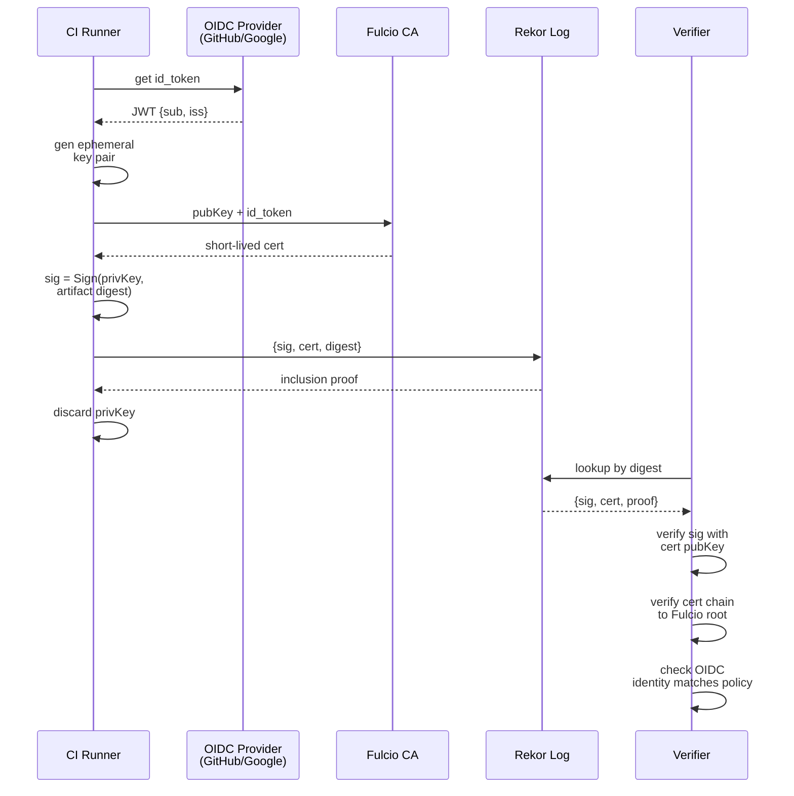
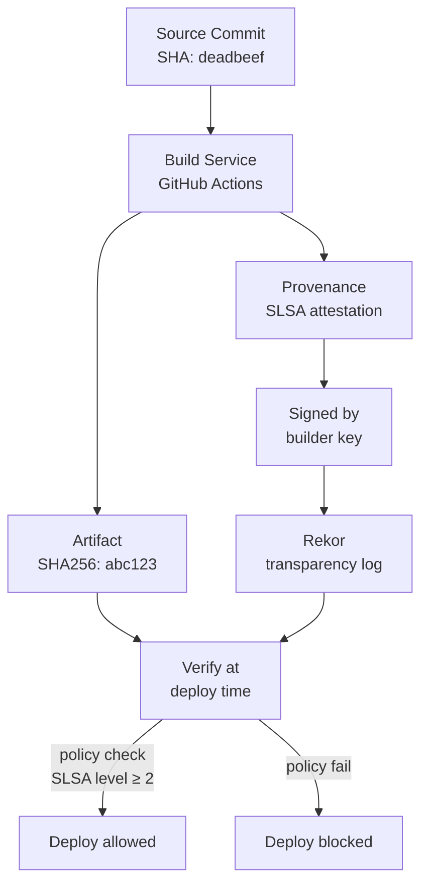
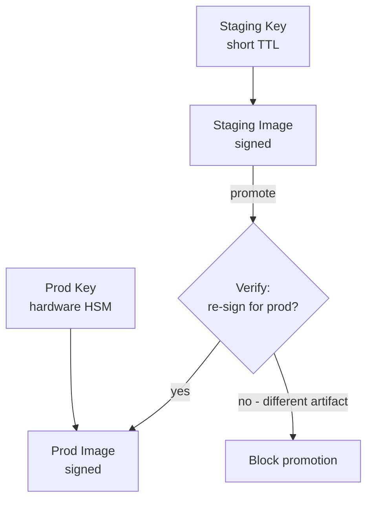
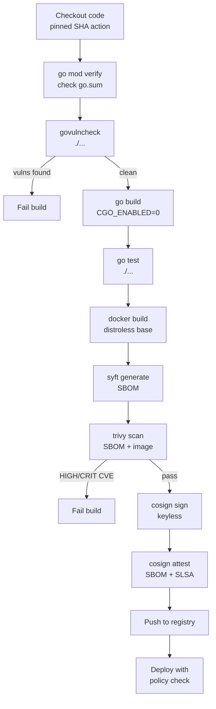

# Supply Chain Security

Software supply chain attacks target the path between writing code and running it in production. This guide covers the attack surface, common attack types, and defenses including SBOMs, Sigstore, SLSA, and Go-specific tooling.

---

## 1. Attack Surface

Every stage from source to production is a potential entry point.



| Stage | Attack Type | Example |
|-------|-------------|---------|
| Source code | Malicious commit, insider threat | Compromised contributor account |
| Dependencies | Typosquatting, dependency confusion | `lodash` → `1odash` |
| Build system | Tampered build env, secrets leak | Compromised CI runner |
| Registry | Tag mutation, image tampering | Moving a Docker tag to malicious image |
| CI/CD pipeline | Action hijack, env injection | `actions/checkout@v3` tag moved |
| Deployment | Config injection, SSRF | Malicious Helm chart values |

---

## 2. Dependency Confusion Attack

An attacker publishes a public package with the **same name** as an internal private package but with a **higher version number**. The package manager, resolving by version, installs the attacker's package.



**Resolution order math:**

Let R = {r₁, r₂, …, rₙ} be the ordered list of registries. For package `p`:

```
resolved_version = max(version(p, rᵢ) for rᵢ in R if p exists in rᵢ)
```

If the attacker publishes `p` at version `v_atk` where `v_atk > v_internal`:

```
P(confusion) = 1   if v_atk > v_internal AND public registry is in R
P(confusion) = 0   if package is scoped (@mycompany/utils) or registry is allowlisted
```

**Mitigations:**

- Scope packages: `@mycompany/utils` — public registries can't host scoped names without org ownership
- Set `NPM_CONFIG_REGISTRY` to private registry only; use `--legacy-peer-deps` carefully
- In `pip`: use `--index-url` (not `--extra-index-url`); `--extra-index-url` merges and picks highest version
- Pin exact versions in lockfiles and verify hashes

```bash
# pip: safe — only uses private index
pip install --index-url https://pypi.mycompany.com/simple/ mycompany-utils

# pip: UNSAFE — merges public + private, attacker wins with higher version
pip install --extra-index-url https://pypi.org/simple/ mycompany-utils
```

---

## 3. Typosquatting

Attackers register package names that look like popular packages, exploiting typos.

**Examples:**

| Legitimate | Typosquat | Trick |
|------------|-----------|-------|
| `lodash` | `1odash` | digit 1 for letter l |
| `requests` | `request` | missing s (also once malicious) |
| `urllib3` | `urlib3` | missing l |
| `setuptools` | `setuptool` | missing s |
| `pycrypto` | `py-crypto` | hyphen inserted |
| `express` | `expres` | missing s |

**Detection via edit distance:**

Levenshtein distance ≤ 2 from any top-1000 package flags a candidate:

```
edit_distance("1odash", "lodash") = 1  ← FLAGGED
edit_distance("request", "requests") = 1  ← FLAGGED
edit_distance("numpy", "numyp") = 2  ← FLAGGED
edit_distance("flask", "flaskk") = 1  ← FLAGGED
```

**Levenshtein recurrence:**

```
D(i,j) = 0                              if i=0 or j=0
D(i,j) = D(i-1,j-1)                    if s1[i] = s2[j]
D(i,j) = 1 + min(D(i-1,j),            otherwise (delete)
                  D(i,j-1),            (insert)
                  D(i-1,j-1))          (substitute)
```

**Automated detection tools:**

```bash
# Check pip packages against known typosquats
pip-audit --vulnerability-service pypi

# OSV scanner
osv-scanner --lockfile requirements.txt

# Socket.dev — real-time npm threat analysis
# Checks installs for typosquats, malicious patterns
```

---

## 4. SBOMs — Software Bill of Materials

An SBOM is a machine-readable inventory of every component in your software: packages, versions, licenses, and their relationships. Think of it as an ingredient list for software.

**Why SBOMs matter:**
- Instantly know if you're affected when a CVE drops (Log4Shell: orgs with SBOMs knew in hours)
- License compliance across transitive dependencies
- Required by US Executive Order 14028 for government software suppliers

### SPDX vs CycloneDX

| Feature | SPDX | CycloneDX |
|---------|------|-----------|
| Maintained by | Linux Foundation | OWASP |
| Formats | JSON, XML, RDF, TV | JSON, XML, Protobuf |
| Focus | License compliance | Security / VEX |
| Standard | ISO/IEC 5962:2021 | De facto security standard |
| VEX support | Partial | Native |
| Tool support | syft, trivy, spdx-tools | syft, trivy, cdxgen |

**VEX** (Vulnerability Exploitability eXchange) — companion to SBOM that states whether a known CVE actually affects your product and why.

### Generating SBOMs

```bash
# syft — generate SBOM from container image
syft nginx:latest -o spdx-json > sbom.spdx.json
syft nginx:latest -o cyclonedx-json > sbom.cdx.json

# syft — from a directory (Go module)
syft dir:. -o cyclonedx-json > sbom.cdx.json

# trivy — SBOM + vulnerability scan
trivy image --format cyclonedx --output sbom.cdx.json nginx:latest
trivy sbom sbom.cdx.json  # scan existing SBOM for CVEs

# cdxgen — language-aware (Go, Python, Node, Java)
cdxgen -t go -o bom.json .
```

**SPDX JSON snippet:**

```json
{
  "spdxVersion": "SPDX-2.3",
  "dataLicense": "CC0-1.0",
  "SPDXID": "SPDXRef-DOCUMENT",
  "packages": [
    {
      "SPDXID": "SPDXRef-gin",
      "name": "github.com/gin-gonic/gin",
      "versionInfo": "v1.9.1",
      "downloadLocation": "https://proxy.golang.org",
      "filesAnalyzed": false,
      "checksums": [{"algorithm": "SHA256", "checksumValue": "abc123..."}]
    }
  ]
}
```

### SBOM in CI Pipeline



---

## 5. Sigstore / Cosign — Keyless Signing

Traditional signing requires managing long-lived private keys (risky: key rotation, storage, leakage). Sigstore solves this with **ephemeral keys tied to OIDC identity** and a **transparency log**.

### Keyless Signing Math

```
1. Generate ephemeral key pair:
   (privKey, pubKey) ← KeyGen()

2. Authenticate with OIDC provider (GitHub Actions, Google, etc.):
   id_token ← OIDC.GetToken(audience="sigstore")
   claims = {sub: "repo:org/repo@refs/heads/main", iss: "https://token.actions.githubusercontent.com"}

3. Request certificate from Fulcio CA:
   cert ← Fulcio.Sign(pubKey, id_token)
   cert.Subject = id_token.sub  (the OIDC identity)
   cert.NotAfter = now + 10min  (short-lived!)

4. Sign artifact:
   digest = SHA256(artifact)
   sig = Sign(privKey, digest)

5. Upload to Rekor transparency log:
   entry = {sig, cert, digest}
   uuid ← Rekor.Add(entry)
   inclusion_proof ← Rekor.GetProof(uuid)

6. Discard privKey — it's no longer needed
```

The security guarantee: anyone can verify the signature by checking Rekor. The cert proves the signer's OIDC identity at the time of signing. No long-lived private key exists to steal.

### Sign → Verify Flow



### Using Cosign

```bash
# Sign a container image (keyless, in GitHub Actions)
cosign sign --yes ghcr.io/myorg/myapp:v1.0.0

# Verify (enforce that image was signed by this GitHub repo)
cosign verify \
  --certificate-identity-regexp "^https://github.com/myorg/myapp/" \
  --certificate-oidc-issuer "https://token.actions.githubusercontent.com" \
  ghcr.io/myorg/myapp:v1.0.0

# Attach SBOM attestation
cosign attest --yes \
  --predicate sbom.cdx.json \
  --type cyclonedx \
  ghcr.io/myorg/myapp:v1.0.0

# Verify attestation
cosign verify-attestation \
  --type cyclonedx \
  --certificate-identity-regexp "^https://github.com/myorg/myapp/" \
  --certificate-oidc-issuer "https://token.actions.githubusercontent.com" \
  ghcr.io/myorg/myapp:v1.0.0 | jq .payload | base64 -d | jq .
```

---

## 6. SLSA Framework (Supply-chain Levels for Software Artifacts)

SLSA (pronounced "salsa") is a graduated framework of security requirements for the software build process. Higher levels require stronger provenance — a verifiable record of *how* an artifact was built.

### Levels

| Level | Name | Requirements |
|-------|------|-------------|
| 0 | No guarantee | No requirements |
| 1 | Provenance exists | Build produces signed provenance; no tampering protection |
| 2 | Hosted build | Uses a hosted build service; provenance is service-generated and signed |
| 3 | Hardened build | Build is isolated, reproducible; provenance is unforgeable; two-party review |

**Provenance** = a document stating: *what was built, from what source, by what process, at what time*.

```json
{
  "subject": [{"name": "myapp", "digest": {"sha256": "abc123"}}],
  "buildType": "https://github.com/actions/runner/...",
  "builder": {"id": "https://github.com/actions/runner"},
  "invocation": {
    "configSource": {
      "uri": "git+https://github.com/myorg/myapp@refs/heads/main",
      "digest": {"sha1": "deadbeef"}
    }
  },
  "buildConfig": {"steps": [{"command": ["go", "build", "-o", "myapp", "."]}]}
}
```

### Provenance Attestation Chain



### Generating SLSA Provenance

```yaml
# .github/workflows/slsa.yml
jobs:
  build:
    uses: slsa-framework/slsa-github-generator/.github/workflows/builder_go_slsa3.yml@v1.9.0
    with:
      go-version: "1.22"
    secrets: inherit
    permissions:
      id-token: write
      contents: read
      actions: read
```

This produces a provenance file alongside your binary, signed via Sigstore keyless signing. Verifiers can run:

```bash
slsa-verifier verify-artifact myapp \
  --provenance-path myapp.intoto.jsonl \
  --source-uri github.com/myorg/myapp \
  --source-tag v1.0.0
```

---

## 7. Go-Specific Supply Chain Security

### go.sum as a Cryptographic Lock

`go.sum` records the expected hash of every module zip downloaded. It acts as a lockfile at the content level, not just version level.

```
github.com/gin-gonic/gin v1.9.1 h1:4idEAncQnU5cB7BeOkPtxjfCSye0AAm1R0RVIqJ+Jmg=
github.com/gin-gonic/gin v1.9.1/go.mod h1:hPrL7YRdg8LmHmGzbEo8/AaXwlFCBHHFI8Z6r/rhxHM=
```

The `h1:` prefix means SHA-256 of the module zip tree hash (Hash1 algorithm). Two entries per module: one for the zip contents, one for go.mod alone (used when only the interface is needed).

**How it works:**

```
1. go get github.com/foo/bar@v1.2.3
2. Go downloads zip from proxy.golang.org
3. Computes h1: hash of zip
4. Checks hash against sum.golang.org (checksum database)
5. Writes to go.sum if match; fails if mismatch
```

If an attacker tampers with a module at the proxy, the hash won't match the checksum database and the build fails.

### Environment Variables

| Variable | Purpose | Example |
|----------|---------|---------|
| `GOPROXY` | Ordered list of module proxies | `https://proxy.golang.org,direct` |
| `GONOSUMCHECK` | Skip sum DB check for matching modules | `GONOSUMCHECK=*.mycompany.com` |
| `GONOSUMDB` | Don't use sum DB for matching modules | `GONOSUMDB=*.mycompany.com` |
| `GOFLAGS` | Default flags for go commands | `GOFLAGS=-mod=readonly` |
| `GOPRIVATE` | Bypass proxy+sumdb for private modules | `GOPRIVATE=github.com/myorg/*` |
| `GONOSUMCHECK` | Regex: skip hash verification | Used for air-gapped builds |

```bash
# Recommended for private modules
export GOPRIVATE=github.com/mycompany/*
# Equivalent to setting both GONOSUMDB and GONOPROXY

# For air-gapped / vendor builds
export GOFLAGS=-mod=vendor
export GOPROXY=off  # fail if not in vendor/
```

### govulncheck

`govulncheck` reports known vulnerabilities in your Go dependencies, but only for code paths that are actually called — not just transitive imports.

```bash
# Install
go install golang.org/x/vuln/cmd/govulncheck@latest

# Scan current module
govulncheck ./...

# Scan a binary
govulncheck -mode=binary ./myapp

# Output as JSON
govulncheck -json ./...
```

Example output:
```
Vulnerability #1: GO-2023-1840
    A maliciously crafted HTTP/2 stream can cause excessive CPU usage
    in net/http. An attacker may cause a denial of service.
  More info: https://pkg.go.dev/vuln/GO-2023-1840
  Module: golang.org/x/net
    Found in: golang.org/x/net@v0.7.0
    Fixed in: golang.org/x/net@v0.17.0
    Example traces found:
      #1: main.go:12:18: myapp.main calls http.ListenAndServeTLS
```

### go mod verify

Verify that downloaded modules haven't been modified since download:

```bash
go mod verify
# all modules verified  ← expected output
# github.com/foo/bar v1.2.3: dir has been modified  ← tampering detected
```

### Reproducible Builds

Go builds are reproducible by default when:
- Same Go version
- Same module versions (via go.sum)
- No `//go:generate` with external tools that vary
- CGO disabled: `CGO_ENABLED=0`

```bash
# Reproducible release build
CGO_ENABLED=0 GOOS=linux GOARCH=amd64 \
  go build -trimpath -ldflags="-s -w" -o myapp .
```

`-trimpath` removes absolute file paths from the binary (otherwise your home directory path leaks into the binary).

---

## 8. CI/CD Hardening

### Pin Action Versions to SHA

A Git tag like `actions/checkout@v3` can be moved by the maintainer (or an attacker who compromises the account) to point to different, malicious code.

```yaml
# UNSAFE — tag can be moved to malicious commit
- uses: actions/checkout@v3

# SAFE — SHA is immutable
- uses: actions/checkout@b4ffde65f46336ab88eb53be808477a3936bae11  # v4.1.1
```

Tools to automate pinning:

```bash
# pin-github-action — pins all actions in a workflow
pip install pin-github-action
pin-github-action .github/workflows/build.yml

# Dependabot — keeps pinned SHAs up to date
# .github/dependabot.yml:
# updates:
#   - package-ecosystem: github-actions
#     directory: /
#     schedule:
#       interval: weekly
```

### Separate Signing Keys Per Environment



Never reuse signing keys across environments. If staging is compromised, the attacker shouldn't be able to sign production artifacts.

### Least-Privilege Tokens

```yaml
# GitHub Actions — minimize permissions
permissions:
  contents: read       # only what's needed
  id-token: write      # needed for OIDC/keyless signing only
  packages: write      # needed to push to GHCR only

# Use short-lived OIDC tokens instead of long-lived secrets
# Bad: DOCKER_PASSWORD stored as repo secret (long-lived)
# Good: OIDC token exchanged at runtime (expires in minutes)
```

### Secrets Management

```bash
# Never store secrets in env vars in CI config files
# BAD
env:
  DB_PASSWORD: "mypassword123"

# GOOD — use secrets store
env:
  DB_PASSWORD: ${{ secrets.DB_PASSWORD }}

# BETTER — use OIDC to fetch from Vault/AWS Secrets Manager at runtime
# No secrets stored in GitHub at all
```

### Dependency Update Policy

```yaml
# .github/dependabot.yml
version: 2
updates:
  - package-ecosystem: gomod
    directory: /
    schedule:
      interval: weekly
    open-pull-requests-limit: 10
    groups:
      go-dependencies:
        patterns: ["*"]

  - package-ecosystem: github-actions
    directory: /
    schedule:
      interval: weekly
```

### Full CI Pipeline with Supply Chain Controls



---

## Quick Reference: Threat → Mitigation

| Threat | Mitigation |
|--------|-----------|
| Dependency confusion | Scoped packages, private registry only (`--index-url` not `--extra-index-url`) |
| Typosquatting | Edit-distance scanning, `pip-audit`, `socket.dev` |
| Tampered module | `go.sum` + checksum DB, `go mod verify` |
| Known CVE in dep | `govulncheck`, `trivy`, `osv-scanner` |
| Action hijack | Pin to SHA, Dependabot to update pins |
| Image tampering | Cosign sign + verify at deploy, image digest pinning |
| No build provenance | SLSA level 2+, GitHub Actions SLSA builder |
| License risk | SBOM (SPDX/CycloneDX) + license scanner |
| Key compromise | Keyless signing (Sigstore), separate keys per env |
| Secrets leak | OIDC tokens, no long-lived secrets in CI config |
