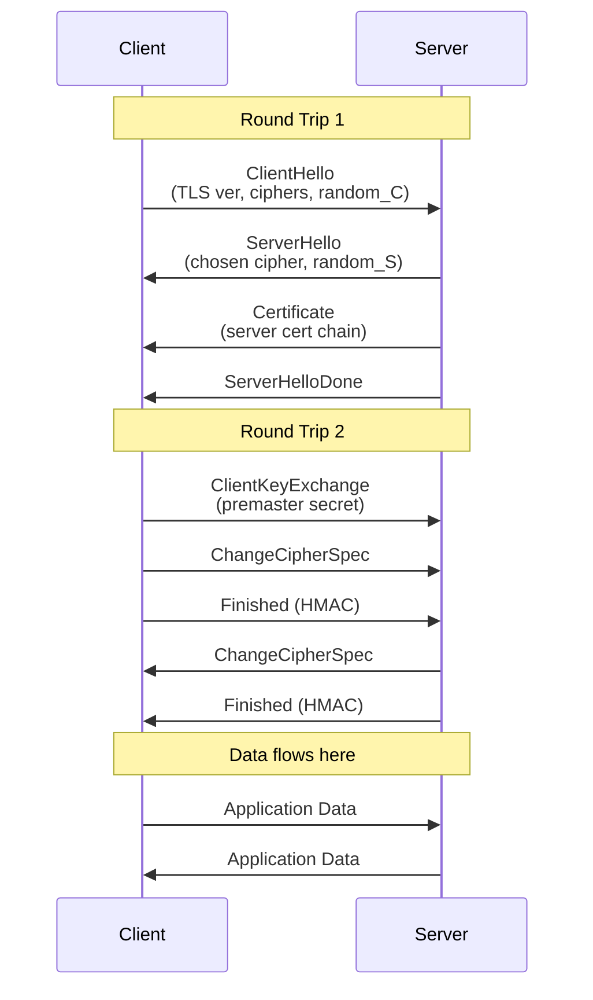
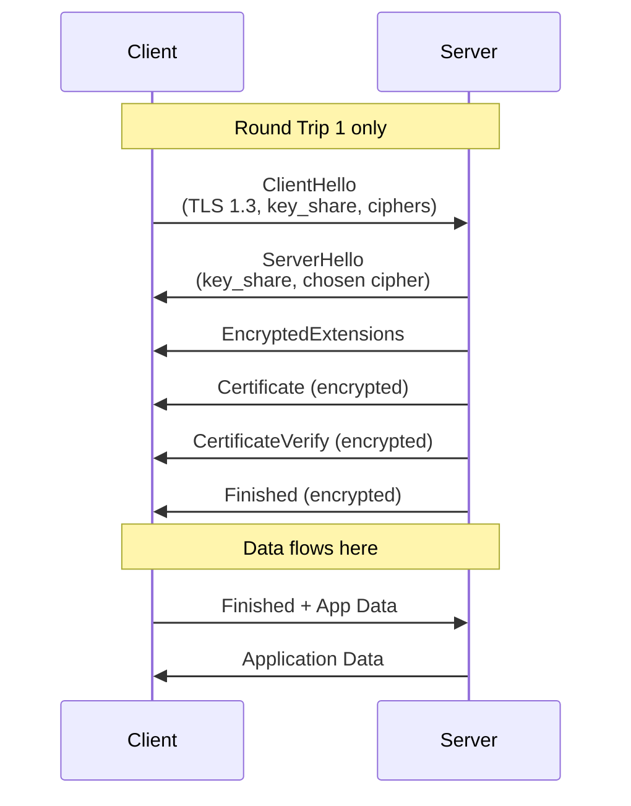
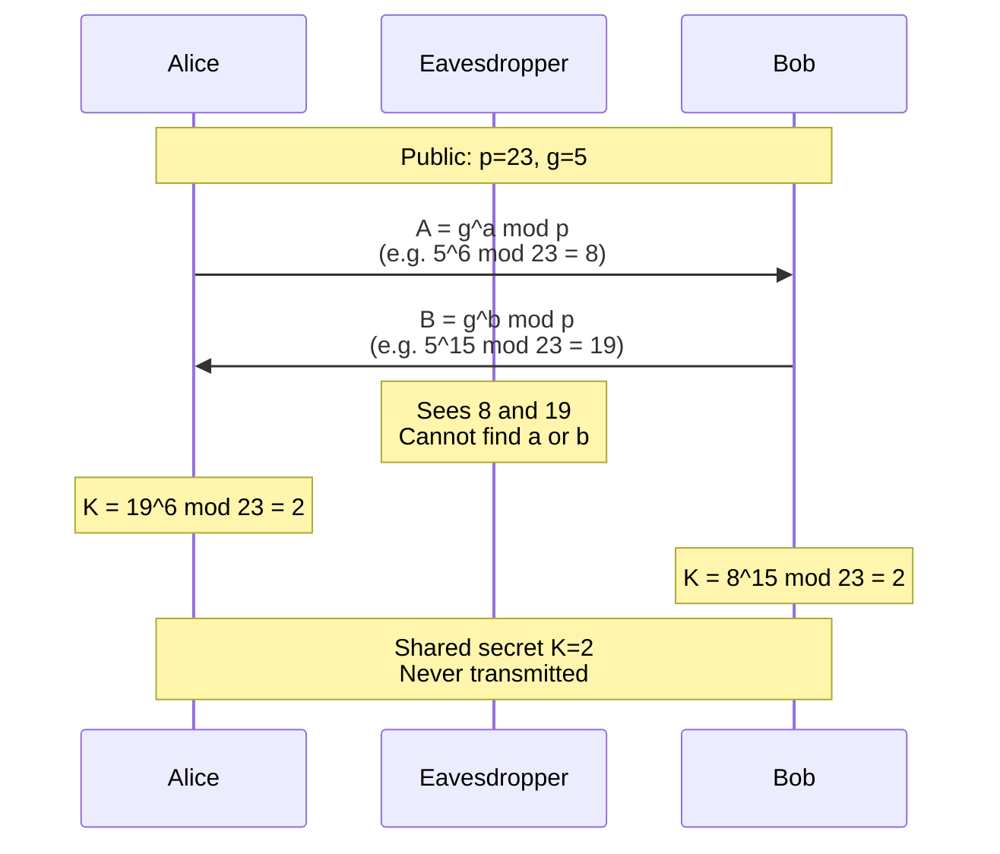
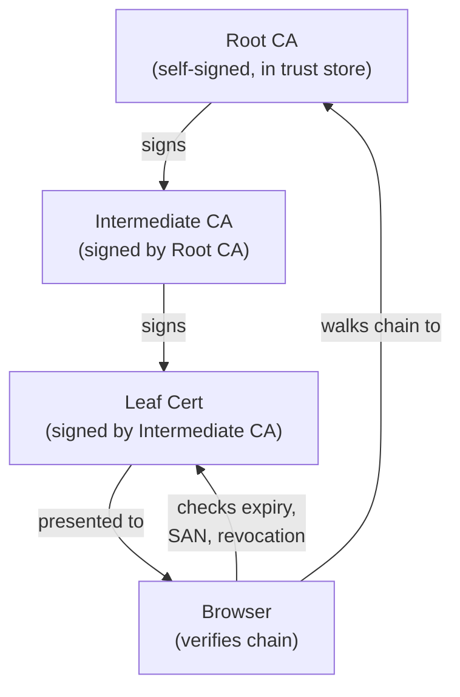
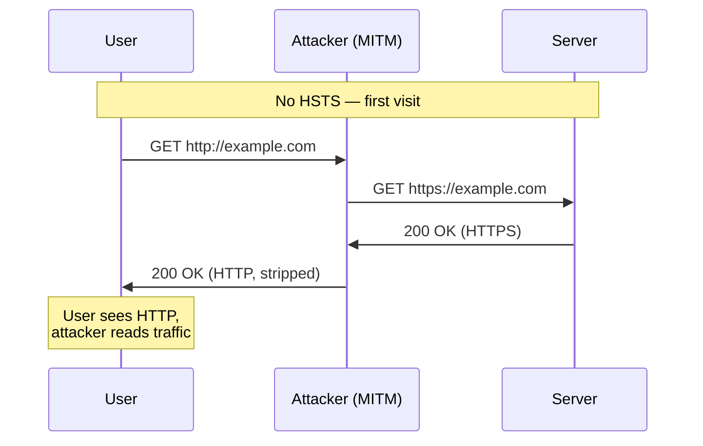
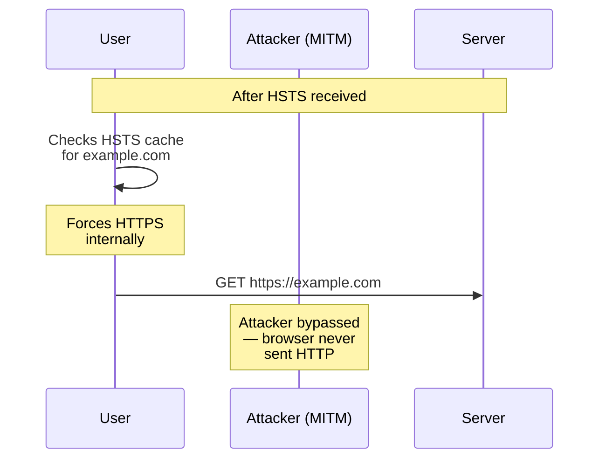
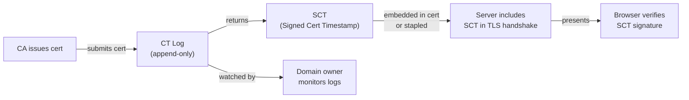

# TLS Hardening Guide

> **Level**: SDE-2 | **Category**: Security / Cryptography

TLS (Transport Layer Security) is the cryptographic protocol underpinning HTTPS. Getting it right means choosing the correct protocol version, cipher suites, certificate chain, and HTTP security headers. This guide covers the math, the mechanics, and production configuration.

---

## Table of Contents

1. [TLS 1.2 vs TLS 1.3 Handshake](#1-tls-12-vs-tls-13-handshake)
2. [Cipher Suite Anatomy](#2-cipher-suite-anatomy)
3. [Forward Secrecy & Diffie-Hellman Math](#3-forward-secrecy--diffie-hellman-math)
4. [Certificate Chain Validation](#4-certificate-chain-validation)
5. [HSTS and Preloading](#5-hsts-and-preloading)
6. [HPKP (Deprecated) vs Certificate Transparency](#6-hpkp-deprecated-vs-certificate-transparency)
7. [Recommended TLS Configuration](#7-recommended-tls-configuration)
8. [Security Bits Comparison](#8-security-bits-comparison)

---

## 1. TLS 1.2 vs TLS 1.3 Handshake

### TLS 1.2 — 2 Round Trips Before Data

TLS 1.2 requires two full round trips (4 messages) before application data can flow.



**Key properties:**
- Key exchange and auth are separate steps
- Server sends certificate before key exchange
- `ChangeCipherSpec` is a distinct message
- Full handshake = 2 RTT

---

### TLS 1.3 — 1 Round Trip Before Data

TLS 1.3 merges the key exchange into `ClientHello`, cutting one full round trip.



**What changed in TLS 1.3:**
- Client sends `key_share` in `ClientHello` — server can derive session keys immediately
- All server messages after `ServerHello` are **encrypted**
- Removed weak cipher suites (RSA key exchange, CBC, SHA-1)
- `ChangeCipherSpec` removed
- 0-RTT resumption available (with replay-attack caveats)

| | TLS 1.2 | TLS 1.3 |
|---|---|---|
| Handshake RTT | 2 | 1 |
| Resumed session RTT | 1 | 0 (0-RTT) |
| Forward secrecy | Optional (DHE/ECDHE) | Mandatory |
| Encrypted cert | No | Yes |
| Weak ciphers | Allowed | Removed |

---

## 2. Cipher Suite Anatomy

A cipher suite name encodes four distinct algorithms. Breaking down `TLS_ECDHE_RSA_WITH_AES_256_GCM_SHA384`:

```
TLS _ ECDHE _ RSA _ WITH _ AES_256_GCM _ SHA384
 │      │      │            │               │
 │      │      │            │               └── MAC / PRF algorithm
 │      │      │            └── Bulk encryption + mode
 │      │      └── Authentication algorithm
 │      └── Key exchange algorithm
 └── Protocol prefix
```

### Component Breakdown

| Component | Value | Role |
|-----------|-------|------|
| **Protocol** | `TLS` | Identifies TLS suite |
| **Key Exchange** | `ECDHE` | Elliptic Curve Diffie-Hellman Ephemeral — establishes shared secret |
| **Authentication** | `RSA` | Proves server identity via certificate signature |
| **Bulk Cipher** | `AES_256` | Symmetric encryption of data (256-bit key) |
| **Cipher Mode** | `GCM` | Galois/Counter Mode — authenticated encryption (AEAD) |
| **MAC/PRF** | `SHA384` | HMAC for integrity; PRF for key derivation |

### Why each choice matters

- **ECDHE** over plain `RSA` key exchange → provides forward secrecy (ephemeral keys)
- **GCM** over **CBC** → AEAD mode; no padding oracle attacks (POODLE, BEAST)
- **SHA384** over **SHA1** → SHA-1 is broken for collision resistance
- **AES-256** → 256-bit security for symmetric encryption

### TLS 1.3 Simplified Suites

TLS 1.3 drops key exchange and auth from the suite name (always ECDHE + cert auth):

```
TLS_AES_256_GCM_SHA384
TLS_CHACHA20_POLY1305_SHA256
TLS_AES_128_GCM_SHA256
```

---

## 3. Forward Secrecy & Diffie-Hellman Math

### The Problem Without Forward Secrecy

In classic RSA key exchange, the client encrypts a pre-master secret with the server's public key. If an attacker records all traffic and later obtains the server's private key, they can decrypt **all past sessions**.

Forward secrecy ensures that **past sessions remain secure** even if the long-term private key is compromised.

---

### Diffie-Hellman Key Exchange

DH works in a cyclic group. Public parameters: prime `p`, generator `g`.

```
Alice picks secret a     Bob picks secret b

Alice sends: A = g^a mod p
Bob sends:   B = g^b mod p

Alice computes: K = B^a mod p = (g^b)^a mod p = g^(ab) mod p
Bob computes:   K = A^b mod p = (g^a)^b mod p = g^(ab) mod p

Both arrive at the same K — without ever transmitting a or b.
```

An eavesdropper sees `p`, `g`, `A = g^a mod p`, `B = g^b mod p` — but cannot compute `g^(ab) mod p` without solving the **Discrete Logarithm Problem** (computationally infeasible for large primes).



### Why Ephemeral = Forward Secrecy

| Mode | Key Reuse | Forward Secrecy |
|------|-----------|-----------------|
| Static DH | Same key every session | No — compromise = all sessions decrypted |
| **Ephemeral DH (DHE/ECDHE)** | New key per session | **Yes** — each session key is independent |

With ECDHE: new `a` and `b` are generated **per handshake**, then discarded. Even if the server's long-term RSA/ECDSA key leaks, the attacker cannot reconstruct past session keys.

### ECDH vs DH

ECDH uses points on an elliptic curve instead of modular exponentiation:

```
DH:   K = g^(ab) mod p         (2048-bit p for 112-bit security)
ECDH: K = a·b·G  (point mul)   (256-bit curve for 128-bit security)
```

ECDH achieves equivalent security with much smaller key sizes → faster handshakes.

---

## 4. Certificate Chain Validation

### Chain of Trust

Browsers don't trust leaf certificates directly. They trust a small set of **Root CAs** (embedded in the OS/browser) and verify a chain of signatures down to the server's cert.



### Validation Steps

1. **Chain building** — server sends leaf + intermediates; browser builds path to trusted root
2. **Signature verification** — each cert's signature is verified using the parent's public key
3. **Validity period** — `notBefore` and `notAfter` fields checked against current time
4. **Subject / SAN** — `Subject Alternative Name` must match the requested hostname
5. **Key usage** — `extendedKeyUsage` must include `serverAuth`
6. **Revocation check** — CRL or OCSP

### OCSP Stapling

OCSP (Online Certificate Status Protocol) checks if a cert has been revoked. Without stapling, the browser makes a separate HTTP request to the CA's OCSP responder on every connection — slow and a privacy leak.

**OCSP Stapling**: the server periodically fetches a **signed OCSP response** from the CA and "staples" it to the TLS handshake. The browser gets revocation proof without a separate round trip.

```
Without stapling:  Client → Server (TLS)  +  Client → CA OCSP (HTTP)
With stapling:     Client → Server (TLS + OCSP response embedded)
```

Enable in nginx:
```nginx
ssl_stapling on;
ssl_stapling_verify on;
resolver 8.8.8.8 1.1.1.1 valid=300s;
```

---

## 5. HSTS and Preloading

### The Downgrade Attack Problem

On the very first request to `http://example.com`, a network attacker can intercept and serve a fake HTTP response — stripping TLS before the user ever sees HTTPS.



### HSTS Protection

`Strict-Transport-Security` tells the browser: **only ever connect via HTTPS for N seconds**.

```
Strict-Transport-Security: max-age=31536000; includeSubDomains; preload
```

| Directive | Meaning |
|-----------|---------|
| `max-age=31536000` | Remember HSTS for 1 year (in seconds) |
| `includeSubDomains` | Apply to all subdomains |
| `preload` | Request inclusion in browser preload list |



### HSTS Preload List

The HSTS preload list (`hstspreload.org`) is a hardcoded list shipped **inside Chrome, Firefox, Safari, Edge** — the site is HTTPS-only from the very first ever request, even on a fresh browser install.

Requirements to join:
- Valid cert
- Redirect HTTP → HTTPS on base domain and all subdomains
- HSTS header with `max-age ≥ 31536000`, `includeSubDomains`, `preload`

> **Warning**: Preloading is hard to undo. Removal from the list takes months to propagate.

---

## 6. HPKP (Deprecated) vs Certificate Transparency

### HPKP — HTTP Public Key Pinning (Deprecated 2018)

HPKP let servers instruct browsers to **pin** specific certificate public keys. Any cert not matching the pin would be rejected.

```
Public-Key-Pins: pin-sha256="base64=="; max-age=5184000; includeSubDomains
```

**Why it was removed:**
- One misconfiguration = your site is **permanently inaccessible** to users who cached the pin
- No recovery mechanism if you lose your private key
- Attackers could use it to DoS a site by injecting a bad pin header
- Chrome removed support in 2018; effectively dead

### Certificate Transparency (CT)

CT is the modern answer. Rather than browsers enforcing pins, **all publicly trusted CAs are required to log every certificate they issue** to append-only, publicly auditable CT logs.



**How CT solves the problem:**
- Mis-issued certs are **publicly visible** within hours
- Domain owners can monitor CT logs (via services like `crt.sh`) for unauthorized certs
- Browsers (Chrome since 2018) require SCTs — if a cert isn't in a CT log, Chrome rejects it
- No site-breaking misconfiguration risk — it's a CA-side requirement

| | HPKP | Certificate Transparency |
|---|---|---|
| Enforcement | Browser-side pin | CA-side log requirement |
| Misconfiguration risk | Site-breaking | None for domain owners |
| Detects mis-issuance | Reactively | Proactively (public log) |
| Status | **Deprecated** | **Required (Chrome)** |

---

## 7. Recommended TLS Configuration

### nginx

```nginx
server {
    listen 443 ssl http2;
    server_name example.com;

    # Certificate chain (leaf + intermediates)
    ssl_certificate     /etc/ssl/certs/example.com.fullchain.pem;
    ssl_certificate_key /etc/ssl/private/example.com.key;

    # Protocol versions — disable TLS 1.0 and 1.1
    ssl_protocols TLSv1.2 TLSv1.3;

    # Cipher suites — TLS 1.2 fallback (TLS 1.3 suites are automatic)
    ssl_ciphers ECDHE-ECDSA-AES256-GCM-SHA384:ECDHE-RSA-AES256-GCM-SHA384:ECDHE-ECDSA-CHACHA20-POLY1305:ECDHE-RSA-CHACHA20-POLY1305:ECDHE-ECDSA-AES128-GCM-SHA256:ECDHE-RSA-AES128-GCM-SHA256;

    # Server chooses cipher (not client) — prevents downgrade
    ssl_prefer_server_ciphers on;

    # DH parameters for DHE (2048-bit minimum, 4096 preferred)
    ssl_dhparam /etc/ssl/dhparam4096.pem;

    # ECDH curve — X25519 is fast and secure; P-256 for compatibility
    ssl_ecdh_curve X25519:P-256:P-384;

    # Session resumption — reduces handshake overhead
    ssl_session_cache   shared:SSL:10m;
    ssl_session_timeout 1d;
    ssl_session_tickets off;   # tickets leak forward secrecy if key not rotated

    # OCSP stapling
    ssl_stapling        on;
    ssl_stapling_verify on;
    ssl_trusted_certificate /etc/ssl/certs/ca-chain.pem;
    resolver 1.1.1.1 8.8.8.8 valid=300s;
    resolver_timeout 5s;

    # HSTS — 1 year, include subdomains, preload
    add_header Strict-Transport-Security "max-age=31536000; includeSubDomains; preload" always;

    # Prevent MIME sniffing
    add_header X-Content-Type-Options nosniff always;

    # Clickjacking protection
    add_header X-Frame-Options DENY always;
}

# Redirect HTTP → HTTPS
server {
    listen 80;
    server_name example.com;
    return 301 https://$host$request_uri;
}
```

**Directive explanations:**

| Directive | Why |
|-----------|-----|
| `ssl_protocols TLSv1.2 TLSv1.3` | Disables TLS 1.0/1.1 (POODLE, BEAST vulnerable) |
| `ssl_ciphers` (ECDHE only) | All suites use ephemeral keys → forward secrecy |
| `ssl_prefer_server_ciphers on` | Server picks strongest mutual cipher, not client |
| `ssl_dhparam` | Custom DH params prevent weak default params |
| `ssl_session_tickets off` | Session tickets encrypted with static key — breaks FS if key leaked |
| `ssl_stapling on` | Embeds OCSP response — faster revocation check |
| HSTS `preload` | Removes first-request MITM window |

---

### Go TLS Server

```go
package main

import (
    "crypto/tls"
    "net/http"
)

func tlsConfig() *tls.Config {
    return &tls.Config{
        // Minimum TLS version
        MinVersion: tls.VersionTLS12,

        // TLS 1.3 is automatic when MinVersion <= TLS13
        // Cipher suites for TLS 1.2 (TLS 1.3 suites are fixed by the spec)
        CipherSuites: []uint16{
            tls.TLS_ECDHE_ECDSA_WITH_AES_256_GCM_SHA384,
            tls.TLS_ECDHE_RSA_WITH_AES_256_GCM_SHA384,
            tls.TLS_ECDHE_ECDSA_WITH_CHACHA20_POLY1305_SHA256,
            tls.TLS_ECDHE_RSA_WITH_CHACHA20_POLY1305_SHA256,
            tls.TLS_ECDHE_ECDSA_WITH_AES_128_GCM_SHA256,
            tls.TLS_ECDHE_RSA_WITH_AES_128_GCM_SHA256,
        },

        // Preferred curves — X25519 first (faster), then NIST curves
        CurvePreferences: []tls.CurveID{
            tls.X25519,
            tls.CurveP256,
            tls.CurveP384,
        },

        // Require client cert for mTLS (optional — remove for public APIs)
        // ClientAuth: tls.RequireAndVerifyClientCert,
        // ClientCAs:  clientCertPool,
    }
}

func main() {
    mux := http.NewServeMux()
    mux.HandleFunc("/", func(w http.ResponseWriter, r *http.Request) {
        // Add HSTS header on every response
        w.Header().Set(
            "Strict-Transport-Security",
            "max-age=31536000; includeSubDomains; preload",
        )
        w.Write([]byte("OK"))
    })

    srv := &http.Server{
        Addr:      ":443",
        Handler:   mux,
        TLSConfig: tlsConfig(),
    }

    // cert and key paths
    if err := srv.ListenAndServeTLS("server.crt", "server.key"); err != nil {
        panic(err)
    }
}
```

**Key Go-specific notes:**
- Go's TLS 1.3 implementation ignores `CipherSuites` for TLS 1.3 connections (suites are fixed by RFC 8446)
- `tls.VersionTLS13` as `MinVersion` disables TLS 1.2 entirely — only do this if you control all clients
- `X25519` is Go's default and preferred; it's faster than P-256 and has no patent/implementation concerns
- Use `crypto/tls`'s `GetCertificate` callback for SNI-based cert selection in multi-domain servers

---

## 8. Security Bits Comparison

"Security bits" measures how hard it is to break a cryptographic primitive — each bit doubles the work for the attacker.

| Algorithm | Key Size | Security Bits | Notes |
|-----------|----------|---------------|-------|
| RSA / DH | 1024-bit | ~80 bits | **Broken** — do not use |
| RSA / DH | 2048-bit | **112 bits** | Minimum acceptable; NIST deprecated after 2030 |
| RSA / DH | 4096-bit | **140 bits** | Recommended for long-lived keys |
| EC (ECDSA/ECDH) | P-256 (256-bit) | **128 bits** | Equivalent to RSA-3072; recommended |
| EC (ECDSA/ECDH) | P-384 (384-bit) | **192 bits** | High-security; used in govt/finance |
| AES | 128-bit | **128 bits** | Secure; no known practical attacks |
| AES | 256-bit | **256 bits** | Post-quantum safe margin |
| ChaCha20 | 256-bit | **256 bits** | Preferred on mobile/ARM (no AES hardware) |

### Why EC is so efficient

RSA/DH security scales poorly: doubling security bits requires much larger keys due to the sub-exponential complexity of the Number Field Sieve. EC uses the harder Elliptic Curve Discrete Log Problem:

```
RSA-2048 = 112 bits security   (2048-bit key)
RSA-4096 = 140 bits security   (4096-bit key)
EC-256   = 128 bits security   (256-bit key)   ← same security, 8x smaller key
EC-384   = 192 bits security   (384-bit key)
```

### Post-Quantum Considerations

Classical RSA and EC are both broken by **Shor's algorithm** on a sufficiently powerful quantum computer. NIST standardized post-quantum algorithms in 2024:

- **ML-KEM** (Kyber) — key encapsulation
- **ML-DSA** (Dilithium) — digital signatures
- **SLH-DSA** (SPHINCS+) — hash-based signatures

TLS 1.3 already supports hybrid key exchange (X25519 + Kyber) in draft extensions. AES-256 and SHA-384 remain quantum-safe (Grover's algorithm only halves effective bits).

---

## Quick Reference: TLS Hardening Checklist

```
Protocol
  ✅ TLS 1.3 enabled
  ✅ TLS 1.2 allowed (compatibility)
  ❌ TLS 1.1 and below disabled

Cipher Suites
  ✅ ECDHE key exchange only (forward secrecy)
  ✅ AES-GCM or ChaCha20-Poly1305 (AEAD)
  ❌ RC4, 3DES, CBC suites disabled
  ❌ NULL and export-grade ciphers disabled

Certificates
  ✅ 2048-bit RSA minimum (prefer EC P-256)
  ✅ SHA-256 signature (not SHA-1)
  ✅ SAN matches all served hostnames
  ✅ Full chain served (leaf + intermediates)
  ✅ OCSP stapling enabled

Session Management
  ✅ Session cache enabled (performance)
  ✅ Session tickets disabled (or key rotated hourly)

HTTP Headers
  ✅ HSTS with max-age ≥ 1 year
  ✅ includeSubDomains
  ✅ preload (after testing)
  ✅ X-Content-Type-Options: nosniff
  ✅ X-Frame-Options: DENY

Monitoring
  ✅ CT log monitoring (crt.sh or similar)
  ✅ Certificate expiry alerts (30/14/7 days)
  ✅ Regular ssllabs.com scan (target A+)
```
