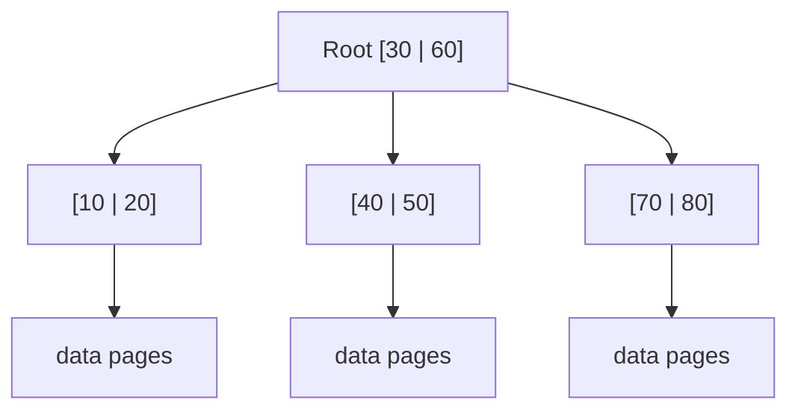
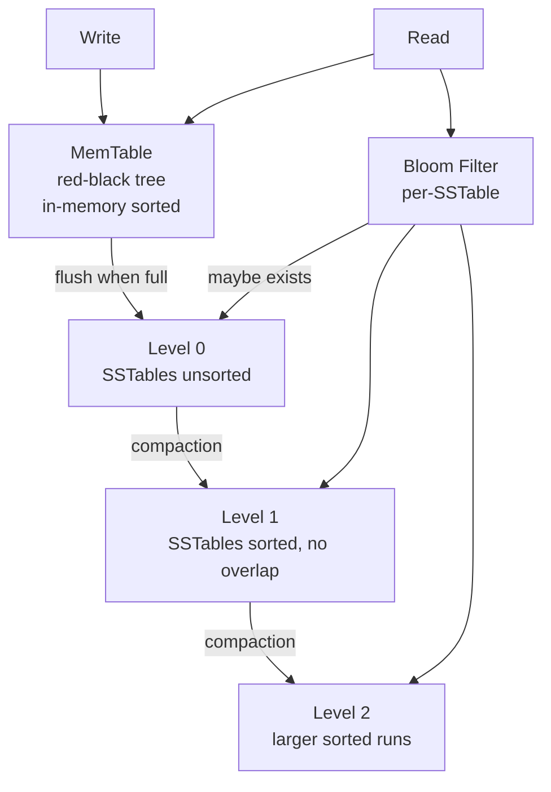
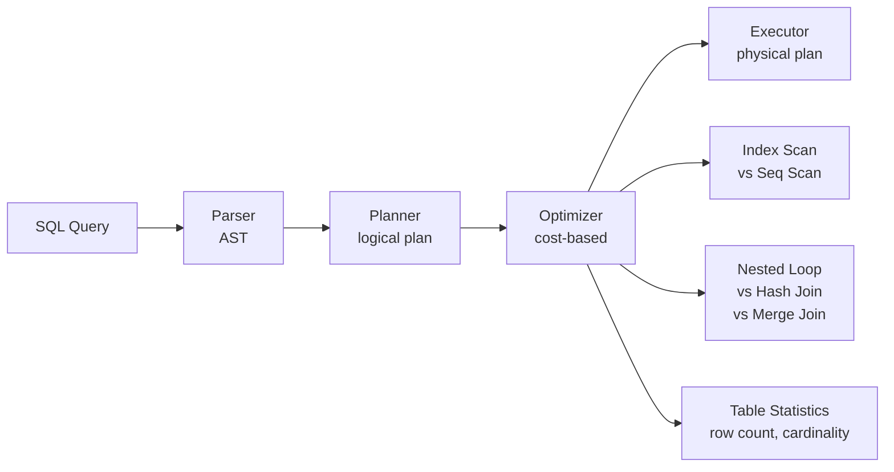
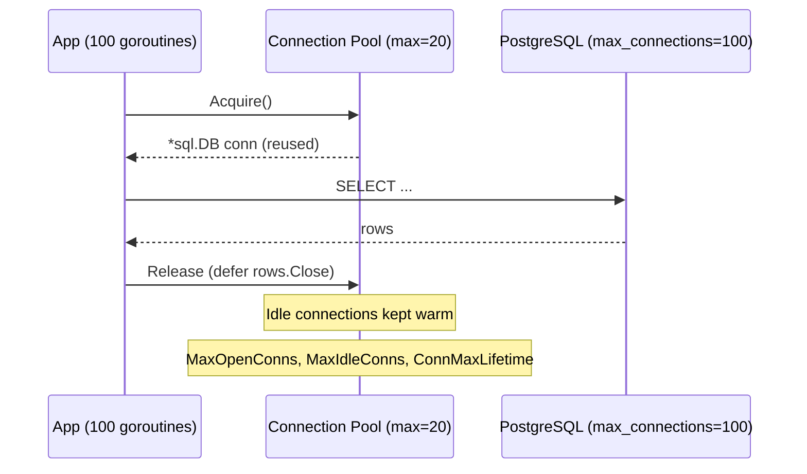

# Database Internals

How storage engines, query optimization, connection pooling, and sharding actually work — with Go implementations.

---

## Storage Engines

### B-Tree (PostgreSQL, MySQL InnoDB)

B-trees are the backbone of relational databases. Every index you create is a B-tree.



**Properties:**
- Balanced — all leaves at same depth → O(log N) lookups
- High fan-out — each node holds many keys → fewer disk reads
- In-place updates — modify pages directly (needs WAL for crash safety)
- Great for: point lookups, range scans, read-heavy workloads

### LSM-Tree (RocksDB, LevelDB, Cassandra)

LSM-trees optimize for writes by buffering in memory and flushing sorted runs to disk.



**Properties:**
- Sequential writes only → 10-100x faster writes than B-tree
- Read amplification — must check multiple levels
- Bloom filters reduce unnecessary disk reads
- Compaction reclaims space and merges levels
- Great for: write-heavy workloads, time-series, logs

### Comparison

| Aspect | B-Tree | LSM-Tree |
|--------|--------|----------|
| Write | O(log N) random I/O | O(1) amortized sequential |
| Read | O(log N) single path | O(log N) × levels |
| Space | ~50% page utilization | Compaction overhead |
| Use case | OLTP, read-heavy | Write-heavy, append-only |

---

## Query Optimization



**Key rules:**
- `EXPLAIN ANALYZE` — always check the actual execution plan
- Index on columns in WHERE, JOIN, ORDER BY
- Covering indexes avoid heap lookups
- Composite index order matters: `(a, b)` helps `WHERE a=1 AND b=2` but not `WHERE b=2`

---

## Connection Pooling



---

## Sharding Strategies

```mermaid
graph TD
    REQ[Request] --> ROUTER[Shard Router]
    ROUTER -->|hash(user_id) % N| HASH[Hash Sharding<br>uniform distribution<br>no range queries]
    ROUTER -->|user_id 1-1M| RANGE[Range Sharding<br>range queries OK<br>hot spots possible]
    ROUTER -->|geography| GEO[Geo Sharding<br>data locality<br>compliance]
    
    HASH --> S1[(Shard 1)]
    HASH --> S2[(Shard 2)]
    HASH --> S3[(Shard 3)]
```

| Strategy | Pros | Cons |
|----------|------|------|
| Hash | Uniform distribution | No range queries, resharding is painful |
| Range | Range scans, easy splits | Hot spots on recent data |
| Directory | Flexible routing | Single point of failure (directory) |

---

## Go Implementation

See `btree.go` for a minimal B-tree, `lsm.go` for an LSM-tree with memtable + SSTable flush, and `pool.go` for connection pool configuration patterns.

```bash
go test -v -race ./...
go run .
```
