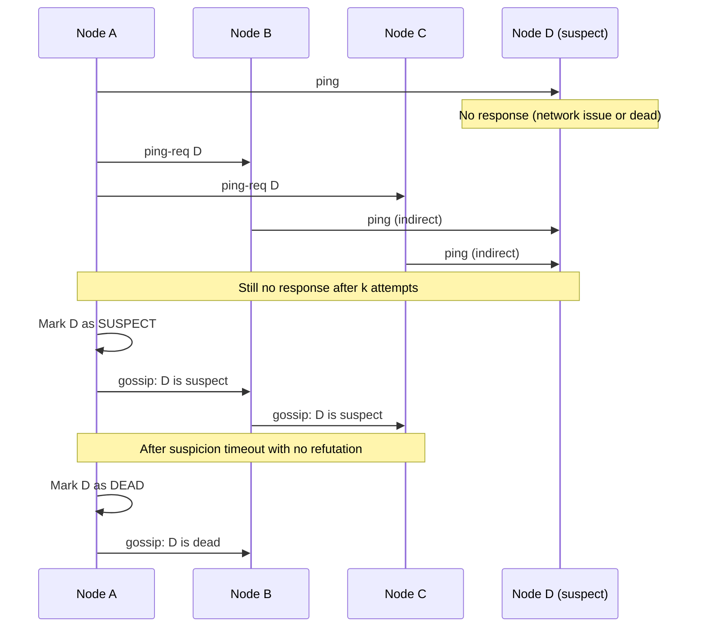

# Service Discovery & Gossip Protocols

In a distributed system, nodes need to find each other, detect failures, and share state — without a central coordinator that becomes a single point of failure.

---

## The Problem with Central Discovery

| Approach | Failure mode |
|----------|-------------|
| Single DNS record | DNS TTL causes stale routing after failure |
| Central DB (Consul KV, etcd) | Works, but the store itself must be highly available |
| ZooKeeper | Complex, Java-heavy, sensitive to GC pauses |
| **Gossip (SWIM)** | No central server — fully decentralized, O(log N) convergence |

---

## SWIM Protocol — How Gossip Works

SWIM (Scalable Weakly-consistent Infection-style Membership) is the algorithm behind HashiCorp Serf, Consul's memberlist, and Kubernetes' kubelet node detection.



**Key properties:**
- Each node pings a random peer every `gossip_interval` (default 200ms)
- Failed direct ping → try `k` indirect pings via random intermediaries (avoids false positives from single network partitions)
- Updates spread exponentially — O(log N) rounds until the whole cluster knows
- Convergence time for 1000 nodes: ~5 seconds

---

## Using hashicorp/memberlist Directly

```go
import "github.com/hashicorp/memberlist"

func joinCluster(bindAddr string, peers []string) (*memberlist.Memberlist, error) {
    config := memberlist.DefaultLANConfig()  // tuned for LAN (fast timeouts)
    config.BindAddr = bindAddr
    config.BindPort = 7946
    config.Name = bindAddr // node identity

    // Hook for receiving cluster events
    config.Events = &clusterEvents{}

    list, err := memberlist.Create(config)
    if err != nil {
        return nil, err
    }

    // Join by providing at least one known peer
    // That peer gossips your existence to the whole cluster
    if len(peers) > 0 {
        _, err = list.Join(peers)
    }
    return list, err
}

type clusterEvents struct{}

func (e *clusterEvents) NotifyJoin(node *memberlist.Node) {
    slog.Info("node joined", "node", node.Name, "addr", node.Addr)
}
func (e *clusterEvents) NotifyLeave(node *memberlist.Node) {
    slog.Info("node left", "node", node.Name)
}
func (e *clusterEvents) NotifyUpdate(node *memberlist.Node) {
    slog.Info("node updated", "node", node.Name)
}

// Query current live members
func liveMembers(list *memberlist.Memberlist) []string {
    var addrs []string
    for _, m := range list.Members() {
        addrs = append(addrs, m.Addr.String())
    }
    return addrs
}
```

---

## Using hashicorp/serf (Higher-Level)

Serf wraps memberlist and adds **custom events** and **queries**:

```go
import "github.com/hashicorp/serf/serf"

func createSerfAgent(bindAddr string) (*serf.Serf, chan serf.Event, error) {
    eventCh := make(chan serf.Event, 256)

    config := serf.DefaultConfig()
    config.MemberlistConfig.BindAddr = bindAddr
    config.MemberlistConfig.BindPort = 7946
    config.NodeName = bindAddr
    config.EventCh = eventCh // receive cluster events here

    s, err := serf.Create(config)
    return s, eventCh, err
}

func handleEvents(s *serf.Serf, eventCh chan serf.Event) {
    for e := range eventCh {
        switch ev := e.(type) {
        case serf.MemberEvent:
            for _, m := range ev.Members {
                switch ev.Type {
                case serf.EventMemberJoin:
                    // register in local service registry
                    registry.Add(m.Name, m.Addr.String())
                case serf.EventMemberFailed, serf.EventMemberLeave:
                    // remove from load balancer pool
                    registry.Remove(m.Name)
                }
            }
        case serf.UserEvent:
            // Custom event — e.g., config reload broadcast
            slog.Info("user event", "name", ev.Name, "payload", string(ev.Payload))
        }
    }
}

// Broadcast a custom event to the entire cluster
func broadcastConfigReload(s *serf.Serf, newConfig []byte) error {
    return s.UserEvent("config-reload", newConfig, false)
}
```

---

## Service Discovery with Consul

Consul uses Serf for gossip + Raft for strong consistency. It provides:
- Service registration + health checks
- KV store
- DNS interface (`service-name.service.consul`)

```go
import "github.com/hashicorp/consul/api"

func registerService(name, addr string, port int) error {
    client, _ := api.NewClient(api.DefaultConfig())

    return client.Agent().ServiceRegister(&api.AgentServiceRegistration{
        ID:      fmt.Sprintf("%s-%s-%d", name, addr, port),
        Name:    name,
        Address: addr,
        Port:    port,
        Check: &api.AgentServiceCheck{
            HTTP:                           fmt.Sprintf("http://%s:%d/health", addr, port),
            Interval:                       "10s",
            DeregisterCriticalServiceAfter: "30s", // auto-deregister after 30s unhealthy
        },
    })
}

func discoverService(name string) ([]*api.ServiceEntry, error) {
    client, _ := api.NewClient(api.DefaultConfig())

    // Returns only healthy instances
    entries, _, err := client.Health().Service(name, "", true, nil)
    return entries, err
}

// Watch for changes (long-polling)
func watchService(ctx context.Context, name string, onChange func([]*api.ServiceEntry)) {
    client, _ := api.NewClient(api.DefaultConfig())
    var lastIndex uint64
    for {
        entries, meta, err := client.Health().Service(name, "", true, &api.QueryOptions{
            WaitIndex: lastIndex, // blocks until something changes
            WaitTime:  30 * time.Second,
            Context:   ctx,
        })
        if err != nil {
            time.Sleep(time.Second)
            continue
        }
        if meta.LastIndex > lastIndex {
            lastIndex = meta.LastIndex
            onChange(entries)
        }
    }
}
```

---

## Gossip vs Consul vs Kubernetes DNS

| | Pure Gossip (memberlist) | Consul | K8s DNS (CoreDNS) |
|--|--------------------------|--------|-------------------|
| Consistency | Eventual | Strong (Raft) or eventual | Eventual (EndpointSlice) |
| Health check | Gossip failure detection | Active HTTP/TCP checks | Readiness probe |
| Discovery API | Membership list | DNS + HTTP API | DNS only |
| Config store | No | Yes (KV) | ConfigMap (not dynamic) |
| Best for | Peer-to-peer mesh, cache rings | Microservice registry | K8s-native workloads |

---

## When to Use What

```
K8s cluster, all services in-cluster
  → CoreDNS + K8s Services (built-in, zero ops)
  → No gossip needed

K8s cluster + external services + multi-cloud
  → Consul (service mesh across boundaries)

Custom distributed system (cache ring, distributed DB, peer-to-peer)
  → memberlist or Serf directly
  → Full control over membership, events, gossip interval

Just need "which nodes are alive"
  → memberlist alone — no Consul overhead
```
