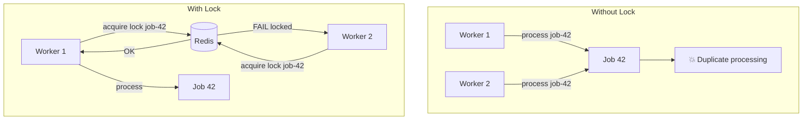
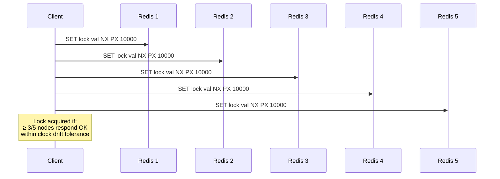
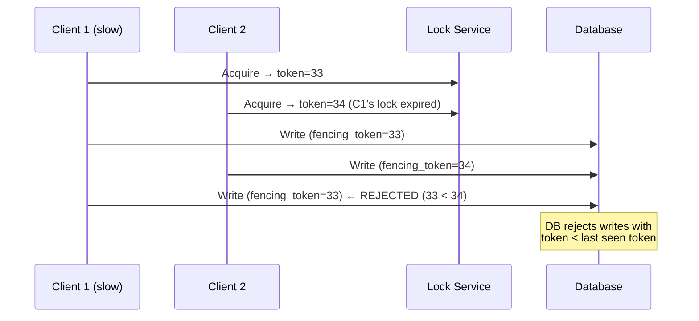

# Distributed Locking

Redis SETNX, Redlock algorithm, lease-based locks, and fencing tokens for coordinating work across processes.

---

## Why Distributed Locks?



---

## Redis SETNX (Simple Lock)

```go
func acquireLock(ctx context.Context, rdb *redis.Client, key string, ttl time.Duration) (bool, error) {
    return rdb.SetNX(ctx, "lock:"+key, "owner-id", ttl).Result()
}

func releaseLock(ctx context.Context, rdb *redis.Client, key, owner string) error {
    // Lua script: only delete if we own the lock
    script := `
        if redis.call("GET", KEYS[1]) == ARGV[1] then
            return redis.call("DEL", KEYS[1])
        end
        return 0
    `
    return rdb.Eval(ctx, script, []string{"lock:" + key}, owner).Err()
}
```

**Critical**: Always use Lua script for release — prevents deleting someone else's lock after your TTL expires.

---

## Redlock Algorithm (Multi-Node)



**Redlock rules:**
1. Try to acquire lock on N (5) independent Redis nodes
2. Lock is valid if acquired on majority (N/2 + 1) within time limit
3. Effective TTL = original TTL - time spent acquiring
4. If failed, release on all nodes

---

## Fencing Tokens



**Why fencing tokens?** Locks can expire while the holder is still working (GC pause, network delay). Fencing tokens prevent stale writes.

```go
type FencedLock struct {
    token   int64
    key     string
    owner   string
}

func (l *FencedLock) Acquire(ctx context.Context) (int64, error) {
    // Atomically increment and set
    token, err := rdb.Incr(ctx, "fence:"+l.key).Result()
    if err != nil {
        return 0, err
    }
    ok, err := rdb.SetNX(ctx, "lock:"+l.key, fmt.Sprintf("%s:%d", l.owner, token), 30*time.Second).Result()
    if !ok {
        return 0, ErrLockHeld
    }
    return token, nil
}
```

---

## Lease-Based Locks

```go
// Lease pattern: lock holder must periodically renew
func holdLock(ctx context.Context, key string) {
    acquired := acquireLock(ctx, key, 30*time.Second)
    if !acquired {
        return
    }
    defer releaseLock(ctx, key)

    // Renewal goroutine
    go func() {
        ticker := time.NewTicker(10 * time.Second) // renew at 1/3 of TTL
        defer ticker.Stop()
        for {
            select {
            case <-ctx.Done():
                return
            case <-ticker.C:
                rdb.Expire(ctx, "lock:"+key, 30*time.Second)
            }
        }
    }()

    // Do work...
    processJob(ctx)
}
```

---

## Comparison

| Approach | Safety | Liveness | Complexity |
|----------|--------|----------|-----------|
| Single Redis SETNX | Weak (Redis crash = lost) | TTL auto-release | Low |
| Redlock (5 nodes) | Strong (majority quorum) | TTL auto-release | Medium |
| ZooKeeper/etcd lease | Strong (consensus) | Session-based | High |
| PostgreSQL advisory lock | Strong (ACID) | Connection-based | Low |
| Fencing token + any lock | Strongest | Depends on lock | Medium |

---

## When to Use What

| Scenario | Recommendation |
|----------|---------------|
| Prevent duplicate cron jobs | Single Redis SETNX + TTL |
| Leader election | etcd lease or Redlock |
| Distributed scheduler | Lease + heartbeat renewal |
| Financial operations | Fencing token + DB constraint |
| Simple mutex (same process) | `sync.Mutex` (no distributed lock needed!) |
