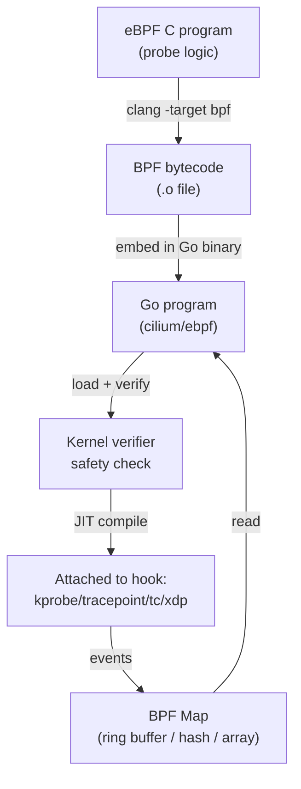

# eBPF with Go

eBPF lets you run sandboxed programs in the Linux kernel without modifying kernel source or loading modules. For Go engineers, this means zero-overhead tracing, network filtering, and security enforcement.

The deep bpftrace one-liners and eBPF hook types are covered in [`devops/linux/ebpf-bpftrace.md`](../../devops/linux/ebpf-bpftrace.md). This file covers **Go as the user-space host** for production eBPF programs.

---

## How It Works



**Go is the control plane:** it loads the BPF program, reads maps, processes events. The BPF C program runs in the kernel and writes to maps.

---

## Full Example: Tracing execve Syscalls

**Step 1: BPF program in C (`execve.bpf.c`)**

```c
//go:build ignore
#include "vmlinux.h"
#include <bpf/bpf_helpers.h>
#include <bpf/bpf_tracing.h>

struct event {
    u32 pid;
    char comm[16];
    char filename[256];
};

// Ring buffer map — efficient multi-producer, single-consumer event stream
struct {
    __uint(type, BPF_MAP_TYPE_RINGBUF);
    __uint(max_entries, 256 * 1024);
} events SEC(".maps");

// Attach to execve tracepoint
SEC("tracepoint/syscalls/sys_enter_execve")
int trace_execve(struct trace_event_raw_sys_enter *ctx) {
    struct event *e = bpf_ringbuf_reserve(&events, sizeof(*e), 0);
    if (!e) return 0;

    e->pid = bpf_get_current_pid_tgid() >> 32;
    bpf_get_current_comm(&e->comm, sizeof(e->comm));
    bpf_probe_read_user_str(&e->filename, sizeof(e->filename), (void *)ctx->args[0]);
    bpf_ringbuf_submit(e, 0);
    return 0;
}

char LICENSE[] SEC("license") = "GPL";
```

**Step 2: Generate Go bindings**

```bash
# Install bpf2go (part of cilium/ebpf toolchain)
go install github.com/cilium/ebpf/cmd/bpf2go@latest

# Generate Go structs + embedded BPF bytecode
bpf2go -target amd64 Execve execve.bpf.c
# Creates: execve_bpfel.go + execve_bpfel.o (embedded in binary)
```

**Step 3: Go host program**

```go
package main

import (
    "bytes"
    "encoding/binary"
    "log"
    "os"
    "os/signal"
    "syscall"

    "github.com/cilium/ebpf/link"
    "github.com/cilium/ebpf/ringbuf"
    "github.com/cilium/ebpf/rlimit"
)

// Generated by bpf2go — matches struct event in C
type ExecveEvent struct {
    Pid      uint32
    Comm     [16]byte
    Filename [256]byte
}

func main() {
    // Allow loading BPF programs (remove memlock rlimit)
    if err := rlimit.RemoveMemlock(); err != nil {
        log.Fatal("remove memlock:", err)
    }

    // Load BPF objects (bytecode embedded at compile time)
    objs := ExecveObjects{}
    if err := LoadExecveObjects(&objs, nil); err != nil {
        log.Fatal("load objects:", err)
    }
    defer objs.Close()

    // Attach to tracepoint
    tp, err := link.Tracepoint("syscalls", "sys_enter_execve", objs.TraceExecve, nil)
    if err != nil {
        log.Fatal("attach tracepoint:", err)
    }
    defer tp.Close()

    // Read events from ring buffer
    rd, err := ringbuf.NewReader(objs.Events)
    if err != nil {
        log.Fatal("ringbuf reader:", err)
    }
    defer rd.Close()

    log.Println("tracing execve syscalls... Ctrl+C to stop")

    // Close reader on signal to unblock rd.Read()
    go func() {
        sig := make(chan os.Signal, 1)
        signal.Notify(sig, syscall.SIGINT, syscall.SIGTERM)
        <-sig
        rd.Close()
    }()

    var event ExecveEvent
    for {
        record, err := rd.Read()
        if err != nil {
            break // closed
        }
        if err := binary.Read(bytes.NewReader(record.RawSample), binary.LittleEndian, &event); err != nil {
            continue
        }
        log.Printf("pid=%d comm=%s file=%s",
            event.Pid,
            nullTermString(event.Comm[:]),
            nullTermString(event.Filename[:]),
        )
    }
}

func nullTermString(b []byte) string {
    i := bytes.IndexByte(b, 0)
    if i == -1 {
        return string(b)
    }
    return string(b[:i])
}
```

---

## BPF Map Types

| Map type | Use case | Go API |
|----------|---------|--------|
| `BPF_MAP_TYPE_HASH` | Key-value store (pid → bytes) | `map.Lookup(key, &val)` |
| `BPF_MAP_TYPE_ARRAY` | Fixed-size indexed array | `map.Lookup(index, &val)` |
| `BPF_MAP_TYPE_PERF_EVENT_ARRAY` | Per-CPU event stream (older) | `perf.NewReader()` |
| `BPF_MAP_TYPE_RINGBUF` | Single ring buffer, lower overhead | `ringbuf.NewReader()` |
| `BPF_MAP_TYPE_LRU_HASH` | Hash with LRU eviction | Same as HASH |

**Ring buffer vs perf buffer:** Ring buffer (kernel 5.8+) is preferred — lower overhead, no per-CPU memory, events are ordered.

---

## Hook Types and Use Cases

| Hook | Kernel version | Use case |
|------|---------------|---------|
| `kprobe/kretprobe` | 4.1+ | Trace kernel function entry/exit |
| `tracepoint` | 4.7+ | Stable trace points (preferred over kprobes) |
| `uprobe/uretprobe` | 4.1+ | Trace user-space function (your Go binary) |
| `XDP` (eXpress Data Path) | 4.8+ | Process packets before kernel network stack |
| `TC` (traffic control) | 4.1+ | Filter/redirect at TC egress/ingress |
| `LSM` (Linux Security Module) | 5.7+ | Security policy enforcement |
| `socket filter` | 2.6+ | Filter packets on a socket |

---

## Network Packet Filtering with XDP

XDP programs run before the kernel networking stack — the fastest possible packet processing:

```c
// Minimal XDP program: drop all packets from a blocklist
SEC("xdp")
int xdp_drop_blocklist(struct xdp_md *ctx) {
    void *data = (void *)(long)ctx->data;
    void *data_end = (void *)(long)ctx->data_end;
    
    struct ethhdr *eth = data;
    if ((void *)(eth + 1) > data_end) return XDP_PASS;
    
    struct iphdr *ip = (void *)(eth + 1);
    if ((void *)(ip + 1) > data_end) return XDP_PASS;
    
    // Check if source IP is in blocklist map
    __u32 src = ip->saddr;
    if (bpf_map_lookup_elem(&blocklist, &src)) {
        return XDP_DROP; // drop at NIC level — never enters kernel
    }
    return XDP_PASS;
}
```

Performance: XDP can process **24 million packets/second** on a single CPU core vs ~3M/sec for iptables.

---

## Go + eBPF in Production: What to Know

```
Prerequisites:
  Linux kernel ≥ 5.8 for ring buffers (5.4 for most features)
  CAP_BPF capability (or root) for loading programs
  BTF (BPF Type Format) enabled in kernel for CO-RE (Compile Once, Run Everywhere)

Production pattern:
  1. Write BPF C program + Go bindings
  2. Compile with bpf2go → BPF bytecode embedded in Go binary
  3. Go binary ships as a single artifact — no runtime C compilation
  4. Load at startup, handle errors gracefully (fallback if kernel too old)

CO-RE (Compile Once, Run Everywhere):
  Traditional: BPF bytecode compiled against running kernel headers (brittle)
  CO-RE: BPF programs adapt to different kernel versions at load time via BTF
  → Cilium, Tetragon all use CO-RE
```

---

## When eBPF vs bpftrace vs Other Tools

| Tool | Use case |
|------|---------|
| `bpftrace` one-liners | Ad-hoc debugging on a live system (see devops/linux/ebpf-bpftrace.md) |
| `BCC tools` (execsnoop, biolatency) | Pre-built analysis tools |
| `cilium/ebpf` (Go) | Production daemon, long-running, needs to handle maps and events |
| `Cilium` | Full K8s CNI + network policy via eBPF (don't write yourself) |
| `Tetragon` | Security observability + enforcement (don't write yourself) |

**Write custom Go + eBPF when:** you need specific application-level tracing (your own service's hot paths, custom network policies, custom audit logging) that generic tools don't cover.
