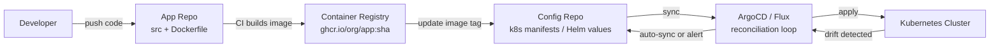
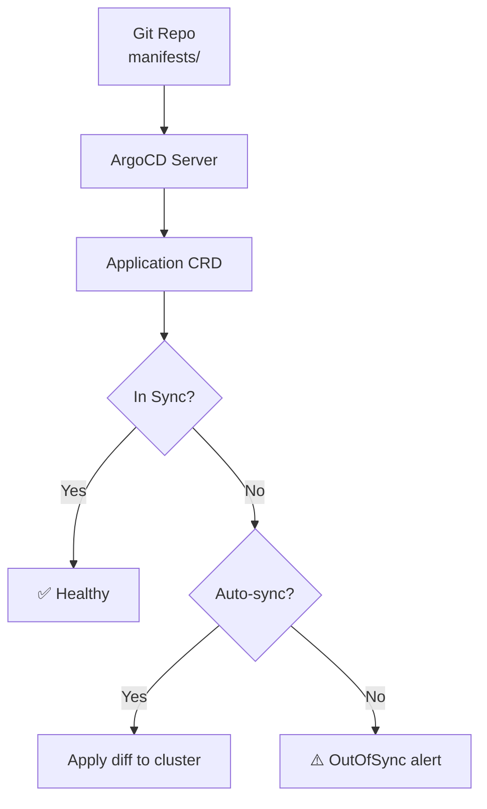
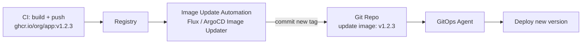

# GitOps

Declarative deployment with ArgoCD and Flux — Git as the single source of truth for infrastructure.

---

## What is GitOps?



**Core principles:**
1. **Declarative**: Desired state described in Git (YAML/Helm/Kustomize)
2. **Versioned**: Git history = deployment history (rollback = `git revert`)
3. **Automated**: Agent pulls changes and applies them
4. **Self-healing**: Drift from desired state is automatically corrected

---

## Push vs Pull Deployment

```mermaid
graph TD
    subgraph Push (Traditional CI/CD)
        CI1[CI Pipeline] -->|kubectl apply| K8S1[Cluster]
        Note1[CI has cluster credentials<br>Security risk]
    end
    
    subgraph Pull (GitOps)
        GIT[Git Repo] --> AGENT[ArgoCD in-cluster]
        AGENT -->|reconcile| K8S2[Cluster]
        Note2[No external access needed<br>Agent pulls from Git]
    end
```

| Aspect | Push (CI/CD) | Pull (GitOps) |
|--------|-------------|---------------|
| Credentials | CI has cluster access | Agent inside cluster |
| Drift detection | None | Continuous |
| Rollback | Re-run old pipeline | `git revert` |
| Audit trail | CI logs | Git history |
| Multi-cluster | Complex | Native |

---

## ArgoCD



### ArgoCD Application

```yaml
apiVersion: argoproj.io/v1alpha1
kind: Application
metadata:
  name: my-go-service
  namespace: argocd
spec:
  project: default
  source:
    repoURL: https://github.com/org/k8s-manifests.git
    targetRevision: main
    path: apps/my-go-service
  destination:
    server: https://kubernetes.default.svc
    namespace: production
  syncPolicy:
    automated:
      prune: true      # delete resources removed from Git
      selfHeal: true   # revert manual kubectl changes
    syncOptions:
      - CreateNamespace=true
```

---

## Flux

```yaml
# GitRepository source
apiVersion: source.toolkit.fluxcd.io/v1
kind: GitRepository
metadata:
  name: my-app
  namespace: flux-system
spec:
  interval: 1m
  url: https://github.com/org/k8s-manifests
  ref:
    branch: main
---
# Kustomization (what to deploy)
apiVersion: kustomize.toolkit.fluxcd.io/v1
kind: Kustomization
metadata:
  name: my-app
  namespace: flux-system
spec:
  interval: 5m
  path: ./apps/my-go-service
  sourceRef:
    kind: GitRepository
    name: my-app
  prune: true
  healthChecks:
    - apiVersion: apps/v1
      kind: Deployment
      name: my-go-service
      namespace: production
```

---

## Repository Structure

```
k8s-manifests/
├── apps/
│   ├── my-go-service/
│   │   ├── deployment.yaml
│   │   ├── service.yaml
│   │   ├── ingress.yaml
│   │   └── kustomization.yaml
│   └── another-service/
├── infrastructure/
│   ├── cert-manager/
│   ├── ingress-nginx/
│   └── monitoring/
└── clusters/
    ├── production/
    │   └── kustomization.yaml  (patches for prod)
    └── staging/
        └── kustomization.yaml  (patches for staging)
```

---

## Image Update Automation



No human intervention: CI builds image → automation updates Git → GitOps deploys.

---

## Rollback

```bash
# GitOps rollback = git revert
git revert HEAD  # undo last commit (image tag change)
git push         # ArgoCD/Flux auto-syncs to previous version

# ArgoCD manual rollback
argocd app rollback my-go-service

# Check sync status
argocd app get my-go-service
```
