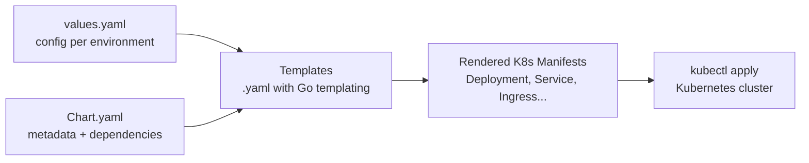
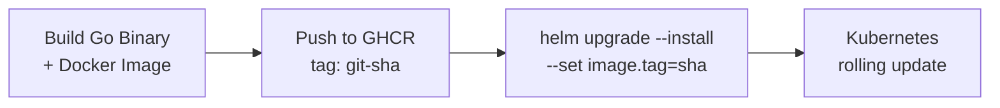

# Helm Charts for Go Services

Chart anatomy, values, templates, and deploying Go microservices to Kubernetes with Helm.

---

## What is Helm?



Helm = package manager for Kubernetes. A **chart** is a bundle of templated K8s manifests.

---

## Chart Structure

```
my-go-service/
├── Chart.yaml              # chart metadata (name, version, appVersion)
├── values.yaml             # default configuration
├── values-staging.yaml     # environment override
├── values-production.yaml  # environment override
├── templates/
│   ├── _helpers.tpl        # template helpers (labels, names)
│   ├── deployment.yaml
│   ├── service.yaml
│   ├── ingress.yaml
│   ├── hpa.yaml            # horizontal pod autoscaler
│   ├── configmap.yaml
│   └── serviceaccount.yaml
└── .helmignore
```

---

## Chart.yaml

```yaml
apiVersion: v2
name: my-go-service
description: A Go microservice
type: application
version: 0.1.0        # chart version (bump on template changes)
appVersion: "1.2.3"   # app version (your Go binary version)
```

---

## values.yaml (Defaults)

```yaml
replicaCount: 2

image:
  repository: ghcr.io/org/my-go-service
  tag: ""  # overridden by CI (defaults to Chart appVersion)
  pullPolicy: IfNotPresent

service:
  type: ClusterIP
  port: 8080

ingress:
  enabled: false
  className: nginx
  hosts:
    - host: api.example.com
      paths:
        - path: /
          pathType: Prefix

resources:
  requests:
    cpu: 100m
    memory: 64Mi
  limits:
    cpu: 500m
    memory: 128Mi

autoscaling:
  enabled: false
  minReplicas: 2
  maxReplicas: 10
  targetCPUUtilization: 70

env:
  LOG_LEVEL: info
  PORT: "8080"

probes:
  liveness:
    path: /healthz
    initialDelaySeconds: 10
  readiness:
    path: /readyz
    initialDelaySeconds: 5
```

---

## Templates

### deployment.yaml

```yaml
apiVersion: apps/v1
kind: Deployment
metadata:
  name: {{ include "my-go-service.fullname" . }}
  labels:
    {{- include "my-go-service.labels" . | nindent 4 }}
spec:
  {{- if not .Values.autoscaling.enabled }}
  replicas: {{ .Values.replicaCount }}
  {{- end }}
  selector:
    matchLabels:
      {{- include "my-go-service.selectorLabels" . | nindent 6 }}
  template:
    metadata:
      labels:
        {{- include "my-go-service.selectorLabels" . | nindent 8 }}
    spec:
      containers:
        - name: {{ .Chart.Name }}
          image: "{{ .Values.image.repository }}:{{ .Values.image.tag | default .Chart.AppVersion }}"
          imagePullPolicy: {{ .Values.image.pullPolicy }}
          ports:
            - containerPort: {{ .Values.service.port }}
          env:
            {{- range $key, $value := .Values.env }}
            - name: {{ $key }}
              value: {{ $value | quote }}
            {{- end }}
          livenessProbe:
            httpGet:
              path: {{ .Values.probes.liveness.path }}
              port: {{ .Values.service.port }}
            initialDelaySeconds: {{ .Values.probes.liveness.initialDelaySeconds }}
          readinessProbe:
            httpGet:
              path: {{ .Values.probes.readiness.path }}
              port: {{ .Values.service.port }}
            initialDelaySeconds: {{ .Values.probes.readiness.initialDelaySeconds }}
          resources:
            {{- toYaml .Values.resources | nindent 12 }}
```

### _helpers.tpl

```yaml
{{- define "my-go-service.fullname" -}}
{{- printf "%s-%s" .Release.Name .Chart.Name | trunc 63 | trimSuffix "-" }}
{{- end }}

{{- define "my-go-service.labels" -}}
app.kubernetes.io/name: {{ .Chart.Name }}
app.kubernetes.io/instance: {{ .Release.Name }}
app.kubernetes.io/version: {{ .Chart.AppVersion | quote }}
app.kubernetes.io/managed-by: {{ .Release.Service }}
{{- end }}

{{- define "my-go-service.selectorLabels" -}}
app.kubernetes.io/name: {{ .Chart.Name }}
app.kubernetes.io/instance: {{ .Release.Name }}
{{- end }}
```

---

## Deploying

```bash
# Install / upgrade
helm upgrade --install my-api ./my-go-service \
  -f values-production.yaml \
  --set image.tag=v1.2.3 \
  --namespace production

# Dry run (see rendered manifests)
helm template my-api ./my-go-service -f values-production.yaml

# Rollback
helm rollback my-api 1  # revision number

# History
helm history my-api
```

---

## CI/CD Integration



```yaml
# GitHub Actions step
- name: Deploy
  run: |
    helm upgrade --install my-api ./charts/my-go-service \
      --namespace production \
      --set image.tag=${{ github.sha }} \
      --set env.DATABASE_URL=${{ secrets.DATABASE_URL }} \
      --wait --timeout 5m
```

---

## Environment Overrides

```yaml
# values-production.yaml
replicaCount: 5

autoscaling:
  enabled: true
  minReplicas: 3
  maxReplicas: 20

resources:
  requests:
    cpu: 500m
    memory: 256Mi
  limits:
    cpu: "2"
    memory: 512Mi

ingress:
  enabled: true
  hosts:
    - host: api.production.example.com
      paths:
        - path: /
          pathType: Prefix
  tls:
    - secretName: api-tls
      hosts:
        - api.production.example.com
```

---

## Best Practices

| Practice | Why |
|----------|-----|
| Never hardcode secrets in values | Use External Secrets Operator or sealed-secrets |
| Pin chart versions in CI | Reproducible deploys |
| Use `helm diff` plugin | Preview changes before apply |
| One chart per service | Independent lifecycle |
| `helm lint` in CI | Catch template errors early |
| Set resource requests/limits | Prevent noisy neighbors |
| Always set probes | K8s needs to know if your app is healthy |
