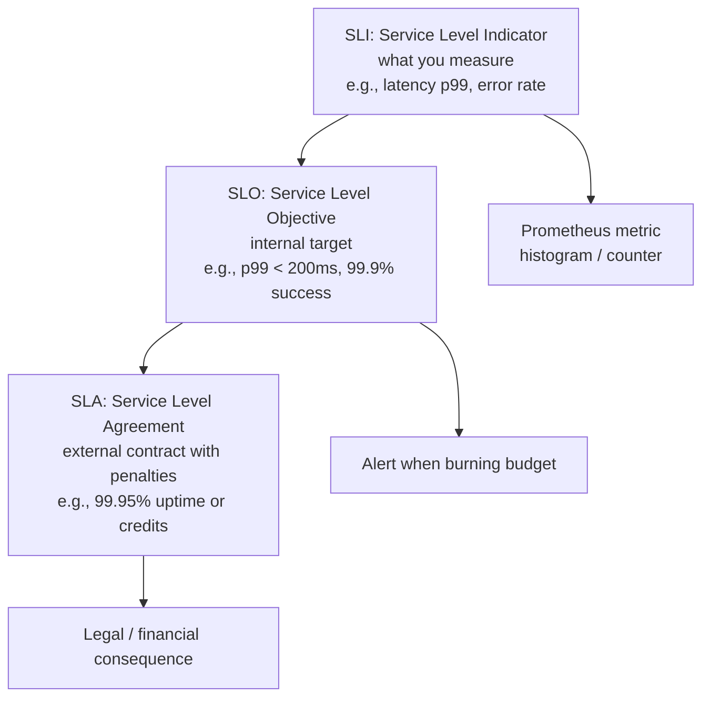
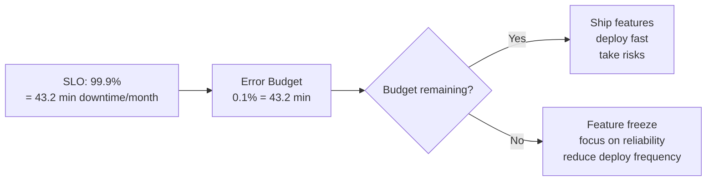
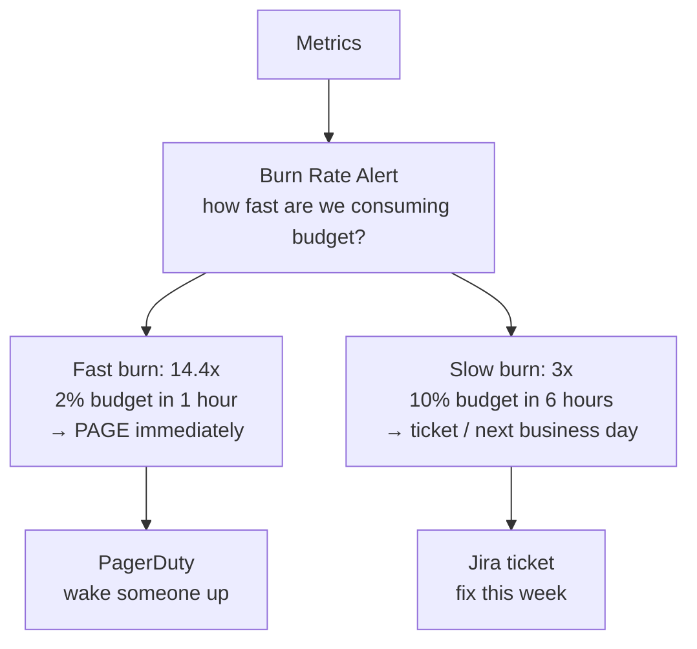

# Incident Response & SRE Fundamentals

SLI/SLO/SLA definitions, error budgets, on-call patterns, and runbook design for Go services.

---

## SLI → SLO → SLA



### Common SLIs

| SLI | Measurement | Good for |
|-----|-------------|----------|
| Availability | successful requests / total requests | APIs |
| Latency | p50, p95, p99 response time | User-facing services |
| Throughput | requests/sec processed | Data pipelines |
| Error rate | 5xx responses / total responses | Any HTTP service |
| Freshness | time since last successful sync | Data systems |

### SLO Examples

```
# API Service
- Availability: 99.9% of requests return 2xx/4xx (not 5xx) per 30-day window
- Latency: 99% of requests complete in < 500ms
- Latency: 99.9% of requests complete in < 2000ms

# Data Pipeline
- Freshness: data is no more than 5 minutes stale
- Completeness: 99.99% of records processed without loss
```

---

## Error Budgets



### Error Budget Calculation

```go
// Monthly error budget calculation
const (
    sloTarget     = 0.999  // 99.9%
    monthMinutes  = 30 * 24 * 60 // 43,200 minutes
)

errorBudgetMinutes := monthMinutes * (1 - sloTarget) // 43.2 minutes
// If you've had 30 minutes of downtime this month:
// Remaining budget = 43.2 - 30 = 13.2 minutes
// Budget consumed = 30 / 43.2 = 69.4%
```

### Uptime Table

| SLO | Downtime/month | Downtime/year |
|-----|---------------|---------------|
| 99% | 7.3 hours | 3.65 days |
| 99.9% | 43.2 minutes | 8.76 hours |
| 99.95% | 21.6 minutes | 4.38 hours |
| 99.99% | 4.3 minutes | 52.6 minutes |
| 99.999% | 26 seconds | 5.26 minutes |

---

## Alerting Strategy



**Multi-window burn rate** (Google SRE approach):
```yaml
# Alert: fast burn (page)
- alert: HighErrorBurnRate
  expr: |
    (
      sum(rate(http_requests_total{code=~"5.."}[1h]))
      / sum(rate(http_requests_total[1h]))
    ) > (14.4 * (1 - 0.999))
  for: 2m
  labels:
    severity: critical

# Alert: slow burn (ticket)
- alert: SlowErrorBurnRate
  expr: |
    (
      sum(rate(http_requests_total{code=~"5.."}[6h]))
      / sum(rate(http_requests_total[6h]))
    ) > (3 * (1 - 0.999))
  for: 30m
  labels:
    severity: warning
```

---

## Runbook Template

```markdown
# Runbook: High Error Rate on Payment Service

## Symptoms
- Alert: `PaymentServiceHighErrorRate` firing
- Error budget burn rate > 14.4x

## Impact
- Users cannot complete purchases
- Revenue loss: ~$X/minute

## Diagnosis Steps
1. Check deployment: `kubectl rollout history deploy/payment-service`
2. Check dependencies: `curl payment-service:8080/healthz`
3. Check database: `SELECT count(*) FROM pg_stat_activity;`
4. Check logs: `kubectl logs -l app=payment-service --since=5m | grep ERROR`

## Mitigation
1. **Rollback** (if recent deploy): `kubectl rollout undo deploy/payment-service`
2. **Scale up** (if load-related): `kubectl scale deploy/payment-service --replicas=10`
3. **Circuit break** (if dependency down): Enable feature flag `PAYMENT_FALLBACK=true`

## Resolution
- Root cause analysis within 48 hours
- Post-mortem document in Confluence
- Action items tracked in Jira

## Escalation
- L1: On-call engineer (first 15 min)
- L2: Team lead (after 15 min)
- L3: VP Engineering (after 30 min, revenue impact)
```

---

## On-Call Best Practices

| Practice | Why |
|----------|-----|
| Runbooks for every alert | Reduce MTTR, enable anyone to respond |
| Blameless post-mortems | Learn from failures, don't punish |
| Error budget policy | Balance velocity vs reliability |
| Handoff notes | Context for next on-call rotation |
| Alert fatigue review | Delete alerts nobody acts on |
