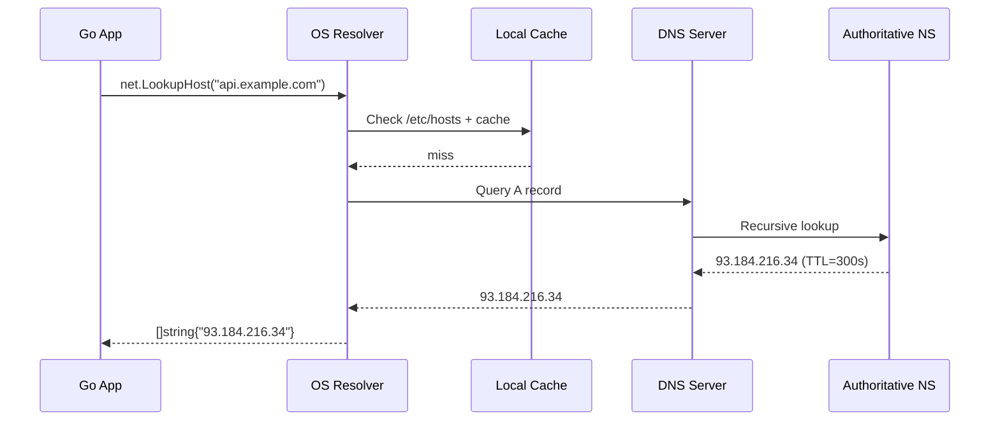
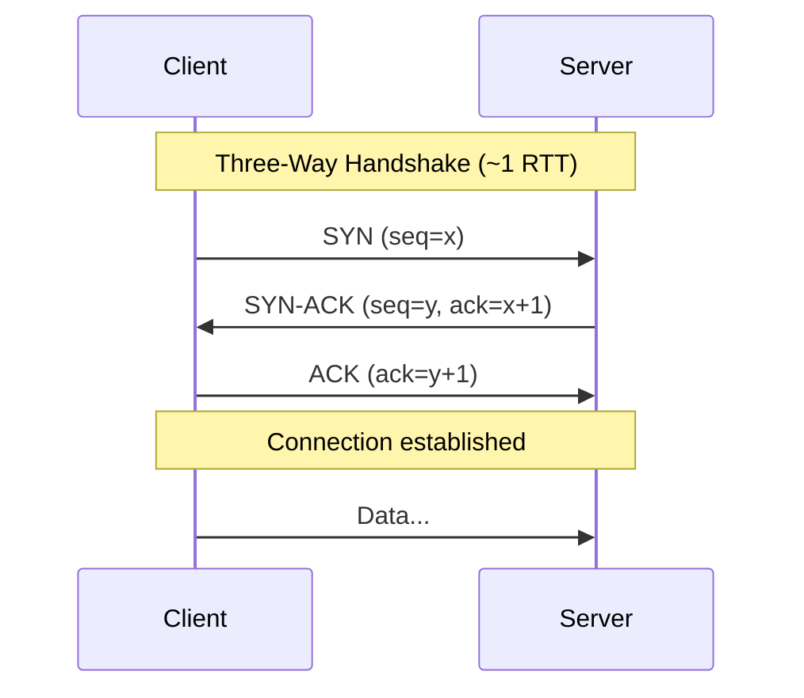
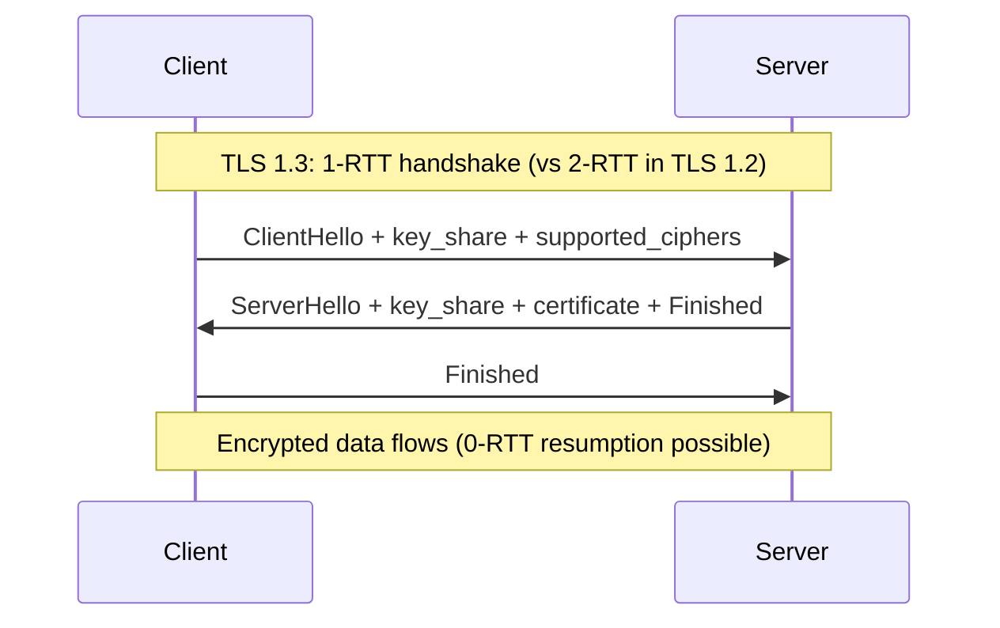
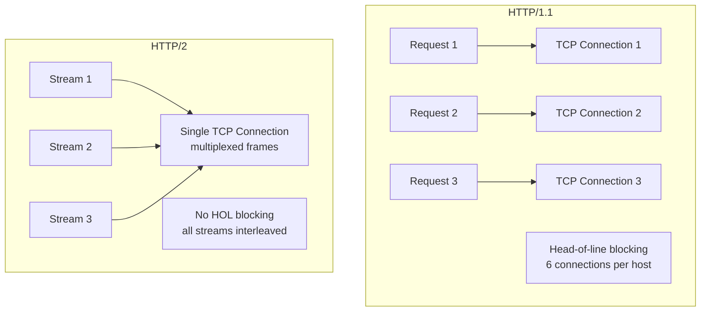
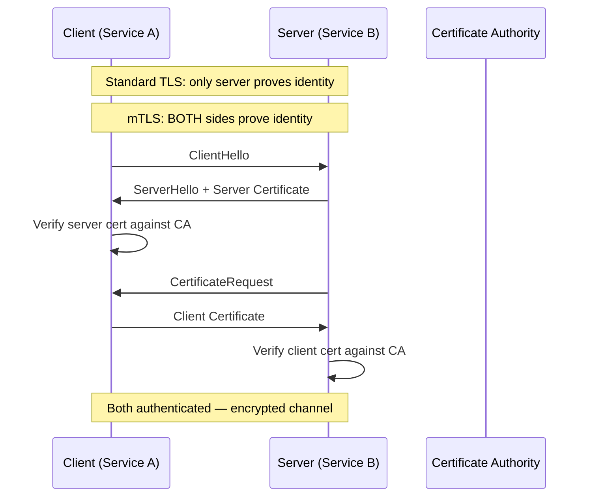
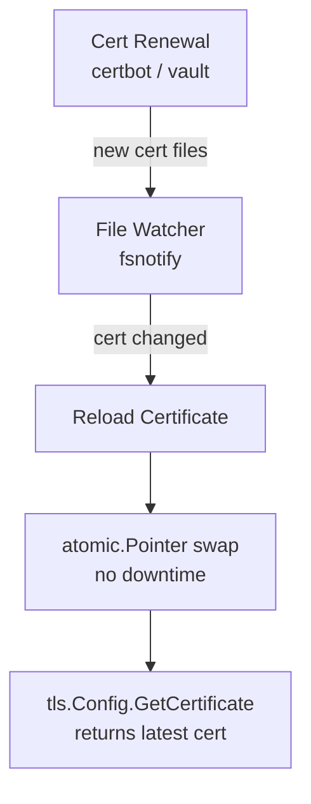

# Networking Fundamentals

DNS resolution, TCP/TLS handshakes, HTTP/2 multiplexing, and mTLS certificate rotation — what every backend engineer must understand.

---

## DNS Resolution



**Go DNS behavior:**
- Uses OS resolver by default (`/etc/resolv.conf`)
- `GODEBUG=netdns=go` forces pure-Go resolver (no CGO)
- DNS caching: Go does NOT cache DNS — each `Dial` triggers a lookup
- For high-throughput: use a custom `net.Resolver` or connection pooling

```go
resolver := &net.Resolver{
    PreferGo: true, // pure-Go resolver, no CGO
    Dial: func(ctx context.Context, network, address string) (net.Conn, error) {
        d := net.Dialer{Timeout: 5 * time.Second}
        return d.DialContext(ctx, "udp", "8.8.8.8:53") // custom DNS
    },
}
```

---

## TCP Handshake



**Latency**: 1 RTT before any data flows. For cross-region (100ms RTT), that's 100ms just to connect.

---

## TLS Handshake (TLS 1.3)



**Total connection cost**: TCP (1 RTT) + TLS (1 RTT) = **2 RTTs** minimum before first byte.

```go
// Go TLS config for production
tlsConfig := &tls.Config{
    MinVersion: tls.VersionTLS13,
    CipherSuites: nil, // TLS 1.3 ciphers are not configurable (always secure)
    CurvePreferences: []tls.CurveID{tls.X25519, tls.CurveP256},
}
```

---

## HTTP/2 Multiplexing



**Why gRPC uses HTTP/2:**
- Multiplexing: many RPCs over one connection
- Header compression (HPACK)
- Server push / bidirectional streaming
- Flow control per-stream

```go
// Go's HTTP/2 is automatic with TLS
srv := &http.Server{
    Addr:      ":443",
    TLSConfig: tlsConfig,
    // HTTP/2 enabled by default when using TLS
}
srv.ListenAndServeTLS("cert.pem", "key.pem")
```

---

## mTLS (Mutual TLS)



### mTLS in Go

```go
// Server: require client certificates
serverTLS := &tls.Config{
    ClientAuth: tls.RequireAndVerifyClientCert,
    ClientCAs:  caCertPool, // CA that signed client certs
    MinVersion: tls.VersionTLS13,
}

// Client: present certificate
clientTLS := &tls.Config{
    Certificates: []tls.Certificate{clientCert},
    RootCAs:      caCertPool, // CA that signed server cert
}
```

### Certificate Rotation



```go
// Hot-reload certificates without restart
func (s *Server) GetCertificate(*tls.ClientHelloInfo) (*tls.Certificate, error) {
    return s.cert.Load(), nil // atomic pointer — lock-free
}
```

---

## Connection Cost Summary

| Protocol | RTTs to first byte | Keep-alive? |
|----------|-------------------|-------------|
| TCP | 1 | Yes (reuse connection) |
| TLS 1.2 | 2 (TCP) + 2 (TLS) = 4 | Yes |
| TLS 1.3 | 1 (TCP) + 1 (TLS) = 2 | Yes + 0-RTT resumption |
| HTTP/2 | Same as TLS 1.3 | Multiplexed streams |
| gRPC | Same as HTTP/2 | Long-lived connections |

**Takeaway**: Connection pooling and keep-alive are critical. Never create a new TCP+TLS connection per request.
