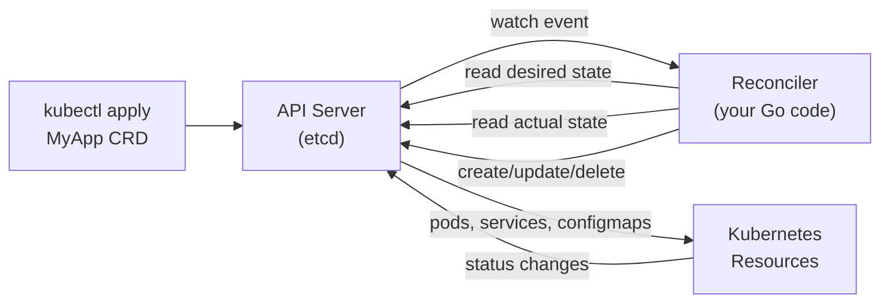

# Go for Platform Ops & SRE

Platform engineering in Go means writing K8s operators, custom controllers, monitoring agents, and infrastructure automation. This covers the patterns you need to know cold.

---

## 1. The Kubernetes Operator Pattern

An **Operator** is a K8s controller that manages a custom resource (CRD) and reconciles the cluster state to match it. The control loop: **observe → diff → act**.



### controller-runtime Operator Skeleton

```go
package main

import (
    "context"
    "fmt"

    appsv1 "k8s.io/api/apps/v1"
    corev1 "k8s.io/api/core/v1"
    "k8s.io/apimachinery/pkg/api/errors"
    metav1 "k8s.io/apimachinery/pkg/apis/meta/v1"
    "k8s.io/apimachinery/pkg/runtime"
    ctrl "sigs.k8s.io/controller-runtime"
    "sigs.k8s.io/controller-runtime/pkg/client"
    "sigs.k8s.io/controller-runtime/pkg/log"
)

// MyApp is your custom resource
type MyApp struct {
    metav1.TypeMeta   `json:",inline"`
    metav1.ObjectMeta `json:"metadata,omitempty"`
    Spec              MyAppSpec   `json:"spec"`
    Status            MyAppStatus `json:"status,omitempty"`
}

type MyAppSpec struct {
    Replicas int32  `json:"replicas"`
    Image    string `json:"image"`
}

type MyAppStatus struct {
    ReadyReplicas int32 `json:"readyReplicas"`
}

// MyAppReconciler watches MyApp CRDs and reconciles them
type MyAppReconciler struct {
    client.Client
    Scheme *runtime.Scheme
}

// Reconcile is called every time a MyApp object changes
func (r *MyAppReconciler) Reconcile(ctx context.Context, req ctrl.Request) (ctrl.Result, error) {
    logger := log.FromContext(ctx)

    // 1. Fetch the MyApp instance
    app := &MyApp{}
    if err := r.Get(ctx, req.NamespacedName, app); err != nil {
        if errors.IsNotFound(err) {
            return ctrl.Result{}, nil // deleted — nothing to do
        }
        return ctrl.Result{}, err
    }

    // 2. Check if Deployment already exists
    deploy := &appsv1.Deployment{}
    err := r.Get(ctx, req.NamespacedName, deploy)

    if errors.IsNotFound(err) {
        // 3a. Create Deployment
        deploy = r.desiredDeployment(app)
        if err := r.Create(ctx, deploy); err != nil {
            return ctrl.Result{}, fmt.Errorf("creating deployment: %w", err)
        }
        logger.Info("created deployment", "name", deploy.Name)
        return ctrl.Result{}, nil
    }
    if err != nil {
        return ctrl.Result{}, err
    }

    // 3b. Update Deployment if spec drifted
    if *deploy.Spec.Replicas != app.Spec.Replicas {
        deploy.Spec.Replicas = &app.Spec.Replicas
        if err := r.Update(ctx, deploy); err != nil {
            return ctrl.Result{}, fmt.Errorf("updating deployment: %w", err)
        }
        logger.Info("updated replicas", "replicas", app.Spec.Replicas)
    }

    // 4. Update status
    app.Status.ReadyReplicas = deploy.Status.ReadyReplicas
    if err := r.Status().Update(ctx, app); err != nil {
        return ctrl.Result{}, err
    }

    return ctrl.Result{}, nil
}

func (r *MyAppReconciler) desiredDeployment(app *MyApp) *appsv1.Deployment {
    replicas := app.Spec.Replicas
    return &appsv1.Deployment{
        ObjectMeta: metav1.ObjectMeta{
            Name:      app.Name,
            Namespace: app.Namespace,
            OwnerReferences: []metav1.OwnerReference{
                *metav1.NewControllerRef(app, app.GroupVersionKind()),
            },
        },
        Spec: appsv1.DeploymentSpec{
            Replicas: &replicas,
            Selector: &metav1.LabelSelector{
                MatchLabels: map[string]string{"app": app.Name},
            },
            Template: corev1.PodTemplateSpec{
                ObjectMeta: metav1.ObjectMeta{
                    Labels: map[string]string{"app": app.Name},
                },
                Spec: corev1.PodSpec{
                    Containers: []corev1.Container{{
                        Name:  app.Name,
                        Image: app.Spec.Image,
                    }},
                },
            },
        },
    }
}

func main() {
    mgr, _ := ctrl.NewManager(ctrl.GetConfigOrDie(), ctrl.Options{})

    // Register the reconciler — watches MyApp objects
    _ = ctrl.NewControllerManagedBy(mgr).
        For(&MyApp{}).
        Owns(&appsv1.Deployment{}). // also reconcile when owned Deployment changes
        Complete(&MyAppReconciler{
            Client: mgr.GetClient(),
            Scheme: mgr.GetScheme(),
        })

    // Manager runs all controllers, leader election, health endpoints
    _ = mgr.Start(ctrl.SetupSignalHandler())
}
```

### Key controller-runtime concepts

| Concept | What it does |
|---------|-------------|
| `ctrl.Manager` | Runs all controllers, handles leader election, health probes |
| `client.Client` | Read/write K8s API — uses an **informer cache**, not direct API calls |
| `ctrl.Result{}` | Return empty = done; `{RequeueAfter: 30s}` = retry after delay |
| `OwnerReference` | Garbage collect child resources (Deployment) when parent (MyApp) is deleted |
| `.Owns(&Deployment{})` | Reconcile MyApp when its owned Deployment changes |

---

## 2. Reading from Cache vs API Server

The `client.Client` in controller-runtime reads from a **local informer cache** (backed by LIST+WATCH), not the API server. This is critical for performance:

```go
// FAST: reads from local cache (in-memory, no API call)
pods := &corev1.PodList{}
r.List(ctx, pods, client.InNamespace("production"))

// SLOW: bypasses cache, hits API server directly
// Only use when you absolutely need latest-version
r.Get(ctx, namespacedName, pod, &client.GetOptions{
    Raw: &metav1.GetOptions{ResourceVersion: "0"}, // force live read
})
```

---

## 3. Leader Election

For controllers running with multiple replicas, only one should reconcile at a time:

```go
mgr, _ := ctrl.NewManager(ctrl.GetConfigOrDie(), ctrl.Options{
    LeaderElection:          true,
    LeaderElectionID:        "my-operator-leader",
    LeaderElectionNamespace: "kube-system",
    // Uses Kubernetes Lease objects in etcd as the lock
})
```

---

## 4. Writing a Node Agent (DaemonSet)

Node agents don't use controller-runtime — they use raw `client-go` with in-cluster config:

```go
import (
    "k8s.io/client-go/kubernetes"
    "k8s.io/client-go/rest"
    "k8s.io/client-go/tools/cache"
)

func main() {
    // In-cluster config (works inside a K8s pod)
    config, _ := rest.InClusterConfig()
    clientset, _ := kubernetes.NewForConfig(config)

    // Watch pods on this node (field selector limits to local node)
    nodeName := os.Getenv("NODE_NAME") // injected via downwardAPI
    factory := informers.NewSharedInformerFactoryWithOptions(clientset, 30*time.Second,
        informers.WithTweakListOptions(func(opts *metav1.ListOptions) {
            opts.FieldSelector = "spec.nodeName=" + nodeName
        }),
    )
    podInformer := factory.Core().V1().Pods()

    podInformer.Informer().AddEventHandler(cache.ResourceEventHandlerFuncs{
        AddFunc:    func(obj interface{}) { /* pod started on this node */ },
        DeleteFunc: func(obj interface{}) { /* pod stopped */ },
        UpdateFunc: func(old, new interface{}) { /* pod changed */ },
    })

    factory.Start(ctx.Done())
    factory.WaitForCacheSync(ctx.Done())
    <-ctx.Done()
}
```

---

## 5. Exposing Prometheus Metrics

Every operator/agent should export metrics for health and business logic:

```go
import (
    "github.com/prometheus/client_golang/prometheus"
    "github.com/prometheus/client_golang/prometheus/promauto"
    "github.com/prometheus/client_golang/prometheus/promhttp"
)

var (
    reconcileTotal = promauto.NewCounterVec(prometheus.CounterOpts{
        Name: "myoperator_reconcile_total",
        Help: "Total reconcile loops run",
    }, []string{"result"}) // labels: success, error, requeue

    reconcileDuration = promauto.NewHistogramVec(prometheus.HistogramOpts{
        Name:    "myoperator_reconcile_duration_seconds",
        Buckets: prometheus.DefBuckets,
    }, []string{"resource"})
)

func (r *MyAppReconciler) Reconcile(ctx context.Context, req ctrl.Request) (ctrl.Result, error) {
    start := time.Now()
    defer func() {
        reconcileDuration.WithLabelValues("myapp").Observe(time.Since(start).Seconds())
    }()

    // ... reconcile logic ...

    reconcileTotal.WithLabelValues("success").Inc()
    return ctrl.Result{}, nil
}

// In main: controller-runtime manager exposes /metrics automatically
// or add manually:
http.Handle("/metrics", promhttp.Handler())
```

---

## 6. G-M-P Scheduler — What Platform Engineers Need to Know

When debugging high-CPU operator pods:

```bash
# Visualize goroutine scheduling
GODEBUG=schedtrace=1000 ./my-operator   # print scheduler stats every 1s

# Profile CPU (find hot reconcile paths)
kubectl port-forward pod/operator-0 6060:6060
go tool pprof http://localhost:6060/debug/pprof/profile?seconds=30

# Goroutine leak detection
curl http://localhost:6060/debug/pprof/goroutine?debug=1 | head -50
# Growing goroutine count = context not cancelled, channels not closed
```

**Key rules for operator goroutines:**
- Every `go func()` inside a reconciler must respect context cancellation
- Use `errgroup.WithContext(ctx)` to propagate cancellation to all sub-goroutines
- Never launch unbounded goroutines from Reconcile — use a worker pool with fixed concurrency
