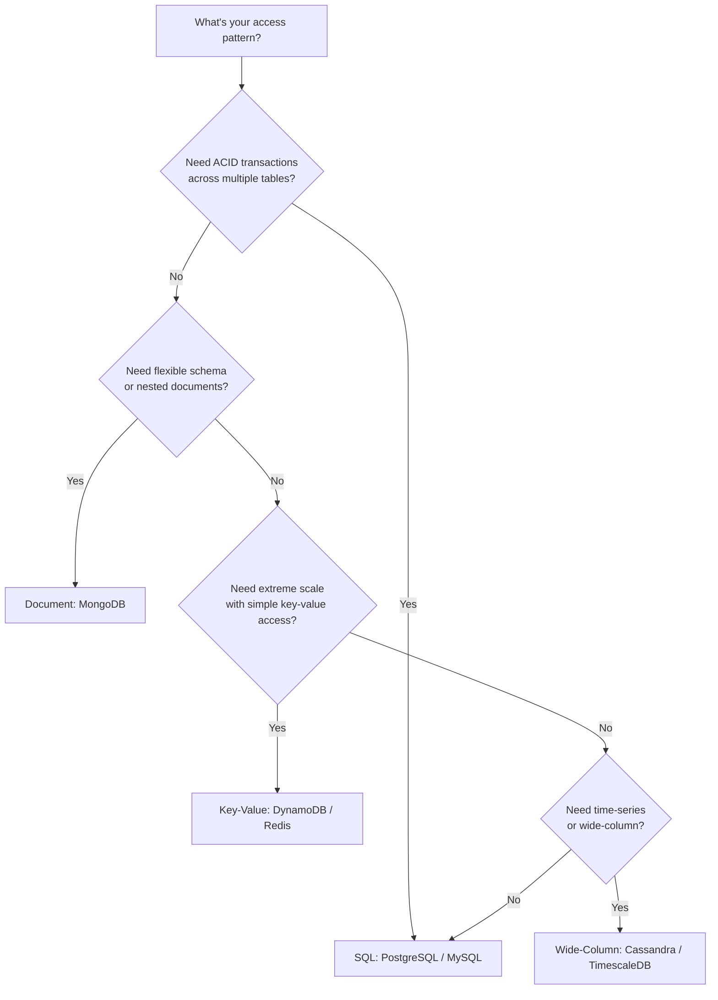
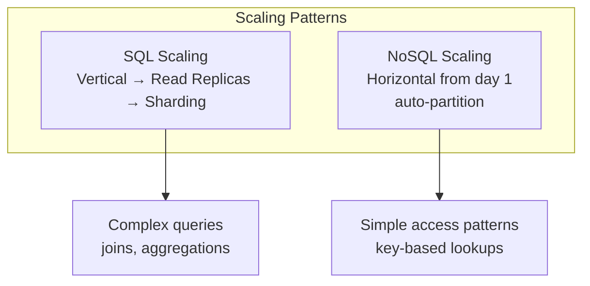

# SQL vs NoSQL Decision Guide

When to use PostgreSQL, MongoDB, DynamoDB, Redis, or Cassandra — and how to model data for each.

---

## Decision Flowchart



---

## Comparison

```mermaid
graph LR
    subgraph SQL
        TABLE[Tables<br>rows + columns] --> JOIN[JOINs<br>relationships]
        JOIN --> ACID[ACID<br>transactions]
    end
    
    subgraph Document
        DOC[Documents<br>JSON/BSON] --> NEST[Nested<br>embedded data]
        NEST --> FLEX[Flexible Schema<br>no migrations]
    end
    
    subgraph Key-Value
        KV[Key → Value] --> FAST[O(1) lookup]
        FAST --> SCALE[Infinite horizontal scale]
    end
```

| Aspect | SQL (PostgreSQL) | Document (MongoDB) | Key-Value (DynamoDB) | In-Memory (Redis) |
|--------|-----------------|-------------------|---------------------|-------------------|
| Schema | Strict (migrations) | Flexible (schemaless) | Strict (partition + sort key) | None |
| Transactions | Full ACID | Single-doc ACID, multi-doc limited | Single-item, limited cross-item | MULTI/EXEC (limited) |
| Joins | Native | $lookup (expensive) | None (denormalize) | None |
| Scale | Vertical + read replicas | Horizontal (sharding) | Infinite horizontal | Vertical + cluster |
| Query flexibility | Any SQL query | Rich queries on any field | Only by key or index | Key-based + data structures |
| Consistency | Strong | Tunable | Tunable (strong or eventual) | Strong (single node) |
| Best for | Complex queries, relationships | Rapid iteration, nested data | Predictable scale, simple access | Caching, sessions, leaderboards |

---

## Data Modeling Examples

### User + Orders

**SQL (PostgreSQL)**
```sql
CREATE TABLE users (id UUID PRIMARY KEY, name TEXT, email TEXT UNIQUE);
CREATE TABLE orders (
    id UUID PRIMARY KEY,
    user_id UUID REFERENCES users(id),
    total DECIMAL, status TEXT,
    created_at TIMESTAMPTZ DEFAULT now()
);
-- Query: SELECT * FROM orders WHERE user_id = $1 ORDER BY created_at DESC;
```

**MongoDB**
```json
// Embed orders if always accessed together
{
  "_id": "user-123",
  "name": "Alice",
  "orders": [
    {"id": "ord-1", "total": 99.99, "status": "shipped"},
    {"id": "ord-2", "total": 49.99, "status": "pending"}
  ]
}
// Or reference if orders are large/independent
```

**DynamoDB**
```
PK: USER#123          SK: PROFILE          → {name, email}
PK: USER#123          SK: ORDER#2024-001   → {total, status}
PK: USER#123          SK: ORDER#2024-002   → {total, status}
// Single-table design: one query gets user + all orders
```

---

## When to Choose What



| Scenario | Choice | Reason |
|----------|--------|--------|
| E-commerce (orders, inventory, payments) | PostgreSQL | ACID transactions, complex joins |
| Content management / blog | MongoDB | Flexible schema, nested content |
| User sessions | Redis | Fast, TTL, ephemeral |
| IoT sensor data | TimescaleDB or Cassandra | Time-series optimized, high write throughput |
| Gaming leaderboard | Redis (sorted sets) | O(log N) rank queries |
| Chat messages | Cassandra or DynamoDB | Write-heavy, partition by conversation |
| Search | Elasticsearch | Full-text, fuzzy, aggregations |
| Config/feature flags | Redis or etcd | Fast reads, pub/sub for changes |
| Analytics | ClickHouse or BigQuery | Columnar, aggregation-optimized |
| Graph relationships | Neo4j or PostgreSQL (recursive CTE) | Traversal queries |

---

## Go Driver Patterns

```go
// PostgreSQL (pgx)
pool, _ := pgxpool.New(ctx, "postgres://...")
row := pool.QueryRow(ctx, "SELECT name FROM users WHERE id=$1", userID)

// MongoDB (mongo-driver)
coll := client.Database("mydb").Collection("users")
coll.FindOne(ctx, bson.M{"_id": userID}).Decode(&user)

// DynamoDB (aws-sdk-go-v2)
client.GetItem(ctx, &dynamodb.GetItemInput{
    TableName: aws.String("users"),
    Key: map[string]types.AttributeValue{"PK": &types.AttributeValueMemberS{Value: "USER#123"}},
})

// Redis (go-redis)
val, _ := rdb.Get(ctx, "session:"+sessionID).Result()
```

---

## Anti-Patterns

| Anti-Pattern | Problem | Fix |
|-------------|---------|-----|
| Using MongoDB for transactions | Multi-doc transactions are slow | Use PostgreSQL |
| Using PostgreSQL for 1M writes/sec | Vertical scaling limit | Use Cassandra/DynamoDB |
| Storing blobs in any DB | Expensive, slow | Use S3 + store URL in DB |
| Using Redis as primary store | Data loss on crash | Use as cache only |
| Joins in DynamoDB | Not supported | Denormalize (single-table design) |
