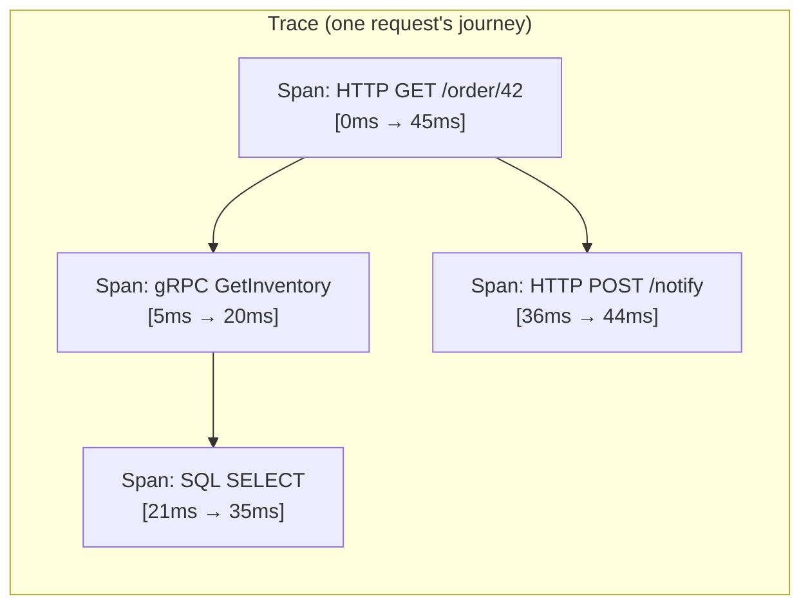
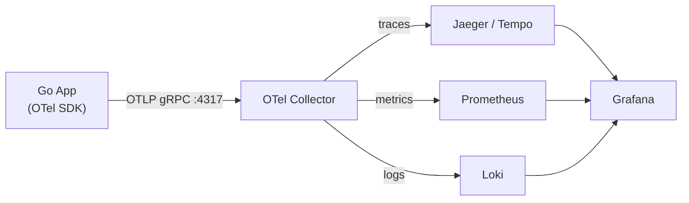

# Distributed Tracing (OpenTelemetry)

In a system with dozens of microservices, a single user request touches many services. Distributed tracing follows that request end-to-end, measuring every hop, so you can find the bottleneck without guessing.

---

## Core Concepts



- **Trace** — one request's complete journey across services, identified by a `TraceID`
- **Span** — a single unit of work (HTTP call, DB query, function). Has start time, duration, attributes, events, and status
- **TraceID** — 128-bit ID shared by every span in a trace, propagated in HTTP headers
- **SpanID** — 64-bit ID unique to this span
- **Parent SpanID** — links child spans to their parent, forming the tree

---

## W3C TraceContext Propagation

Every outbound HTTP call must carry these headers:

```
traceparent: 00-4bf92f3577b34da6a3ce929d0e0e4736-00f067aa0ba902b7-01
             ^^ version   ^^ TraceID (32 hex)              ^^ SpanID (16 hex) ^^ flags
tracestate:  vendor=specific-data
```

The Go OTel SDK injects/extracts these automatically via a `Propagator`.

---

## Full Setup in Go

```go
package main

import (
    "context"
    "net/http"

    "go.opentelemetry.io/otel"
    "go.opentelemetry.io/otel/exporters/otlp/otlptrace/otlptracegrpc"
    "go.opentelemetry.io/otel/propagation"
    "go.opentelemetry.io/otel/sdk/resource"
    sdktrace "go.opentelemetry.io/otel/sdk/trace"
    semconv "go.opentelemetry.io/otel/semconv/v1.21.0"
    "go.opentelemetry.io/otel/trace"
)

// initTracer sets up the OTel SDK, connects to the collector, and returns a shutdown func.
func initTracer(ctx context.Context) (func(context.Context) error, error) {
    // 1. Exporter — sends spans to OTLP collector (Jaeger, Tempo, Honeycomb)
    exp, err := otlptracegrpc.New(ctx,
        otlptracegrpc.WithEndpoint("otel-collector:4317"),
        otlptracegrpc.WithInsecure(),
    )
    if err != nil {
        return nil, err
    }

    // 2. Resource — service name, version, env (appears in every span)
    res := resource.NewWithAttributes(
        semconv.SchemaURL,
        semconv.ServiceName("order-service"),
        semconv.ServiceVersion("v1.2.3"),
        semconv.DeploymentEnvironment("production"),
    )

    // 3. TracerProvider — batches + exports spans
    tp := sdktrace.NewTracerProvider(
        sdktrace.WithBatcher(exp),              // async batch export
        sdktrace.WithResource(res),
        sdktrace.WithSampler(sdktrace.ParentBased(  // respect parent sampling decision
            sdktrace.TraceIDRatioBased(0.1),         // 10% head sampling for new traces
        )),
    )

    // 4. Set global provider + propagator
    otel.SetTracerProvider(tp)
    otel.SetTextMapPropagator(propagation.NewCompositeTextMapPropagator(
        propagation.TraceContext{},  // W3C TraceContext
        propagation.Baggage{},       // W3C Baggage
    ))

    return tp.Shutdown, nil
}

func main() {
    ctx := context.Background()
    shutdown, _ := initTracer(ctx)
    defer shutdown(ctx)

    http.HandleFunc("/order", orderHandler)
    http.ListenAndServe(":8080", nil)
}
```

---

## Instrumenting HTTP Handlers

```go
import "go.opentelemetry.io/contrib/instrumentation/net/http/otelhttp"

// Wrap the mux — every request automatically gets a span
handler := otelhttp.NewHandler(mux, "order-service")
http.ListenAndServe(":8080", handler)
```

```go
// Inside a handler — create child spans for sub-operations
func orderHandler(w http.ResponseWriter, r *http.Request) {
    ctx := r.Context() // already has the parent span from otelhttp

    tracer := otel.Tracer("order-service")

    // Child span for DB query
    ctx, dbSpan := tracer.Start(ctx, "db.query",
        trace.WithAttributes(
            attribute.String("db.system", "postgresql"),
            attribute.String("db.statement", "SELECT * FROM orders WHERE id=$1"),
        ),
    )
    order, err := db.GetOrder(ctx, orderID)
    if err != nil {
        dbSpan.RecordError(err)
        dbSpan.SetStatus(codes.Error, err.Error())
    }
    dbSpan.End()

    // Child span for downstream HTTP call
    ctx, httpSpan := tracer.Start(ctx, "inventory.check")
    resp, _ := httpClient.Do(requestWithContext(ctx, "GET", "http://inventory/check"))
    httpSpan.End()
}
```

---

## Instrumenting Outbound HTTP Clients

```go
import "go.opentelemetry.io/contrib/instrumentation/net/http/otelhttp"

// Wrap the transport — auto-injects traceparent header on every request
httpClient := &http.Client{
    Transport: otelhttp.NewTransport(http.DefaultTransport),
}

// The request MUST carry the context with the active span
req, _ := http.NewRequestWithContext(ctx, "GET", "http://inventory/check", nil)
resp, _ := httpClient.Do(req)
// → traceparent header injected automatically
```

---

## Span Attributes, Events, and Status

```go
ctx, span := tracer.Start(ctx, "process.payment")
defer span.End()

// Attributes — indexed, searchable metadata
span.SetAttributes(
    attribute.String("payment.method", "card"),
    attribute.Float64("payment.amount", 99.99),
    attribute.String("customer.id", customerID),
)

// Events — timestamped log entries within the span (not exported as log lines)
span.AddEvent("payment.authorized", trace.WithAttributes(
    attribute.String("auth.code", "ABC123"),
))

// Status — OK, Error, or Unset
if err != nil {
    span.RecordError(err)                          // attaches err to span
    span.SetStatus(codes.Error, "payment failed")  // marks span as error
    return err
}
span.SetStatus(codes.Ok, "")
```

---

## Sampling Strategies

| Strategy | How | Use case |
|----------|-----|---------|
| `AlwaysSample` | Sample 100% | Dev/staging |
| `NeverSample` | Sample 0% | Disable tracing |
| `TraceIDRatioBased(0.01)` | 1% head sampling | High-traffic prod |
| `ParentBased(root sampler)` | Inherit parent's decision | Consistent across services |
| Tail sampling (collector) | Buffer all spans, decide after root completes | 100% of errors, 1% of success |

**Head sampling** — decision made at root span, before any work. Fast, loses rare events.
**Tail sampling** — all spans buffered, decision after root span completes. Can guarantee 100% of error traces. Implemented in OTel Collector, not the SDK.

```yaml
# OTel Collector: tail sampling policy
processors:
  tail_sampling:
    decision_wait: 10s
    policies:
      - name: errors-policy
        type: status_code
        status_code: {status_codes: [ERROR]}   # 100% of error traces
      - name: rate-limiting
        type: rate_limiting
        rate_limiting: {spans_per_second: 100} # cap everything else
```

---

## Correlating Logs with Traces

Inject TraceID into every log line so you can jump from a log to its trace:

```go
func logWithTrace(ctx context.Context, msg string) {
    span := trace.SpanFromContext(ctx)
    sc := span.SpanContext()

    slog.InfoContext(ctx, msg,
        slog.String("trace_id", sc.TraceID().String()),
        slog.String("span_id", sc.SpanID().String()),
    )
}
// Log output:
// {"msg":"payment processed","trace_id":"4bf92f3577b34da6","span_id":"00f067aa0ba902b7"}
```

---

## Architecture: OTel Collector



The Collector decouples your app from the backend. Swap Jaeger for Honeycomb by changing one line in the Collector config — no code change in any service.

---

## What to Always Instrument

```
✅ Every inbound HTTP/gRPC handler (use otelhttp/otelgrpc wrappers)
✅ Every outbound HTTP call (wrap transport)
✅ Every database query (use otelsql or pgx hook)
✅ Every message queue publish/consume (propagate TraceContext in message headers)
✅ Every external API call
❌ Don't span tight loops — one span per logical operation, not per iteration
```
