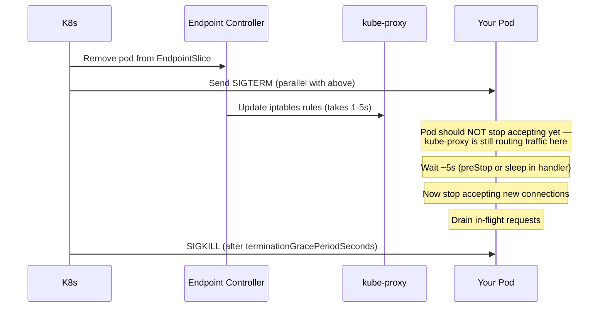

# Zero-Downtime Deployments & Graceful Shutdown

In Kubernetes, your pod is killed constantly — rolling updates, node drains, autoscaling. Every kill sends `SIGTERM`. If your Go service ignores it, in-flight requests get `connection reset`, users see errors, and health checks fail.

---

## The Kubernetes Kill Sequence



**The race:** K8s removes the pod from `EndpointSlice` and sends `SIGTERM` simultaneously. kube-proxy takes 1–5 seconds to propagate the iptables change. If your app stops accepting the instant it gets SIGTERM, requests arriving during that window get `connection refused` → `502`.

**Fix:** Sleep 5 seconds after receiving SIGTERM before stopping the HTTP server.

---

## Single HTTP Server — Production Pattern

```go
package main

import (
    "context"
    "log/slog"
    "net/http"
    "os"
    "os/signal"
    "syscall"
    "time"
)

func main() {
    srv := &http.Server{
        Addr:         ":8080",
        Handler:      newRouter(),
        ReadTimeout:  10 * time.Second,
        WriteTimeout: 30 * time.Second,
        IdleTimeout:  120 * time.Second,
    }

    // Start server in background
    go func() {
        slog.Info("starting server", "addr", srv.Addr)
        if err := srv.ListenAndServe(); err != http.ErrServerClosed {
            slog.Error("server error", "err", err)
            os.Exit(1)
        }
    }()

    // Wait for SIGTERM or SIGINT
    quit := make(chan os.Signal, 1)
    signal.Notify(quit, syscall.SIGTERM, syscall.SIGINT)
    sig := <-quit
    slog.Info("signal received", "signal", sig)

    // CRITICAL: wait for kube-proxy to drain iptables before stopping
    // This prevents 502s during rolling updates.
    // Use preStop hook instead if you want this outside the binary.
    time.Sleep(5 * time.Second)

    // Give in-flight requests 25s to complete (terminationGracePeriodSeconds - 5s drain)
    ctx, cancel := context.WithTimeout(context.Background(), 25*time.Second)
    defer cancel()

    if err := srv.Shutdown(ctx); err != nil {
        slog.Error("shutdown error", "err", err)
    }
    slog.Info("server exited cleanly")
}
```

---

## Multi-Component Shutdown (Production Reality)

Real services have multiple components that need ordered shutdown: HTTP server stops first (stop accepting), then workers drain, then DB connections close.

```go
package main

import (
    "context"
    "database/sql"
    "log/slog"
    "net/http"
    "os"
    "os/signal"
    "syscall"
    "time"

    "golang.org/x/sync/errgroup"
)

type App struct {
    srv    *http.Server
    db     *sql.DB
    worker *Worker
}

func (a *App) Run(ctx context.Context) error {
    g, ctx := errgroup.WithContext(ctx)

    // Component 1: HTTP server
    g.Go(func() error {
        slog.Info("http server starting")
        if err := a.srv.ListenAndServe(); err != http.ErrServerClosed {
            return err
        }
        return nil
    })

    // Component 2: Background worker
    g.Go(func() error {
        return a.worker.Run(ctx)
    })

    // Component 3: Shutdown coordinator
    g.Go(func() error {
        // Wait for context cancel (triggered by signal handler)
        <-ctx.Done()
        slog.Info("shutdown signal received")

        // Step 1: drain iptables race window
        time.Sleep(5 * time.Second)

        // Step 2: stop HTTP server (no new requests)
        shutCtx, cancel := context.WithTimeout(context.Background(), 20*time.Second)
        defer cancel()
        if err := a.srv.Shutdown(shutCtx); err != nil {
            slog.Error("http shutdown error", "err", err)
        }
        slog.Info("http server stopped")

        // Step 3: worker drains via context cancellation (already done above)
        // worker.Run returns when ctx is Done and in-flight jobs complete

        // Step 4: close DB after all queries are done
        a.db.Close()
        slog.Info("database closed")
        return nil
    })

    return g.Wait()
}

func main() {
    ctx, stop := signal.NotifyContext(context.Background(), syscall.SIGTERM, syscall.SIGINT)
    defer stop()

    app := newApp()
    if err := app.Run(ctx); err != nil {
        slog.Error("app exited with error", "err", err)
        os.Exit(1)
    }
}
```

`signal.NotifyContext` (Go 1.16+) is the idiomatic way — cancels the context on signal, no manual channel needed.

---

## Readiness Probe During Shutdown

Once SIGTERM arrives, the readiness probe should immediately return 503 — this accelerates kube-proxy's removal of the pod from the load balancer, reducing the window where new requests arrive.

```go
type Server struct {
    ready atomic.Bool
}

func (s *Server) readinessHandler(w http.ResponseWriter, r *http.Request) {
    if !s.ready.Load() {
        http.Error(w, "shutting down", http.StatusServiceUnavailable)
        return
    }
    w.WriteHeader(http.StatusOK)
}

// In signal handler: immediately mark not-ready
func (s *Server) shutdown() {
    s.ready.Store(false)  // readiness → 503 immediately
    time.Sleep(5 * time.Second) // let LB stop routing
    s.srv.Shutdown(ctx)
}
```

---

## Kubernetes preStop Hook (Alternative to sleep in code)

Instead of `time.Sleep` in Go code, use a preStop hook — K8s runs it before SIGTERM, giving the same delay without coupling infra concerns to the binary:

```yaml
spec:
  containers:
  - name: app
    lifecycle:
      preStop:
        exec:
          command: ["/bin/sh", "-c", "sleep 5"]
    # terminationGracePeriodSeconds must cover:
    # preStop duration + actual drain time + buffer
  terminationGracePeriodSeconds: 60
```

**Rule:** `terminationGracePeriodSeconds` > `preStop duration` + max request duration + 5s buffer.

---

## Worker Graceful Shutdown

```go
type Worker struct {
    queue chan Job
    sem   chan struct{} // limits concurrency
}

func (w *Worker) Run(ctx context.Context) error {
    var wg sync.WaitGroup
    for {
        select {
        case <-ctx.Done():
            // Stop accepting new jobs, wait for in-flight to finish
            wg.Wait()
            return nil
        case job := <-w.queue:
            w.sem <- struct{}{}
            wg.Add(1)
            go func(j Job) {
                defer wg.Done()
                defer func() { <-w.sem }()
                j.Process() // context-unaware jobs run to completion
            }(job)
        }
    }
}
```

---

## Summary: The Shutdown Checklist

```
On SIGTERM:
  □ Immediately set readiness → 503 (stop new traffic)
  □ Sleep 5s (let kube-proxy drain iptables)
  □ srv.Shutdown(ctx) — wait for in-flight HTTP requests
  □ Cancel background worker context — workers drain their queues
  □ Wait for all goroutines via WaitGroup or errgroup
  □ Close DB connections, flush log buffers, close message queue connections
  □ Exit with code 0

terminationGracePeriodSeconds:
  = preStop(5s) + p99 request duration + worker drain + 10s buffer
  Typical: 60s for most services, 300s for long-running workers
```
